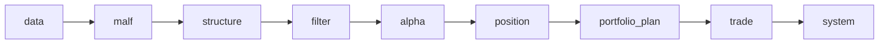

# 仓库协作规则

本文档为自动化代理和协作者提供 `lifespan-0.01` 的最小可执行仓库规则。

## 1. 仓库定位

`lifespan-0.01` 是一个面向个人 PC 的、本地优先的历史账本系统。
系统第一目标不是短期跑通，而是长期可运行、可续跑、可复算、可审计。

必须始终服从这些现实约束：

- 数据量大
- 本地 `cpu / memory / io` 受限
- 很多计算不能反复全量重跑
- 中间事实必须长期沉淀

## 2. 权威入口与阅读顺序

进入仓库后，不要直接改代码。
默认先读：

1. `README.md`
2. `docs/README.md`
3. `docs/01-design/00-system-charter-20260409.md`
4. `docs/01-design/01-doc-first-development-governance-20260409.md`
5. `docs/01-design/α-system-roadmap-and-progress-tracker-charter-20260409.md`
6. `docs/01-design/modules/README.md`
7. `docs/02-spec/00-repo-layout-and-docflow-spec-20260409.md`
8. `docs/02-spec/01-doc-first-task-gating-spec-20260409.md`
9. `docs/02-spec/Ω-system-delivery-roadmap-20260409.md`
10. `docs/03-execution/README.md`

如果只是追当前正式口径，优先看 `conclusion`。
如果要继续正式实现，再回到对应 `card / evidence / record`。

补充理解：

- `α / β / Ω` 三份路线图文档不只负责阶段进度，也负责说明各模块主要继承自哪些老仓来源、当前继承方式与置信度是什么。
- 当前 `Ω` 文档还承担后半部施工指挥蓝图职责：它以 `28` 的 `checkpoint + dirty/work queue + replay/resume` 为统一基线，先做 `43 -> 44 -> 45 -> 46 -> 47 -> 48 -> 49 -> 50 -> 51 -> 52 -> 53 -> 54 -> 55` 的 pre-trade upstream 前置卡组，把 `data -> portfolio_plan` 打造成全 A baseline，再恢复 `100 -> 105`，并按纵向模块档案显式记录六条历史账本约束。

## 3. 五根目录纪律

系统采用五根目录协作：

1. `H:\lifespan-0.01`
   - 代码、文档、测试、治理脚本
2. `H:\Lifespan-data`
   - 正式数据库与长期数据资产
3. `H:\Lifespan-temp`
   - working DB、缓存、pytest、smoke、benchmark 等临时产物
4. `H:\Lifespan-report`
   - 人读报告、图表、导出物
5. `H:\Lifespan-Validated`
   - 正式验证资产快照

禁止把临时工作库、缓存、benchmark 产物长期堆在仓库内部。
`pytest` cache、`pytest` basetemp、smoke 临时产物、环境重建过程中的临时文件，都必须进入 `H:\Lifespan-temp`。

## 4. 正式模块边界

`src/mlq` 下的正式模块是：

- `core`
- `data`
- `malf`
- `structure`
- `filter`
- `alpha`
- `position`
- `portfolio_plan`
- `trade`
- `system`

当前主链冻结为：

`data -> malf -> structure -> filter -> alpha -> position -> portfolio_plan -> trade -> system`

补充规则：

1. `PAS` 是 `alpha` 内部能力，不再是顶层模块。
2. `data` 负责把本地离线市场数据沉淀为官方 `raw_market / market_base` 历史账本。
   - 当前 `data` 的正式 bounded runner 入口为 `scripts/data/run_tdx_stock_raw_ingest.py`，只允许从本地官方离线目录把股票日线增量写入 `raw_market.stock_file_registry / stock_daily_bar`，不允许绕过历史账本直接给下游喂临时 DataFrame。
   - 当前 `data` 的正式 bounded runner 入口为 `scripts/data/run_tdx_asset_raw_ingest.py`，只允许从本地官方离线目录把 `index / block / stock` 日线增量写入各自的 `raw_market.{asset}_file_registry / {asset}_daily_bar`，并为对应 `market_base` 脏标的挂账，不允许把指数、板块临时 DataFrame 直接喂给下游。
   - 当前 `data` 的正式 bounded runner 入口为 `scripts/data/run_tdxquant_daily_raw_sync.py`，只允许把 `TdxQuant(dividend_type='none')` 代表的官方日更原始事实按 `run / request / instrument checkpoint` 账本语义桥接进 `raw_market.stock_daily_bar(adjust_method='none')`，并只标记 `base_dirty_instrument(adjust_method='none')`，不允许把 `front/back` 直接写成正式复权真值。
   - 当前 `data` 的正式 bounded runner 入口为 `scripts/data/run_market_base_build.py`，只允许从官方 `raw_market` 物化 `market_base.{stock,index,block}_daily_adjusted`，并正式沉淀 `adjust_method in {none, backward, forward}` 三套价格，不允许把执行口径和信号口径混写成一套。
   - 当前 `data` 的正式 bounded runner 入口为 `scripts/data/run_mainline_local_ledger_standardization_bootstrap.py`，只允许按 `39` 已冻结的官方 ledger 清单完成一次性批量标准化建仓，不允许继续把 shadow DB 当正式主线库。
   - 当前 `data` 的正式 bounded runner 入口为 `scripts/data/run_mainline_local_ledger_incremental_sync.py`，只允许围绕 `39` 已冻结的官方 ledger 清单维护每日增量同步、checkpoint / dirty queue / replay 与 freshness audit，不允许把 run / checkpoint 反写成业务真值。
3. `malf` 负责把官方 `market_base` 价格事实沉淀为按时间级别独立运行的走势语义账本层。
   - 当前 `malf` 的正式核心只允许使用 `HH / HL / LL / LH / break / count` 描述本级别结构，不允许把高周期 `context`、动作接口或直接交易建议写回 `malf` 核心定义。
   - 当前 `malf` 的 `牛逆 / 熊逆` 只允许表示旧顺结构失效后、到新顺结构确认前的本级别过渡状态，不允许被解释成背景标签。
   - 当前 `pivot-confirmed break` 只允许作为 `malf` 之外的只读机制层 break 确认事实存在，不新增 `malf core` 原语，也不替代新的 `HH / LL` 推进确认。
   - 当前 `same-timeframe stats sidecar` 只允许由同级别 `pivot / wave / state / progress` 派生，并以只读 sidecar 方式供 `structure / filter` 消费，不得反向参与 `state / wave / break / count` 计算。
  - 当前 `malf` 的正式 canonical bounded runner 入口为 `scripts/malf/run_malf_canonical_build.py`，只允许消费官方 `market_base.stock_daily_adjusted(adjust_method='backward')`，并物化 `malf_canonical_run / malf_canonical_work_queue / malf_canonical_checkpoint / malf_pivot_ledger / malf_wave_ledger / malf_extreme_progress_ledger / malf_state_snapshot / malf_same_level_stats`；其中 `D / W / M` 必须独立计算，且 queue/checkpoint 只允许用于续跑，不允许反写结构语义。
  - 当前 `malf` 的 `scripts/malf/run_malf_snapshot_build.py` 只保留 bridge v1 兼容输出职责：它可以继续物化 `malf_run / pas_context_snapshot / structure_candidate_snapshot / malf_run_context_snapshot / malf_run_structure_snapshot` 供 `31` 之前的下游过渡消费，但不再代表 `malf` 正式真值，也不允许回读离线文本或 `raw_market`。
  - `malf snapshot` 的实现允许拆分为 `src/mlq/malf/runner.py` 与同目录 helper 模块 `snapshot_shared.py / snapshot_source.py / snapshot_materialization.py`；拆分只服务治理文件长度与职责收敛，外部正式脚本入口、bridge v1 表族契约与兼容输出语义不得变化。
  - `malf bootstrap` 的实现允许拆分为 `src/mlq/malf/bootstrap.py` 与同目录 helper 模块 `bootstrap_tables.py / bootstrap_columns.py`；拆分只服务 DDL/补列映射的职责收敛与治理文件长度控制，对外导出的表名常量、bootstrap/连接/path 入口与表族语义不得变化。
   - 当前 `malf` 的正式 bounded runner 入口为 `scripts/malf/run_malf_mechanism_build.py`，只允许消费官方 bridge v1 `pas_context_snapshot / structure_candidate_snapshot`，物化 `malf_mechanism_run / malf_mechanism_checkpoint / pivot_confirmed_break_ledger / same_timeframe_stats_profile / same_timeframe_stats_snapshot`，并按 `instrument + timeframe` checkpoint 续跑，不允许反写 `malf core`。
  - 当前 `malf` 的正式 bounded runner 入口为 `scripts/malf/run_malf_wave_life_build.py`，只允许只读消费 canonical `malf_wave_ledger / malf_state_snapshot / malf_same_level_stats`，物化 `malf_wave_life_run / malf_wave_life_work_queue / malf_wave_life_checkpoint / malf_wave_life_snapshot / malf_wave_life_profile`；已完成 wave 样本与活跃 wave 快照必须分开建模，默认无窗口调用走 canonical checkpoint 驱动的 queue/replay，不允许把寿命概率反写回 `malf core`。
  - `wave life` 的实现允许拆分为 `src/mlq/malf/wave_life_runner.py` 与同目录 helper 模块 `wave_life_shared.py / wave_life_source.py / wave_life_materialization.py`；拆分只服务治理文件长度与职责收敛，外部正式脚本入口、表族契约与只读 sidecar 边界不得变化。
4. `structure` 负责把 `malf` 结构语义沉淀为官方结构事实层。
   - 当前 `structure` 的正式 bounded runner 入口为 `scripts/structure/run_structure_snapshot_build.py`，默认只允许从官方 canonical `malf_state_snapshot(timeframe='D')` 物化 `structure_run / snapshot / run_snapshot`；如消费 `pivot_confirmed_break_ledger / same_timeframe_stats_snapshot`，也只允许按只读 sidecar 附加，不允许夹带 `filter / alpha / position` 判定逻辑。
   - bridge v1 `structure_candidate_snapshot / pas_context_snapshot` 只允许作为 canonical 表缺失时的兼容回退，不再承担默认正式上游职责。
5. `filter` 负责 pre-trigger 准入。
   - 当前 `filter` 的正式 bounded runner 入口为 `scripts/filter/run_filter_snapshot_build.py`，只允许消费官方 `structure snapshot` 与 canonical `malf_state_snapshot(timeframe='D')` 最小执行上下文物化 `filter_run / snapshot / run_snapshot`；如携带 `break / stats` sidecar 字段，也只允许只读透传和提示，不允许硬拦截研究观察或夹带 `alpha detector / position / trade` 逻辑。
   - bridge v1 `pas_context_snapshot` 只允许作为 canonical 表缺失时的兼容回退，不再承担默认正式上游职责。
6. `alpha` 负责对下游冻结正式 `formal signal` 事实。
  - 当前 `alpha` 的正式 bounded PAS detector 入口为 `scripts/alpha/run_alpha_pas_five_trigger_build.py`，只允许消费官方 `filter / structure snapshot` 与 `market_base.stock_daily_adjusted(adjust_method='backward')`，物化 `alpha_pas_trigger_run / alpha_pas_trigger_work_queue / alpha_pas_trigger_checkpoint / alpha_trigger_candidate / alpha_pas_trigger_run_candidate`，不允许回读 bridge-era `pas_context_snapshot / structure_candidate_snapshot`，也不允许夹带 `position / trade / system` 逻辑。
  - 当前 `alpha` 的正式 bounded trigger ledger 入口为 `scripts/alpha/run_alpha_trigger_ledger_build.py`，只允许从 bounded detector 输入与官方 `filter / structure snapshot` 上游物化 `alpha_trigger_run / event / run_event`，不允许夹带 `position / trade / system` 逻辑。
  - 当前 `alpha` 的正式 bounded family ledger 入口为 `scripts/alpha/run_alpha_family_build.py`，只允许从官方 `alpha_trigger_event` 与 bounded family candidate 输入物化 `alpha_family_run / event / run_event`，不允许绕过共享 trigger 事实层，也不允许夹带 `position / trade / system` 逻辑。
  - `alpha family` 的实现允许拆分为 `src/mlq/alpha/family_runner.py` 与同目录 helper 模块 `family_shared.py / family_source.py / family_materialization.py`；拆分只服务治理文件长度与职责收敛，外部正式脚本入口、表族契约与 bounded family ledger 语义不得变化。
   - 当前 `alpha` 的正式 bounded producer 入口为 `scripts/alpha/run_alpha_formal_signal_build.py`，只允许从官方触发事实与官方 `filter / structure snapshot` 上游物化 `alpha_formal_signal_run / event / run_event`，默认关闭 `pas_context_snapshot` fallback，不允许夹带 `position` sizing 或 `trade / system` 逻辑。
7. `position` 负责单标的仓位计划与资金管理。
   - 当前 `position` 的正式 bounded runner 入口为 `scripts/position/run_position_formal_signal_materialization.py`，只允许消费官方 `alpha formal signal` 与 `market_base.stock_daily_adjusted(adjust_method='none')` 参考价；脚本默认 `adjust_method` 也必须保持为 `none`，不允许回读 `alpha` 内部临时过程。
   - `position bootstrap` 的实现允许拆分为 `src/mlq/position/bootstrap.py` 与同目录 helper 模块 `position_shared.py / position_bootstrap_schema.py / position_materialization.py`；拆分只服务治理文件长度与职责收敛，对外导出的表名常量、输入/输出数据结构、bootstrap/连接/path 入口与 position materialization 语义不得变化。
8. `portfolio_plan` 负责组合层计划、组合回测、容量协调。
   - 当前 `portfolio_plan` 的正式 bounded runner 入口为 `scripts/portfolio_plan/run_portfolio_plan_build.py`，只允许消费官方 `position_candidate_audit / position_capacity_snapshot / position_sizing_snapshot`，物化 `portfolio_plan_run / snapshot / run_snapshot`，不允许回读 `alpha` 内部过程，也不允许顺手夹带 `trade / system` 逻辑。
9. `trade` 负责执行与成交账本，不承担组合研究职责。
   - 当前 `trade` 的正式 bounded runner 入口为 `scripts/trade/run_trade_runtime_build.py`，只允许消费官方 `portfolio_plan_snapshot`、上一轮 `trade_carry_snapshot` 与 `market_base.stock_daily_adjusted(adjust_method='none')`，不允许改回复权价计算成交股数。
   - 当前 `55` 之前，`trade` 仍不得恢复为 data-grade 主线模块；`55` 接受后必须按 `100 -> 101 -> 102 -> 103 -> 104` 顺排恢复，其中 `100` 先冻结 `signal_low / last_higher_low` 的正式透传合同，`102` 再补齐 `trade_exit_ledger / trade_realized_pnl_ledger`，`103` 再把 `trade` 升级为带 `work_queue / checkpoint / replay / freshness` 的 progression runner。
10. `system` 负责编排、治理、审计、冻结，不保存策略事实主数据。
   - 当前 `system` 的正式 bounded runner 入口为 `scripts/system/run_system_mainline_readout_build.py`，只允许消费官方 `structure / filter / alpha / position / portfolio_plan / trade` 账本与 `trade_*` 正式落表事实，物化 `system_run / system_child_run_readout / system_mainline_snapshot / system_run_snapshot`，不允许回读私有中间过程，也不允许越界扩成 live orchestration / broker runtime。
   - `system readout` 的实现允许拆分为 `src/mlq/system/runner.py` 与同目录 helper 模块 `readout_shared.py / readout_children.py / readout_snapshot.py / readout_materialization.py`；拆分只服务治理文件长度与职责收敛，外部正式脚本入口、表族契约与 bounded readout 语义不得变化。
   - 当前 `55` 之前，`system` 仍只保留 bounded readout / audit 角色；只有 `104` 完成真实官方库 smoke 后，才允许进入 `105`，把 `system` 升级为只读消费官方 child ledger、带 step/checkpoint/resume 的正式 orchestration 入口。

补充价格口径：

1. `malf -> structure -> filter -> alpha` 默认使用 `adjust_method = backward`
2. `position -> trade` 默认使用 `adjust_method = none`
3. `adjust_method = forward` 当前只作为研究与展示保留，不作为正式执行口径
4. 当前最新生效结论锚点已推进到 `49-position-batched-entry-trim-and-partial-exit-contract-conclusion-20260414.md`；它已把 `position` 提升为带 batched entry / trim / partial-exit leg-aware 合同的正式计划账本，并把当前待施工卡前移到 `50-position-data-grade-checkpoint-and-replay-runner-card-20260413.md`。其中 `29-49` 已完成并生效，`50 -> 51 -> 52 -> 53 -> 54 -> 55` 成为进入 `trade` 前的前置卡组，`100-105` 退回到通过 `55` 之后才允许恢复的 trade/system 卡组。
5. 当前主线系统级路线图必须以 `docs/02-spec/Ω-system-delivery-roadmap-20260409.md` 为准；该文档已把 `structure -> filter -> alpha -> position -> portfolio_plan` 识别为当前后半部最薄弱链段，并把 `43 -> 44 -> 45 -> 46 -> 47 -> 48 -> 49 -> 50 -> 51 -> 52 -> 53 -> 54 -> 55` 固定为进入 `trade` 前的前置卡组，不允许再仅凭旧宽表口径判断模块成熟度。

## 5. 历史账本原则

本系统中的数据库不是一次运行产物，而是历史账本。
正式数据库应优先满足：

1. 自然键累积
2. 增量更新
3. 断点续跑
4. 中间事实永续存储
5. 尽量减少重复 CPU/IO 成本

新增硬规则：

1. 所有正式账本必须先声明稳定实体锚点；标的类默认是 `asset_type + code`
2. `name` 只能作为属性、快照或审计辅助字段，不得替代稳定主键
3. 所有正式实现都必须同时声明：
   - 一次性批量建仓如何做
   - 每日或每批次增量更新如何做
   - checkpoint / dirty queue / replay 如何续跑
   - 审计账本落在哪里
4. `run_id` 只做审计，不得充当正式业务主语义

`run_id` 可以保留为批次与审计元数据，但不能再充当历史账本主语义。
正式运行时应优先通过 `enter_repo.ps1` 或环境变量加载五根目录；`repo_root.parent` 形式的相邻目录回退只服务测试和开发兜底，不代表正式环境默认口径。

## 6. 文档先行规则

正式实现默认遵循：

`需求 -> 设计 -> 任务分解 -> card -> implementation -> evidence -> record -> conclusion`

硬规则：

1. 先有 `design / spec`，再开 `card`，再实现。
2. 任何正式代码生成、Schema 变更、Pipeline 新增、行为改写，都必须先具备需求、设计、任务分解。
3. 缺少上述前置文档，不允许进入正式实现。
4. 缺少 `card / evidence / record / conclusion` 任意一件，不算正式完成。
5. 进入 `src/`、`scripts/`、`.codex/` 下的正式实现前，当前待施工卡必须已经通过 `doc-first gating` 检查。
6. 当前待施工卡必须显式填写 `历史账本约束` 六条声明：
   - 实体锚点
   - 业务自然键
   - 批量建仓
   - 增量更新
   - 断点续跑
   - 审计账本

## 7. 入口文件规则

下面三个文件是仓库入口，不允许长期滞后于当前治理口径：

1. `AGENTS.md`
2. `README.md`
3. `pyproject.toml`

只要治理规则、环境脚手架、路径契约、测试入口、执行入口发生变化，就必须同步刷新这三个入口文件。
其中 `docs/01-design/`、`docs/02-spec/` 与 `src/mlq/core/paths.py` 的正式口径变化，也视为入口变化。
全仓 `python scripts/system/check_development_governance.py` 盘点允许通过 `scripts/system/development_governance_legacy_backlog.py` 显式登记历史债务；但按改动路径触发的严格治理检查，不得豁免新增违规。
当前 `44` 施工已经收口，历史硬超长 backlog 与目标超长 backlog 均已清零；当前正式施工位前移到 `45`，并顺排进入 `46 -> 47 -> 48 -> 49 -> 50 -> 51 -> 52 -> 53 -> 54 -> 55`，只有 `55` 接受后才恢复 `100-105`。每解决一项都必须同步回填 card / evidence / record / conclusion，并从 backlog 台账移除。
当前已完成的清债包括 `src/mlq/system/runner.py`、`src/mlq/trade/runner.py`、`src/mlq/alpha/trigger_runner.py`、`src/mlq/filter/runner.py`、`src/mlq/malf/mechanism_runner.py`、`src/mlq/malf/canonical_runner.py`、`src/mlq/structure/runner.py`、`src/mlq/alpha/runner.py`、`src/mlq/data/runner.py`、`tests/unit/data/test_data_runner.py`、`src/mlq/data/bootstrap.py`、`src/mlq/malf/runner.py`、`src/mlq/malf/bootstrap.py`、`src/mlq/alpha/family_runner.py`、`src/mlq/position/bootstrap.py` 与 `docs/03-execution/37-system-governance-historical-debt-backlog-burndown-card-20260412.md`；本卡后续 `pytest` 证据统一按串行口径执行，避免多个进程争用 `H:\Lifespan-temp\pytest-tmp`。

## 8. 文档规则

正式文档默认中文。
新增文档时：

1. 不要直接复制旧系统过时口径。
2. 参考资料只放在 `docs/04-reference/`。
3. 当前正式事实必须写在 `design / spec / execution conclusion` 中。
4. 执行区默认先读 `conclusion`，不要把历史 `card` 当成当前真相。
5. 正式文档、设计解释与执行卡在涉及模块边界、数据流、状态机、账本表族或施工顺序时，默认必须提供图示；优先使用 Mermaid，并保证图与正文口径一致。

## 9. 代码规则

1. 复杂实现必须写必要的中文注释，重点解释边界、契约、增量逻辑、断点续跑和反直觉规则。
2. 不要为了单次运行方便，破坏历史账本结构。
3. 不要把临时脚本逻辑直接混进正式运行时模块。
4. 模块之间只通过正式契约和正式输出对接，不直接依赖彼此内部实现细节。

## 10. 测试与验证

修改正式逻辑后，至少要补下面之一，最好同时具备：

1. 单元测试
2. 可复现命令
3. 运行证据
4. 落表事实或导出产物摘要

证据必须可追溯，不能只写“已验证”。

## 11. 提交与推送

提交前应确认：

1. 改动边界清晰
2. 文档闭环已补齐
3. 测试或证据已具备

提交信息建议使用：

`<area>: 
`
