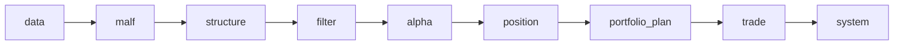

# lifespan-0.01

`lifespan-0.01` 是面向个人 PC 的、本地优先的历史账本系统。目标不是“单次跑通”，而是让市场数据、研究语义、执行账本都能长期沉淀为可续跑、可复算、可审计的正式资产。

## 系统定位

本仓库默认服从这些现实约束：

- 数据量大
- 本地 `cpu / memory / io` 受限
- 很多计算不能反复全量重跑
- 中间事实必须长期沉淀

因此，正式数据库优先满足：

- 自然键累积
- 增量更新
- 断点续跑
- 中间事实永续存储
- 尽量减少重复 CPU/IO 成本

新增全系统硬规则：

- 稳定实体锚点优先，标的类默认使用 `asset_type + code`
- `name` 只作属性、快照或审计辅助字段，不替代正式主键
- 所有正式实现都必须声明：
  - 一次性批量建仓
  - 后续增量更新
  - checkpoint / dirty queue / replay 续跑语义
  - 审计账本
- `run_id` 只做审计，不做正式业务主语义

## 当前正式模块

- `core`
- `data`
- `malf`
- `structure`
- `filter`
- `alpha`
- `position`
- `portfolio_plan`
- `trade`
- `system`

当前主链冻结为：

`data -> malf -> structure -> filter -> alpha -> position -> portfolio_plan -> trade -> system`

## 五根目录契约

1. `H:\lifespan-0.01`
   - 代码、文档、测试、治理脚本
2. `H:\Lifespan-data`
   - 正式数据库与长期数据资产
3. `H:\Lifespan-temp`
   - working DB、缓存、pytest、smoke、benchmark 等临时产物
4. `H:\Lifespan-report`
   - 人读报告、图表、导出产物
5. `H:\Lifespan-Validated`
   - 正式验证资产快照

`pytest` cache、`basetemp`、smoke 临时目录、benchmark 临时产物都必须落到 `H:\Lifespan-temp`。

## 当前正式 runner 入口

### data

- `scripts/data/run_tdx_stock_raw_ingest.py`
  - 从本地官方离线目录把股票 txt 日线增量写入 `raw_market.stock_file_registry / stock_daily_bar`
- `scripts/data/run_tdx_asset_raw_ingest.py`
  - 从本地官方离线目录把 `stock / index / block` txt 日线增量写入各自 `raw_market.{asset}_file_registry / {asset}_daily_bar`
  - 支持一次性建仓、每日断点续传、文件级 `skipped_unchanged`
  - 自 `73` 起同时兼容 `{asset_type}/Backward-Adjusted` 与 `{asset_type}-day/Backward-Adjusted` 两种本地离线源布局
  - 自 `74` 起支持 `--batch-size N`，按标的/文件批次串行生成 child raw ingest run
- `scripts/data/run_tdxquant_daily_raw_sync.py`
  - 把 `TdxQuant(dividend_type='none')` 作为股票日更原始事实桥接进 `raw_market.stock_daily_bar(adjust_method='none')`
  - 只标记 `base_dirty_instrument(adjust_method='none')`
  - 同步把 `get_stock_info` 的官方客观状态沉淀进 `raw_market.raw_tdxquant_instrument_profile`，供 `filter` 只读消费 objective gate
- `scripts/data/run_tushare_objective_source_sync.py`
  - 把 `Tushare stock_basic / suspend_d / stock_st / namechange` 有边界地同步进 `raw_market.tushare_objective_{run,request,checkpoint,event}`
  - 正式 CLI 必须显式二选一：传入 `signal_start_date / signal_end_date` 走 bounded window，或显式传入 `--use-checkpoint-queue`
- `scripts/data/run_tushare_objective_profile_materialization.py`
  - 把 `tushare_objective_event` 有边界地物化进 `raw_market.raw_tdxquant_instrument_profile`
  - 正式 CLI 必须显式二选一：传入 `signal_start_date / signal_end_date` 走 bounded window，或显式传入 `--use-checkpoint-queue`
- `scripts/data/run_market_base_build.py`
  - 从官方 `raw_market` 物化 `market_base.{stock,index,block}_daily_adjusted`
  - 支持 `--asset-type {stock,index,block}`
  - 自 `73` 起，只有无日期窗、无标的窗且 `--limit 0` 的真正全历史 `full` 才允许删除缺失行；局部 `full` 只做 upsert，避免误删同一 `adjust_method` 的范围外历史
  - 自 `74` 起，正式批量建仓优先使用 `--batch-size N --build-mode full --limit 0`，按标的批次串行生成 child run，避免一次 staging 全资产全历史 rows
- `scripts/data/run_mainline_local_ledger_standardization_bootstrap.py`
  - 冻结主线 `10` 个官方 ledger 的标准路径与一次性批量标准化建仓入口
- `scripts/data/run_mainline_local_ledger_incremental_sync.py`
  - 为 `39` 已冻结的官方 ledger 清单补齐每日增量同步、checkpoint / dirty queue / replay 与 freshness audit

### malf / structure / filter / alpha / position / portfolio_plan / trade / system

- `scripts/malf/run_malf_snapshot_build.py`
- `scripts/malf/run_malf_canonical_build.py`
- `scripts/malf/run_malf_mechanism_build.py`
- `scripts/malf/run_malf_wave_life_build.py`
  - 正式脚本入口保持不变；实现允许拆分到 `src/mlq/malf/wave_life_runner.py` 与同目录 helper 模块 `wave_life_shared.py / wave_life_source.py / wave_life_materialization.py`，用于满足治理文件长度约束而不改变外部契约。
- `scripts/malf/run_malf_zero_one_wave_audit.py`
  - `80` 冻结的正式只读审计入口；只允许读取 `malf_day / malf_week / malf_month`，把完成的 `bar_count in {0,1}` wave 标成 `same_bar_double_switch / stale_guard_trigger / next_bar_reflip`。
  - 任何 `canonical_materialization` 行为改写、`0/1` 消费合同调整或 `malf_day / malf_week / malf_month` 重建，都必须先跑一版变更前基线，再跑一版变更后对照。
- `scripts/structure/run_structure_snapshot_build.py`
  - 正式 CLI 必须显式选择执行模式：传入 `signal_start_date / signal_end_date` 走 bounded full-window，或显式传入 `--use-checkpoint-queue` 走 checkpoint queue；无参调用不再静默进入 queue。
- `scripts/filter/run_filter_snapshot_build.py`
  - 正式 CLI 必须显式选择执行模式：传入 `signal_start_date / signal_end_date` 走 bounded full-window，或显式传入 `--use-checkpoint-queue` 走 checkpoint queue；无参调用不再静默进入 queue。
  - 自 `62` 起，`structure_progress_failed / reversal_stage_pending` 只保留为 `admission_notes` 或既有 risk sidecar，不再在 `filter` 层形成 hard block。
  - 自 `69` 起，runner 还会只读消费 `raw_market.raw_tdxquant_instrument_profile`，把停牌/ST/退市整理/证券类型与市场类型宇宙排除映射成正式 `filter_gate_code / filter_reject_reason_code`
- `scripts/filter/run_filter_objective_coverage_audit.py`
  - 只读审计官方 `filter_snapshot` 对 `raw_market.raw_tdxquant_instrument_profile` 的历史覆盖率。
  - 输出按日期、标的、市场类型分组的 missing 摘要，以及建议的最小 backfill 窗口。
- `scripts/alpha/run_alpha_pas_five_trigger_build.py`
- `scripts/alpha/run_alpha_trigger_ledger_build.py`
- `scripts/alpha/run_alpha_family_build.py`
- `scripts/alpha/run_alpha_formal_signal_build.py`
  - 只允许从官方 `alpha trigger / alpha family / filter / structure` 与只读 `malf_wave_life_snapshot` sidecar 冻结 `alpha_formal_signal_run / event / run_event`
  - 自 `65` 起，`stage_percentile_*` 允许在 `alpha` 层通过 `admission_verdict_*` 落成 `note_only / downgraded / admitted` 审计结论；仍不得夹带 `position / trade / system` 逻辑
- `scripts/position/run_position_formal_signal_materialization.py`
  - 默认 `adjust_method='none'`
  - `stage_percentile_*` 若存在，只允许作为 `position` 自身后续 sizing/trim 的只读输入
  - 默认无窗口调用走 `work_queue / checkpoint` 续跑；显式窗口保留 bounded replay/rematerialize
- `scripts/portfolio_plan/run_portfolio_plan_build.py`
- `scripts/trade/run_trade_runtime_build.py`
- `scripts/system/run_system_mainline_readout_build.py`
  - 只消费官方 `structure / filter / alpha / position / portfolio_plan / trade` 账本与 `trade_*` 正式落表事实
  - 物化 `system_run / system_child_run_readout / system_mainline_snapshot / system_run_snapshot`
  - 实现允许拆分到 `src/mlq/system/runner.py` 与同目录 helper 模块 `readout_shared.py / readout_children.py / readout_snapshot.py / readout_materialization.py`，但外部脚本入口与 bounded readout 契约保持不变

## 当前 data 正式口径

- `txt -> raw_market -> market_base` 现在正式覆盖：
  - `stock`
  - `index`
  - `block`
- `TdxQuant(dividend_type='none')` 正式桥接股票 `raw_market.stock_daily_bar(adjust_method='none')`
- 价格口径冻结为：
  - `malf -> structure -> filter -> alpha` 默认消费 `adjust_method='backward'`
  - `position -> trade` 默认消费 `adjust_method='none'`
  - `forward` 当前只作研究与展示保留
- 当前最新生效结论锚点已推进到 `91-malf-timeframe-native-base-source-rebind-conclusion-20260418.md`；当前待施工卡已切回 `81-malf-origin-chat-semantic-truth-gap-freeze-card-20260419.md`。
- 当前 `malf` 的单点权威设计/规格锚点为：
  - `docs/01-design/modules/malf/15-malf-authoritative-timeframe-native-ledger-charter-20260419.md`
  - `docs/02-spec/modules/malf/15-malf-authoritative-timeframe-native-ledger-spec-20260419.md`
- 当前若要追“聊天里成型的 `malf` 与系统现状差多少、接下来先修什么”，正式入口改为：
  - `docs/01-design/modules/malf/16-malf-origin-chat-semantic-reconciliation-charter-20260419.md`
  - `docs/02-spec/modules/malf/16-malf-origin-chat-semantic-reconciliation-spec-20260419.md`
  - `docs/03-execution/81-malf-origin-chat-semantic-truth-gap-freeze-card-20260419.md`
- `docs/02-spec/Ω-system-delivery-roadmap-20260409.md` 现已把 `60 -> 66` 视为已完成整改卡组，并在恢复 `79 -> 80 -> 91 -> 92 -> 93 -> 94 -> 95` 之前依次插入并完成 `67` 历史 file-length 治理债务卡、`68` 执行文档目录治理卡、`69` filter 客观 gate、`70 -> 72` objective 历史回补卡组、`73` market_base backward 全历史修缮卡、`74` raw/base 分批建仓治理卡、`75` 单库周月账本扩展卡，以及 `76-77` 的日周月分库迁移与尾收口。
- `78-80` 与 `91` 已完成双主轴范围冻结、`0/1` 波段过滤边界、`malf day/week/month` 路径契约与 canonical native full coverage；当前正式待施工位先回到 `81`，用于冻结 origin-chat `malf` 语义与当前 truth gap；`91-95` 继续作为远置后的 downstream cutover 卡组保留。`92-95` 的现行口径是：
  - `malf` 改成 `day / week / month` 三库
  - `structure` 保留，并拆成 `structure_day / structure_week / structure_month` 三个薄投影层
  - `filter` 保留模块壳，但只拦截客观不可交易与正式宇宙 gate；是否继续保留独立本地库留待 `93` 裁决
  - `alpha` 升格为正式终审主真值层，并按 `BOF / TST / PB / CPB / BPB` 五个 PAS 拆成五个日线官方库
- `73` 已确认 `stock / index / block` 的 `market_base(backward)` 与 `raw_market(backward)` 覆盖对齐，`stock_daily_adjusted(backward)` 当前覆盖 `1990-12-19 -> 2026-04-10`。
- `100 -> 105` 仍然保留为 `trade/system` 恢复卡组，但只有 `76-raw-base-day-week-month-ledger-split-migration-card-20260417.md` 与 `95-malf-alpha-official-truthfulness-and-cutover-gate-card-20260418.md` 先后接受后才允许恢复。
- `txt -> raw_market -> market_base` 继续保留为正式 fallback

## 当前 malf 正式口径

- `malf` 的正式核心已冻结为按时间级别独立运行的走势账本，只允许使用 `HH / HL / LL / LH / break / count` 描述本级别结构。
- 高周期 `context`、动作接口、仓位建议与直接交易解释不属于 `malf` core；若后续需要同级别统计或多级别共读，应在 `malf` 之外单独冻结 sidecar 或消费视图。
- `pivot-confirmed break` 已正式冻结为 `malf` 之外的只读机制层 break 确认事实：它只确认 break 站稳，不替代新的 `HH / LL` 推进确认。
- `same-timeframe stats sidecar` 已正式冻结为同级别只读 sidecar：只允许由同级别 `pivot / wave / state / progress` 派生，并供 `structure / filter` 读取，不得回写 `malf core`。
- 当前 `scripts/malf/run_malf_canonical_build.py` 已正式按 timeframe native 物化 canonical v2 `pivot / wave / extreme / state / same_level_stats` 与 `work_queue / checkpoint / run` 账本：
  - `D -> market_base_day.stock_daily_adjusted -> malf_day`
  - `W -> market_base_week.stock_weekly_adjusted -> malf_week`
  - `M -> market_base_month.stock_monthly_adjusted -> malf_month`
- 自 `79` 起，`WorkspaceRoots.databases` 已正式暴露 `malf_day / malf_week / malf_month` 三库路径；单 `malf.duckdb` 只保留 legacy fallback 位阶。
- 自 `80` 起，`0/1` 波段过滤已拥有独立治理卡位；自 `91` 起，canonical `malf_day / malf_week / malf_month` 已完成 official native full coverage，三库最新 checkpoint 都追平到 `2026-04-10`，覆盖 `5501` 个官方 scope。
- 自 `91` 起，若需要查看当前 `malf` 最完整、最权威的设计与实现边界，不再需要从 `modules/malf/01-14` 自行拼图；统一以 `modules/malf/15` 为准。
- 自 `80` 起，`scripts/malf/run_malf_zero_one_wave_audit.py` 还被固定为 `0/1` 问题的统一只读审计基线：
  - `same_bar_double_switch`：`bar_count=0`，且起始 bar 找不到本 wave 自己的 `state_snapshot`
  - `stale_guard_trigger`：`bar_count=1`，且相关 guard 年龄达到给定阈值
  - `next_bar_reflip`：其余 `bar_count=1` wave
- 后续若要修改 `switch_mode` 时序、`bar_count` 归属或 stale guard 合同，或者决定重建 `malf_day / malf_week / malf_month`，都必须保留这份审计脚本的变更前/后结果，不能只凭下游样本感觉裁决。
- 当前 `malf snapshot / mechanism / wave_life` runner 仍显式走 legacy 单库；`91` 只完成 canonical native source 与三库真值层，不提前替 `92-95` 做 downstream 重绑。
- 当前 `scripts/malf/run_malf_snapshot_build.py` 仍保留 bridge v1 兼容职责：
  - 消费 `market_base.stock_daily_adjusted(adjust_method='backward')`
  - 物化 `pas_context_snapshot / structure_candidate_snapshot`
  - 仅供显式兼容回退或历史桥接链路消费，不再承担默认正式真值职责
  - 实现允许拆分到 `src/mlq/malf/runner.py` 与同目录 helper 模块 `snapshot_shared.py / snapshot_source.py / snapshot_materialization.py`，但外部脚本入口与 bridge v1 契约保持不变
- `malf bootstrap` 的实现允许拆分到 `src/mlq/malf/bootstrap.py` 与 helper 模块 `bootstrap_tables.py / bootstrap_columns.py`，但对外导出的表名常量、bootstrap/连接/path 入口和表族语义保持不变
- `alpha family` 的实现允许拆分到 `src/mlq/alpha/family_runner.py` 与 helper 模块 `family_shared.py / family_source.py / family_materialization.py`，但外部脚本入口与 family ledger 契约保持不变
- `position bootstrap` 的实现允许拆分到 `src/mlq/position/bootstrap.py` 与 helper 模块 `position_shared.py / position_bootstrap_schema.py / position_materialization.py`，但对外导出的表名常量、输入/输出数据结构、bootstrap/连接/path 入口与 position materialization 语义保持不变
- 当前 `scripts/malf/run_malf_mechanism_build.py` 正式负责 bridge-era 机制层 sidecar 账本：
  - 消费 `pas_context_snapshot / structure_candidate_snapshot`
  - 物化 `pivot_confirmed_break_ledger / same_timeframe_stats_profile / same_timeframe_stats_snapshot`
  - 维护 `malf_mechanism_checkpoint`，支持按 `instrument + timeframe` 增量续跑
- 当前 `scripts/malf/run_malf_wave_life_build.py` 正式负责 canonical 波段寿命概率 sidecar：
  - 只读消费 `malf_wave_ledger / malf_state_snapshot / malf_same_level_stats`
  - 物化 `malf_wave_life_run / malf_wave_life_work_queue / malf_wave_life_checkpoint / malf_wave_life_snapshot / malf_wave_life_profile`
  - 正式 CLI 必须显式二选一：要么提供 `signal_start_date / signal_end_date` 做 bounded bootstrap，要么显式传入 `--use-checkpoint-queue` 做增量续跑；无参调用不再允许静默进入 queue
  - `wave life` 代码实现允许拆分为 runner + helper 模块，但脚本入口、表族命名与只读 sidecar 边界保持不变

## 当前 canonical downstream 默认绑定

- `structure`
  - 默认 `source_context_table / source_structure_input_table='malf_state_snapshot'`
  - 默认 `source_timeframe='D'`
  - bridge v1 只保留为 canonical 表缺失时的兼容回退
- `filter`
  - 默认 `source_context_table='malf_state_snapshot'`
  - 默认 `source_timeframe='D'`
  - bridge v1 `pas_context_snapshot` 只保留兼容回退
- `alpha`
  - `alpha trigger` 继续只读官方 `filter_snapshot + structure_snapshot`
  - `alpha formal signal` 默认关闭 `pas_context_snapshot` fallback，只有显式指定时才启用兼容路径
  - `alpha formal signal` 现正式只读接入 `malf_wave_life_snapshot`，并在 `65` 起以 `admission_verdict_*` 冻结 final admission authority；`filter.trigger_admissible` 只保留 pre-trigger gate 语义

## 文档治理

正式实现遵循：

`需求 -> 设计 -> 任务分解 -> card -> implementation -> evidence -> record -> conclusion`

硬规则：

1. 先有 `design / spec`，再开 `card`，再实现
2. 缺少前置文档，不允许进入正式实现
3. 缺少 `card / evidence / record / conclusion` 任意一件，不算正式完成
4. 进入 `src/`、`scripts/`、`.codex/` 下的正式实现前，当前待施工卡必须通过 `python scripts/system/check_doc_first_gating_governance.py`
5. 当前待施工卡必须显式填写 `历史账本约束` 六条声明：实体锚点、业务自然键、批量建仓、增量更新、断点续跑、审计账本
6. 正式文档默认多用图：涉及模块边界、数据流、状态机、账本表族或施工顺序时，至少提供一张与正文一致的图，优先使用 Mermaid。
7. 全仓 `python scripts/system/check_development_governance.py` 盘点允许通过 `scripts/system/development_governance_legacy_backlog.py` 登记历史债务；按改动路径触发的严格治理检查仍直接拦截新增违规。
8. `37` 卡收口时，每解决一项历史债务，都必须同步更新 `development_governance_legacy_backlog.py` 与 `37` 对应的 card / evidence / record / conclusion。
9. 当前已完成的清债包括 `src/mlq/system/runner.py`、`src/mlq/trade/runner.py`、`src/mlq/alpha/trigger_runner.py`、`src/mlq/filter/runner.py`、`src/mlq/malf/mechanism_runner.py`、`src/mlq/malf/canonical_runner.py`、`src/mlq/structure/runner.py`、`src/mlq/alpha/runner.py`、`src/mlq/data/runner.py`、`tests/unit/data/test_data_runner.py`、`src/mlq/data/bootstrap.py`、`src/mlq/malf/runner.py`、`src/mlq/malf/bootstrap.py`、`src/mlq/alpha/family_runner.py`、`src/mlq/position/bootstrap.py`、`src/mlq/data/data_mainline_incremental_sync.py`、`src/mlq/portfolio_plan/runner.py`、`src/mlq/data/data_market_base_materialization.py`、`src/mlq/data/data_tdxquant.py` 与 `tests/unit/data/test_market_base_runner.py`；当前历史 file-length backlog 已由 `67` 正式清零，`68` 已把执行文档目录纪律恢复到 `root/card-conclusion-index-template + evidence/ + records/`，`56-59` 已作为真实正式库 middle-ledger `2010` pilot 卡组完成；当前正式施工位已切到 `92`，只有 `95` 再完成 truthfulness / cutover gate 后才恢复 `100-105` trade/system 卡组，本仓 `pytest` 证据仍统一按串行命令登记，避免多个进程争用 `H:\Lifespan-temp\pytest-tmp`。
10. `docs/03-execution/` 根目录只允许保留 `card / conclusion / index / template / README`；正式 `evidence` 与 `record` 必须分别落在 `docs/03-execution/evidence/` 与 `docs/03-execution/records/`，不得再回根目录漂移。

## 建议阅读顺序

1. `AGENTS.md`
2. `docs/README.md`
3. `docs/01-design/00-system-charter-20260409.md`
4. `docs/01-design/01-doc-first-development-governance-20260409.md`
5. `docs/01-design/α-system-roadmap-and-progress-tracker-charter-20260409.md`
6. `docs/01-design/modules/README.md`
7. `docs/02-spec/00-repo-layout-and-docflow-spec-20260409.md`
8. `docs/02-spec/01-doc-first-task-gating-spec-20260409.md`
9. `docs/02-spec/Ω-system-delivery-roadmap-20260409.md`
10. `docs/03-execution/README.md`

如果只追当前正式口径，优先看 `docs/03-execution/*conclusion*`。

