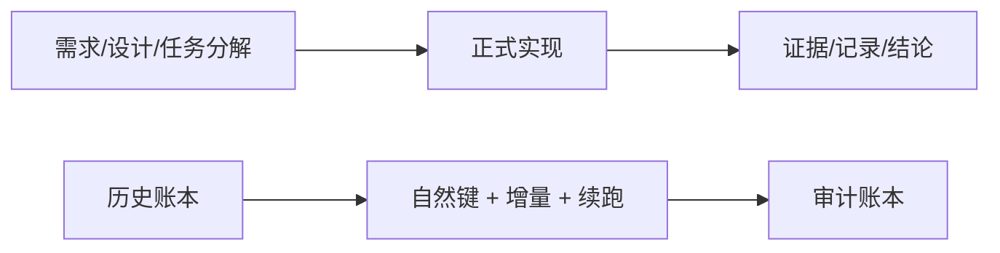

# 系统宪章

日期：`2026-04-09`
状态：`生效`

## 目的

`lifespan-0.01` 是一个面向个人 PC 的、本地优先的历史账本系统，用于大规模市场数据处理与长期研究执行。

系统必须优先支持：

- 分批处理
- 断点续跑
- 增量更新
- 中间事实的永续存储

系统必须拒绝：

- 没有必要的全历史重算
- 伪装成正式账本的临时运行产物
- 没有文档约束的代码先行扩张

## 正式原则

本系统围绕“历史账本”而不是“临时运行”来构建。

`run_id` 可以保留为审计和追踪字段，但系统的正式历史意义最终应由自然键和稳定契约表达。

## 文档原则

新仓库延续老系统对以下内容的重视：

- 证据
- 记录
- 结论

并新增一条更强的规则：

任何正式实现工作，在开始前都必须先写清楚需求、设计和任务分解。

## 流程图

