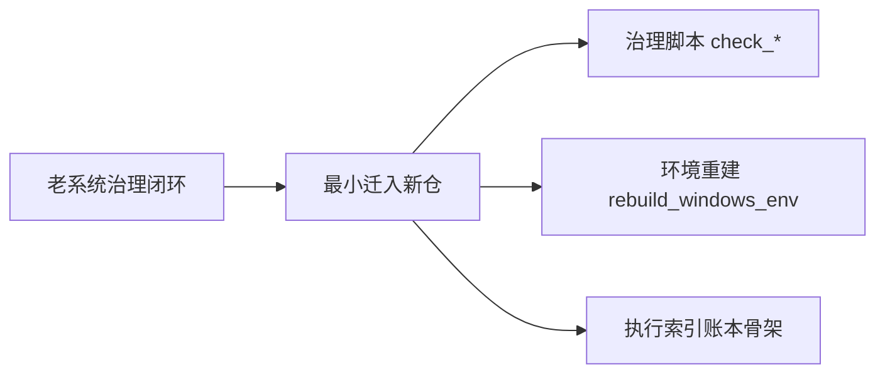

# 治理工具与环境重建设计

日期：`2026-04-09`
状态：`生效中`

## 背景

新仓已经建立了文档先行原则，但治理工具仍未迁入，环境也缺少老系统那套可重复重建入口。
如果没有这一层，执行纪律只能靠口头约束，无法稳定复用。

## 设计目标

1. 迁入老系统最小可用治理闭环，而不是整包复制旧业务脚本。
2. 保留老系统“索引、账本、当前施工卡、证据回填”的治理风格。
3. 在新仓提供 Windows 本地环境重建入口，默认对接 `D:\miniconda310\python.exe`。
4. 所有新增治理脚本优先服务当前新仓结构，而不是继续绑定旧仓路径。

## 迁移范围

本轮只迁以下内容：

1. `.codex/skills/lifespan-execution-discipline/`
2. `scripts/setup/enter_repo.ps1`
3. `scripts/setup/rebuild_windows_env.ps1`
4. `scripts/system/check_file_length_governance.py`
5. `scripts/system/check_chinese_governance.py`
6. `scripts/system/check_repo_hygiene_governance.py`
7. `scripts/system/check_development_governance.py`
8. `docs/03-execution/` 下的索引账本骨架

## 不在本轮范围内

1. 老系统的业务 runner
2. 老系统特定模块的正式回测入口
3. 与旧仓数据表直接耦合的治理脚本

## 关键原则

1. 治理脚本必须优先读新仓当前索引文件名。
2. 环境脚本必须允许在个人 PC 上重复执行。
3. `.venv` 只作为仓内运行环境，不保存正式数据产物。
4. 治理脚本本身也必须满足中文化与仓库卫生规则。

## 流程图

