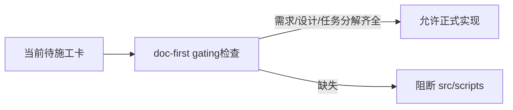

# 文档先行硬门禁检查器设计宪章

日期：`2026-04-09`
状态：`生效中`

## 问题

仓库已经明确了“需求 -> 设计 -> 任务分解 -> card -> implementation -> evidence -> record -> conclusion”的正式顺序，但当前主要还是靠人自觉执行。

如果没有一个真正可运行的硬门禁检查器，后续在 `position / alpha / portfolio_plan / trade` 上开始写正式代码时，仍然可能出现：

1. 先改 `src/` 或正式脚本，再回头补文档
2. 执行卡存在，但仍是模板态或占位态
3. `design / spec / task breakdown` 只写在口头或上下文里，没有冻结进仓库

## 目标

为新仓补一个最小但正式的 `doc-first gating` 检查器，让仓库在进入正式代码生成之前，至少能够自动确认：

1. 当前待施工卡存在
2. 当前待施工卡已经写明需求
3. 当前待施工卡已经链接正式 `design / spec`
4. 当前待施工卡已经写出非占位的任务分解
5. 只有满足上述前提，`src/`、`scripts/`、`.codex/` 下的正式改动才允许通过治理链路

## 设计原则

1. 优先检查“当前待施工卡”，而不是尝试推断所有历史卡片
2. 优先卡正式实现入口，不去替代执行卡本身的人工判断
3. 优先最小可执行，不做复杂语义分析
4. 失败信息必须直接告诉维护者缺什么，而不是只返回布尔值

## 作用边界

范围内：

1. 针对当前待施工卡的结构完整性检查
2. 针对 `src/`、`scripts/`、`.codex/` 改动的严格门禁
3. 接入 `check_development_governance.py`
4. 与入口新鲜度治理联动

范围外：

1. 不检查历史已完成卡是否都满足新门禁
2. 不判断设计内容本身是否“足够正确”
3. 不替代测试、证据和结论检查

## 裁决

本轮采用“当前待施工卡 + 正式改动前缀触发”的最小硬门禁方案。

这样既能在进入模块实现前卡住最危险的回滑路径，又不会把仓库治理一次性复杂化到难以维护。

## 流程图

