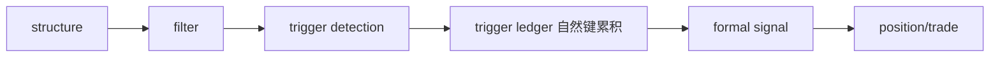

# alpha 模块经验冻结

日期：`2026-04-09`
状态：`生效中`

## 当前职责

- 承接结构语义、前置 filter、trigger 模式与 formal signal
- 在 `alpha` 内部组织 PAS 等 trigger 家族
- 回答“它什么时候出现了”

## 必守边界

1. `structure semantics`、`filter admission`、`trigger detection`、`formal signal` 不能再混写。
2. trigger 的发生依据必须来自 `raw / base`，不能把 `malf` 当成发生依据层。
3. `alpha` 负责 trigger 事实，后续值不值得做、做多大、怎么结束交给下游。

## 已验证坑点

1. 把 PAS 挂在研究链里会导致每次研究都得重算 trigger。
2. 把 trigger ledger 绑在 `latest pas_context` 候选池上，会让历史事实反向依赖 `malf` 覆盖率。
3. “按日删后重写”适合实验，不适合历史账本。

## 新系统施工前提

1. `alpha.duckdb` 内的 trigger 表族应按自然键长期累积。
2. trigger ledger 与 formal signal 必须彻底分层。
3. run 元数据只做审计，不再充当 trigger 历史主语义。

## 来源

1. 老系统总表 `battle-tested-lessons-all-modules-and-mainline-bridging-20260408.md`
2. 老系统 `alpha 02 / 03 / 04 / 05 / 06` 系列章程

## 流程图

