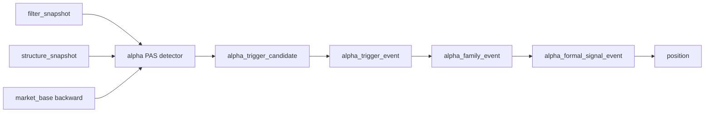

# alpha PAS 五触发 canonical detector 宪章
日期：`2026-04-13`
状态：`生效`

## 背景

`12-13` 已完成 `alpha_trigger_event -> alpha_family_event -> alpha_formal_signal_event` 的最小正式账本骨架，但主线仍缺官方 `PAS detector` 生产者。

当前 `alpha_trigger_candidate` 只是占位输入表，没有按照当前主线

`data -> malf -> structure -> filter -> alpha`

的 canonical 语义正式生成。结果是五触发虽然出现在合同里，但没有官方实现来证明它们来自新版 `malf` 清洗后的 `structure / filter`。

## 目标

建立 `alpha` 模块内官方、bounded、可续跑的 `PAS` 五触发 detector 生产链路，使其：

1. 只消费官方 `filter_snapshot`
2. 只消费官方 `structure_snapshot`
3. 只消费官方 `market_base.stock_daily_adjusted(adjust_method='backward')`
4. 不回读 bridge-era `pas_context_snapshot / structure_candidate_snapshot`
5. 不夹带 `position / trade / system` 逻辑
6. 继续复用现有 `trigger / family / formal signal` 三段账本链

## 主线边界

### 上游

官方 `PAS detector` 只允许读取：

1. `filter_snapshot`
2. `structure_snapshot`
3. `market_base.stock_daily_adjusted(adjust_method='backward')`

### 下游

官方 `PAS detector` 只负责物化 `alpha_trigger_candidate`。后续链路保持不变：

## 五触发在新主线中的角色

五触发必须继续全部保留，但角色不再视为平权：

1. `bof / tst` 是主线触发
2. `pb` 只允许作为“新趋势成立后的第一次回调”
3. `cpb` 默认保留为复杂回撤后的延续候选，不直接提升成强 admitted 主线
4. `bpb` 保留为警惕型形态，不再按经典教科书形态自动加权

本卡不冻结 `trade` 要用的 `signal_low / last_higher_low`，那属于 `100` 的正式锚点合同；`41` 只负责把五触发重新接成 canonical 主线生产者。

## detector 原则

### 1. 触发判定必须以 filter 后样本为前提

如果 `filter_snapshot.trigger_admissible = false`，该样本不进入正式 detector 判定范围。

### 2. 触发判定必须以 backward 价格事实为准

`malf -> structure -> filter -> alpha` 主线默认使用 `adjust_method='backward'`，`PAS` detector 不得混入 `none / forward`。

### 3. 触发判定与 malf 新语义对齐，但不反写 malf

`PAS` detector 可以消费 `major_state / trend_direction / reversal_stage / break_confirmation_status` 等官方结果做过滤和解释，但不得改写 `malf` 或 `structure` 真值。

### 4. detector 输出只冻结触发事实

它只回答：

1. 哪天
2. 哪个标的
3. 哪个触发
4. 为什么触发
5. 对应的结构与价格证据是什么

## 官方输出

`alpha_trigger_candidate` 从本卡开始成为官方 detector 输出，必须至少包含：

1. `instrument`
2. `signal_date`
3. `asof_date`
4. `trigger_family`
5. `trigger_type`
6. `pattern_code`
7. `family_code`
8. `trigger_strength`
9. `detect_reason`
10. `skip_reason`
11. `price_context_json`
12. `structure_context_json`
13. `detector_trace_json`
14. `source_filter_snapshot_nk`
15. `source_structure_snapshot_nk`
16. `source_price_fingerprint`

其中前六列维持对现有 `trigger_runner` 的兼容；扩展列由 `family` 与审计读出消费。

## 运行方式

`41` 冻结两段运行：

1. `run_alpha_pas_five_trigger_build.py`
   - 从 `filter / structure / market_base` 物化 `alpha_trigger_candidate`
2. `run_alpha_trigger_ledger_build.py`
   - 继续把 `alpha_trigger_candidate` 提升为 `alpha_trigger_event`

前者必须支持：

1. 一次性 bounded 回放
2. checkpoint / dirty queue / replay
3. detector trace 审计
4. 每个 `instrument + timeframe` 的增量续跑

## 历史账本约束

1. 实体锚点：`asset_type + code`
2. 业务自然键：`instrument + signal_date + asof_date + trigger_type + pattern_code + detector_contract_version`
3. 批量建仓：按官方 `filter` checkpoint 与价格历史一次性回放
4. 增量更新：按 `filter_checkpoint` 推进日更
5. 断点续跑：必须具备 `checkpoint / dirty queue / replay`
6. 审计账本：`run / work_queue / checkpoint / candidate / run_candidate`

## 参考来源

允许参考旧仓，但禁止直接复制代码：

1. `G:\。backups\MarketLifespan-Quant\src\mlq\alpha\pas\detectors_breakout.py`
2. `G:\。backups\MarketLifespan-Quant\src\mlq\alpha\pas\detectors_cpb.py`
3. `G:\。backups\MarketLifespan-Quant\src\mlq\alpha\pas\detectors_runtime.py`
4. `G:\。backups\EmotionQuant-gamma\src\backtest\pas_ablation.py`
5. `G:\。backups\EmotionQuant-gamma\src\backtest\normandy_pas_alpha.py`

## 完成定义

`41` 完成后必须满足：

1. 官方 `PAS detector` 能在 canonical `filter / structure / market_base` 上生成五触发候选
2. `trigger / family / formal signal` 能消费这个官方候选表，不再依赖手工注入
3. 单元测试覆盖五触发最小正反样本
4. 执行索引与入口文件完成同步
