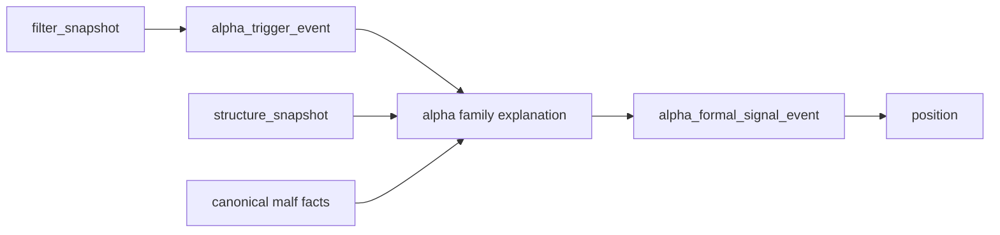

# alpha family role 与 malf 协同设计章程
`日期：2026-04-13`
`状态：生效`

## 背景

`41` 已经把 PAS 五触发重新接回 canonical 主线，`alpha_trigger_candidate` 不再依赖测试注入或手工写表。

但当前 `alpha family` 仍然只冻结最小 `family_code + payload_json`，它还没有正式回答下面这些问题：

- 这次触发在 PAS 五触发里属于什么角色
- 它和 canonical `malf` 当前阶段是顺配、逆配还是仅观察
- 下游 `position / portfolio_plan` 应该把它视为主线机会、试单机会还是警戒事件

如果这层继续保持空壳，`100` 之前的 alpha 主线仍然会停留在“候选已存在，但语义未冻结”的状态。

## 目标

在不污染 `malf core` 的前提下，把 `alpha family ledger` 升级为正式的家族解释层：

1. 对 `bof / tst / pb / cpb / bpb` 五触发冻结统一 family role 语义。
2. 将 canonical `malf` 只读协同结果写入 `alpha_family_event` 的结构化 payload。
3. 为下游 `formal signal / position` 提供稳定、可审计、可续跑的解释性事实，但不在本卡冻结 trade anchor。

## 非目标

本卡不做下面这些事：

1. 不冻结 `signal_low / last_higher_low`。
2. 不改写 `trade / system`。
3. 不把 sizing、执行优先级或具体交易动作直接塞进 `malf core`。

## 设计原则

1. `malf` 仍然只表达结构与阶段，不表达交易动作。
2. `alpha family` 负责把触发事实翻译成“家族语义 + malf 协同解释”。
3. `formal signal` 只消费官方 `trigger + family + structure / filter`，不直接重跑 PAS detector 细节。
4. 兼容列 `malf_context_4 / lifecycle_rank_*` 继续保留为过渡消费字段，但本卡新增字段必须明确标注为正式真值。

## 建议冻结的 family 语义

### 触发角色

- `BOF`
  - 默认 `mainline`
- `TST`
  - 默认 `mainline`
- `PB`
  - 默认 `supporting`
  - 仅当满足“新趋势成立后的第一次回调”时才可升级为 admitted 主线候选
- `CPB`
  - 默认 `scout`
- `BPB`
  - 默认 `warning`

### malf 协同结果

`alpha family` 新增的协同结果只允许来自 canonical `malf` 的只读派生，不允许反向定义 `malf`：

- `malf_alignment`
  - `aligned / cautious / conflicted / unknown`
- `malf_phase_bucket`
  - `early / middle / late / unknown`
- `family_bias`
  - `trend_continuation / reversal_attempt / countertrend_probe / trap_warning`

## 主链位置

## 历史账本约束

1. 实体锚点
   - `asset_type + code`
2. 业务自然键
   - `source_trigger_event_nk + family_contract_version`
3. 批量建仓
   - 对指定日期窗口内的官方 `alpha_trigger_event` 批量解释并落 `alpha_family_event`
4. 增量更新
   - 基于官方 trigger checkpoint 与 rematerialize 指纹做增量重算
5. 断点续跑
   - 保留 `run / checkpoint / run_event`
6. 审计账本
   - `alpha_family_run / alpha_family_event / alpha_family_run_event`

## 完成定义

满足以下条件才算收口：

1. `alpha family` 有明确的 family role 与 malf 协同字段合同。
2. `alpha_family_event.payload_json` 不再只是空壳透传，而是结构化表达正式解释事实。
3. 有覆盖五触发正反样本与 rematerialize 的单元测试。
4. `41` 的 PAS detector 输出可以直接进入新的 family 解释层。
