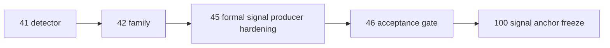

# alpha formal signal producer 在进入 position 前硬化设计宪章

日期：`2026-04-13`
状态：`生效`

适用执行卡：`45-alpha-formal-signal-producer-hardening-before-position-card-20260413.md`

## 背景

`41` 与 `42` 已完成 PAS detector 与 family role 收口，但当前最关键的执行前缺口仍然存在：

1. `alpha_formal_signal_event` 还没有完全升级消费 family 正式解释键
2. `formal signal -> position` 的稳定输入合同还没有达到“像 data/malf 一样可复算”的程度
3. `100` 的 signal anchor freeze 不能建立在仍有 compat-only 过渡语义的 producer 上

## 设计目标

1. 先把 `alpha formal signal producer` 硬化到可进入 `position` 的稳定状态。
2. 明确 family 正式解释键与 formal signal 正式输出的关系。
3. 为 `46` 的 integrated acceptance gate 提供可判断的 `alpha` 输出真值。

## 核心裁决

1. `alpha formal signal` 必须明确哪些字段已经是进入 `position` 的正式输入，哪些仍是 compat-only 过渡字段。
2. `family` 正式解释层若仍未物理进入 formal signal，则不得宣称 `alpha` 已达到进入 `position` 的完整标准。
3. `100` 只能冻结 signal anchor，不负责替代 `45` 解决 producer 稳定性本身。

## 非目标

1. 本卡不进入 `position sizing`
2. 本卡不实现 `trade signal anchor freeze`
3. 本卡不进入 `trade / system`

## 流程图

## 2026-04-15 补充：producer hardening 的最新口径

1. `45` 所说的 producer 稳定性，在 `65` 后必须包含 admission authority 的正式收口，而不只是 family-aware 上下文字段落表。
2. `alpha formal signal` 现在必须能把 `filter pre-trigger`、`family role/alignment` 与 `stage_percentile` sidecar 统一折叠成可审计的 final verdict。
3. 进入 `position` 的 producer 合同，默认以 `alpha-formal-signal-v5` 为当前正式口径。
