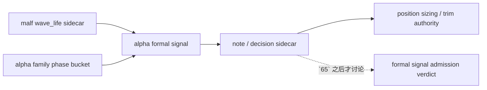

# alpha stage percentile decision matrix 设计宪章

日期：`2026-04-15`
状态：`生效`

适用执行卡：`64-alpha-stage-percentile-decision-matrix-integration-card-20260415.md`

## 背景

`63` 已把 `malf_wave_life_snapshot / profile` 的官方真值与 bootstrap / replay 边界裁清，但 downstream 仍缺少一个正式裁决：

1. `wave_life_percentile` 应该从哪一层接入 `alpha`
2. `stage × percentile -> action` 应由哪一层持有最终权力
3. `trim / shrink` 这类动作是否可以提前写成 `alpha` 的 hard gate

## 设计目标

1. 把 `wave_life` 保持为 `malf` 侧只读 sidecar，不回写 `malf core`
2. 冻结 `alpha` 内部 `stage × percentile` 的首个正式融合层
3. 明确 `alpha` 与 `position` 对 action 的分工，避免 `64` 越界吞掉 `65`

## 核心裁决

1. `alpha detector / trigger` 不得消费 `wave_life_percentile` 决定触发是否存在；触发事实仍由 `filter / structure / price` 官方上游回答。
2. `alpha family` 继续负责产出 `malf_phase_bucket`，它是 decision matrix 的 `stage` 轴正式来源；family 本身不持有 `blocked / admitted / trim` 权限。
3. `alpha formal signal` 是首个允许融合 `malf_phase_bucket × wave_life_percentile` 的正式层，但在 `64` 内只允许物化解释性 sidecar：
   - `wave_life_percentile / remaining_life_bars_p50 / remaining_life_bars_p75 / termination_risk_bucket`
   - `stage_percentile_decision_code / stage_percentile_action_owner / stage_percentile_note`
4. `position` 是本轮唯一允许把 `trim_bias` 一类 decision matrix 输出解释成真实缩仓/减仓动作的层；`64` 不提前把这类动作写回 `alpha admitted / blocked`。
5. `65` 才允许继续讨论 `admission authority` 如何使用这些 sidecar；`64` 不得直接改写 `formal_signal_status` 主权来源。

## 非目标

1. 本卡不把 `wave_life` 改写成 `filter` hard block
2. 本卡不把 `position sizing / trim` 逻辑塞回 `alpha`
3. 本卡不恢复 `trade / system`

## 设计图

