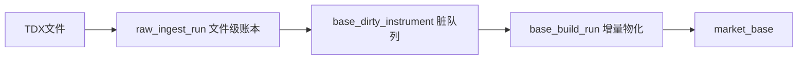

# data 模块 raw/base 强断点与脏标的物化增强章程

日期：`2026-04-10`
状态：`生效中`

## 问题

当前 `data` 模块已经补齐：

`TDX 离线文件 -> raw_market -> market_base`

并且已经能完成全量建库与基础增量更新，但仍存在两个正式缺口：

1. `raw_market` 虽然有文件级断点雏形，但还缺正式 `run / file` 账本。
   - 当前只能从结果表和 `stock_file_registry` 反推导入状态。
   - 中途中断后，无法直接回答“哪些文件已成功、哪些文件失败、失败原因是什么”。
2. `market_base` 已经能重跑增量，但还不是“强断点、强续跑”的正式账本。
   - 当前 `base` 没有自己的 `build_run / dirty_queue / scope_action`。
   - 日常更新仍更像“从 raw 重算一个范围”，而不是“只消费脏标的队列”。

如果不单独补这层增强，`raw/base` 虽然能跑，但还不够“又快又稳”。

## 设计输入

1. `docs/01-design/modules/data/01-tdx-offline-raw-and-market-base-bridge-charter-20260410.md`
2. `docs/02-spec/modules/data/01-tdx-offline-raw-and-market-base-bridge-spec-20260410.md`
3. `docs/03-execution/16-data-malf-minimal-official-mainline-bridge-conclusion-20260410.md`
4. 用户确认的增强方向：
   - `raw_ingest_run / raw_ingest_file`
   - `base_build_run / base_build_scope / base_build_action`
   - `base_dirty_instrument`
   - 全量模式 / 日增模式双入口

## 裁决

### 裁决一：本轮增强只落在 `data.raw/base`，不扩到 `malf`

当前 `malf` 合同仍待单独讨论，因此这轮增强只处理：

1. `raw_market`
2. `market_base`

不顺手推进 `malf` 语义账本。

### 裁决二：`raw` 负责“文件级断点 + 原始 bar 历史账本”

`raw_market` 的正式职责冻结为：

1. 保存原始文件级采集记忆
2. 保存原始 bar 历史账本
3. 显式记录每次 ingest run 与每个文件在该 run 中的动作、结果与错误

也就是说，`raw` 不只是“有 registry 表”，而是要成为真正可审计的文件级运行账本。

### 裁决三：`base` 负责“官方价格事实层 + 脏标的增量物化”

`market_base` 的正式职责冻结为：

1. 稳定产出官方 `stock_daily_adjusted`
2. 保存每次 build 的范围、价格口径、影响规模与物化动作
3. 以 `(code, adjust_method)` 为最小脏标的粒度做日常增量

### 裁决四：全量建库与日常增量共用同一 runner，但走不同模式

正式增强后，`base` runner 需要至少支持两种模式：

1. `full`
   - 适合首建库、大修复、清库重建
2. `incremental`
   - 默认只消费 `base_dirty_instrument`

两种模式共用同一正式合同，不额外分叉出临时脚本。

### 裁决五：增量路径优先保证快路径，但允许可选更强指纹

`raw` 文件指纹增强口径冻结为：

1. 默认仍以 `size + mtime` 做快路径
2. 对“mtime 变化但 size 不变”或显式指定的可疑文件，允许额外计算 `content_hash`

这样可以兼顾吞吐与稳健性。

### 裁决六：库级约束补硬，但排在 run ledger 与 dirty queue 之后

本轮增强最终要把下面约束补硬：

1. `raw.stock_file_registry.file_nk` 唯一
2. `raw.stock_daily_bar.bar_nk` 唯一
3. `base.stock_daily_adjusted(code, trade_date, adjust_method)` 唯一
4. 关键字段补齐 `NOT NULL`

但优先级排在 `base dirty queue` 与 `run ledger` 之后，避免一上来就卡在脏历史清洗。

## 模块边界

### 范围内

1. `raw_market` 运行账本增强
2. `market_base` 运行账本增强
3. `base_dirty_instrument` 脏标的队列
4. `full / incremental` 正式 runner 模式
5. 对应脚本入口、测试、执行文档和读数证据

### 范围外

1. `malf` 合同调整
2. 复权因子账本
3. corporate action 账本
4. 指数、板块下游表增强

## 一句话收口

这轮增强的目标不是再换一套导入脚本，而是把 `raw` 补成真正的文件级运行账本，把 `base` 补成真正的脏标的增量账本，让全量建库和日常增量都既快又稳。

## 流程图

