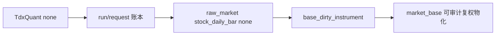

# data 模块 TdxQuant 日更原始事实接入 raw/base 账本章程

日期：`2026-04-10`
状态：`生效中`

## 问题

卡 `18` 已形成阶段性裁决：

1. `.day` 本地直读不适合作为唯一每日主路径。
2. 官方 `TdxQuant` 更接近“每日联动更新”的日更源头。
3. 但 `TdxQuant(front/back)` 当前不能直接视为正式 `raw_forward / raw_backward`，其结果还受窗口长度影响。

因此下一张实现卡不应再研究“如何继续每天导三份 `txt`”，而应研究：

`怎么把 TdxQuant 的日更原始事实正式接进现有 raw/base 账本机制`

这里的关键词是：

1. `日更原始事实`
2. `正式接入`
3. `现有 raw/base 账本机制`

这意味着卡 `19` 的目标不是推翻卡 `17`，也不是跳过 `raw_market` 直接给下游喂官方 DataFrame，而是把官方日更事实接到已有的 run ledger、dirty queue、incremental build 与断点续跑框架里。

## 设计输入

1. `docs/01-design/modules/data/01-tdx-offline-raw-and-market-base-bridge-charter-20260410.md`
2. `docs/01-design/modules/data/02-raw-base-strong-checkpoint-and-dirty-materialization-charter-20260410.md`
3. `docs/01-design/modules/data/03-daily-raw-base-fq-incremental-update-source-selection-charter-20260410.md`
4. `docs/02-spec/modules/data/01-tdx-offline-raw-and-market-base-bridge-spec-20260410.md`
5. `docs/02-spec/modules/data/02-raw-base-strong-checkpoint-and-dirty-materialization-spec-20260410.md`
6. `docs/02-spec/modules/data/03-daily-raw-base-fq-incremental-update-source-selection-spec-20260410.md`
7. `docs/03-execution/17-raw-base-strong-checkpoint-and-dirty-materialization-conclusion-20260410.md`
8. `docs/03-execution/18-daily-raw-base-fq-incremental-update-source-selection-conclusion-20260410.md`

## 裁决

### 裁决一：卡 `19` 只接 TdxQuant 的“日更原始事实”，不直接接官方复权结果

卡 `19` 当前接受的官方输入只应被视为：

1. 官方日更 OHLCV 原始事实
2. 官方基础证券元数据
3. 官方每日是否新增交易日、是否新增标的的同步线索

卡 `19` 明确拒绝把下面两类结果直接写成正式账本真值：

1. `TdxQuant(front)` 直接写成正式 `raw_forward`
2. `TdxQuant(back)` 直接写成正式 `raw_backward`

原因已经由卡 `18` 的专项 probe 固化：

1. `front/back` 当前没有稳定映射到正式 `raw_forward / raw_backward`
2. `back` 还会受 `count / end_time` 窗口影响

### 裁决二：卡 `19` 先做 raw 侧桥接，不在本卡完成 corporate action 总账

卡 `19` 的最小实现目标是：

1. 把 `TdxQuant` 的日更原始事实正式写入 `raw_market`
2. 把这套日更行为纳入正式 run ledger、checkpoint 与失败恢复合同
3. 把日更成功后的 dirty queue 联动接回现有 `base` 机制

卡 `19` 不在本轮顺手完成：

1. 新的 corporate action 总账
2. 基于官方返回直接重建 `forward / backward` 全套正式物化
3. `malf` 或下游模块改造

### 裁决三：现有 `txt -> raw_market -> market_base` 正式入口继续保留

卡 `19` 生效前，卡 `17` 仍是唯一已生效正式入口。

卡 `19` 即使开始实现，也必须按以下定位推进：

1. 现有 `txt` 路线继续作为正式 fallback
2. 新的 `TdxQuant` 路线先作为官方日更源头桥接
3. 后续是否升级为主路径，取决于 bounded pilot 与新结论

### 裁决四：TdxQuant runner 必须有独立的 request/date/instrument 账本语义

卡 `17` 的 `raw_ingest_file` 是文件级账本。

但 `TdxQuant` 不是文件驱动，而是请求驱动，因此卡 `19` 必须显式引入新的 raw 侧语义：

1. `run`
2. `request`
3. `instrument checkpoint`
4. `trade_date coverage`

不能硬把请求式同步伪装成文件式同步。

### 裁决五：官方 universe 不得直接依赖 `get_stock_list(market='0/1/2')`

卡 `18` 已证明 `get_stock_list(market='0'/'1'/'2')` 当前语义异常。

因此卡 `19` 的最小 universe 合同应先基于：

1. 现有正式 `raw_market.stock_file_registry` 已知标的
2. 显式 onboarding 名单
3. 官方可验证的全市场列表入口或后续单独治理后的 universe 服务

在 universe 语义没澄清前，不允许直接把当前 `market='0/1/2'` 返回结果当正式源头。

### 裁决六：TdxQuant runner 必须显式治理策略路径与串行约束

卡 `18` 已证明：

1. `initialize(path)` 的 `path` 更像策略实例标识
2. 同一路径重复初始化会触发 `返回ID小于0`

因此卡 `19` 的正式 runner 必须冻结：

1. 唯一策略路径生成规则
2. 单路径单活跃 run 约束
3. 失败清理与重入规则

不能把这类运行时约束留在 operator 手册里临时处理。

## 预期产出

卡 `19` 的正式产出应至少回答：

1. TdxQuant 日更原始事实进入 `raw_market` 的最小表族与 runner 合同是什么
2. 它如何与现有 `raw_ingest_run / base_dirty_instrument / base_build_run` 共同工作
3. 它的 checkpoint、续跑、bounded replay 与 fallback 如何设计
4. 本轮最小实现是否只覆盖 `adjust_method='none'` 的 raw 事实桥接

## 模块边界

### 范围内

1. `TdxQuant` 日更原始事实到 `raw_market` 的正式桥接
2. TdxQuant runner 的 run/request/checkpoint 合同
3. 与 `base_dirty_instrument` 的正式联动
4. 与现有 `txt` 路线并存时的 fallback 规则

### 范围外

1. 直接让 `TdxQuant(front/back)` 成为正式 `market_base`
2. corporate action 总账
3. universe 服务的完整重做
4. 下游 `malf / structure / filter / alpha` 改造

## 一句话收口

卡 `19` 的任务不是继续喂 `txt`，而是把 `TdxQuant` 的日更原始事实正式接进现有 `raw/base` 账本机制，同时把复权继续留在仓内可审计物化层。

## 流程图

