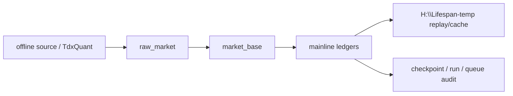

# 主线本地账本标准化设计

日期：`2026-04-13`
状态：`生效中`

## 目标

`data` 已经把官方本地数据口径冻结到 `raw_market -> market_base`。  
后续主线所有永续化本地数据库需要统一按 `data` 模块的账本纪律治理，避免各模块继续各自沉淀临时库、影子库和不可续跑的私有状态。

## 设计裁决

### 1. 五根目录身份继续冻结

1. `H:\Lifespan-data`：正式永续账本
2. `H:\Lifespan-temp`：working DB、迁移中间产物、pytest、smoke、benchmark
3. 仓库内不再长期堆放主线数据库与迁移缓存

### 2. 以 data 标准统一主线账本

主线永续库统一遵守 `data` 已定型的四件事：

1. 稳定实体锚点
2. 一次性批量建仓
3. 每日增量更新
4. checkpoint / dirty queue / replay 续跑

### 3. 标准化分两段实施

#### `39`

完成主线本地库标准化 bootstrap：

1. 盘点现有主线正式库
2. 定义标准库清单与路径口径
3. 设计存量批量迁移方案

#### `40`

完成日常增量同步与断点续跑：

1. 每日增量更新
2. 断点恢复
3. 新鲜度审计

## 约束

1. 不允许把 `alpha / position / trade / system` 的临时 DataFrame 当正式主线输入
2. 不允许把一次性修库脚本冒充正式日更入口
3. 不允许绕过 `data` 的官方价格口径重新定义下游基础事实

## 数据流

