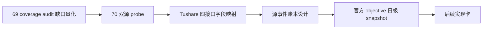

# data 模块历史 objective profile 回补源选型与治理章程
`日期：2026-04-15`
`状态：生效中`

## 问题

`69` 已把 `filter` 的客观可交易性与标的宇宙 gate 冻结为正式上游合同，并新增只读 `objective coverage audit`。真实官方库首轮审计已经证明：

1. `H:\Lifespan-data\filter\filter.duckdb` 中 `filter_snapshot` 现有 `6835` 行全部处于 objective missing。
2. 日期窗口覆盖 `2010-01-04 -> 2026-04-08`。
3. `H:\Lifespan-data\raw\raw_market.duckdb` 当前尚不存在 `raw_tdxquant_instrument_profile` 表。

这说明当前缺口已经不再是 `filter` 合同冻结问题，而是独立的“历史 objective profile 回补 / 覆盖率治理”问题。

同时，当前 `run_tdxquant_daily_raw_sync(...)` 内的 `get_stock_info(code)` 更像“当前观测快照按 `observed_trade_date` 记账”，尚未证明它能回放历史时点的停牌、ST、退市整理、证券类型与市场类型。直接把今天查到的状态回填到历史日期，会破坏历史账本真值语义。

## 设计输入

1. `docs/01-design/modules/data/03-daily-raw-base-fq-incremental-update-source-selection-charter-20260410.md`
2. `docs/01-design/modules/data/04-tdxquant-daily-raw-source-ledger-bridge-charter-20260410.md`
3. `docs/01-design/modules/filter/01-filter-formal-snapshot-charter-20260409.md`
4. `docs/02-spec/modules/filter/01-filter-formal-snapshot-spec-20260409.md`
5. `docs/02-spec/Ω-system-delivery-roadmap-20260409.md`
6. `docs/03-execution/69-filter-objective-tradability-and-universe-gate-freeze-conclusion-20260415.md`
7. `docs/03-execution/evidence/69-filter-objective-tradability-and-universe-gate-freeze-evidence-20260415.md`
8. `docs/03-execution/evidence/70-historical-objective-profile-backfill-source-selection-and-governance-evidence-20260415.md`

## 裁决

### 裁决一：`70` 是 source-selection + 字段映射 + 账本化设计卡，不是正式 backfill runner 卡

本轮先冻结：

1. 候选历史源的真值能力。
2. 候选历史源与正式账本的字段映射。
3. 后续实现卡的表族、批量建仓、增量与 checkpoint 口径。

本轮不直接新增正式回补 runner，也不把任何第三方数据直接写成正式历史真值。

### 裁决二：`Tushare` 暂定为主源，`Baostock` 只保留侧证职责

当前书面裁定：

1. `Tushare stock_basic + suspend_d + stock_st + namechange` 组成主源候选组合。
2. `Baostock` 仅用于 `tradestatus / isST` 的日级交叉验证和审计侧证。
3. `TdxQuant get_stock_info(...)` 仅保留为面向未来的当前观测快照候选，不外推成历史真值源。

### 裁决三：objective 信息必须拆成“源事件账本”和“官方消费快照”两层

后续正式实现优先采用两层结构：

1. `raw_market.tushare_objective_run / request / checkpoint / event`
   - 记录外部源抓取过程、请求窗口、断点、原始归一化事件。
2. `raw_market.raw_tdxquant_instrument_profile`
   - 继续作为 `filter` 的官方 objective 日级消费快照。
   - 虽然表名带 `tdxquant`，但在后续实现卡落地前先视为“官方 objective profile 快照合同”的现役名称，不在 `70` 内改合同名。

这意味着：

1. 外部源抓取不能直接写成下游消费快照。
2. `filter` 不直接依赖 `Tushare` 在线接口。
3. 历史回补和未来日更可以共用一套 normalized objective event 账本。

### 裁决四：四个 `Tushare` 接口的职责边界必须拆开

1. `stock_basic`
   - 承担 universe、`market_type`、`security_type`、`list_status`、`list_date`、`delist_date` 的主数据来源。
2. `suspend_d`
   - 承担 `suspension_status` 的日期事件来源。
3. `stock_st`
   - 承担 `2016-01-01` 之后 `risk_warning_status` 的日级事实来源。
4. `namechange`
   - 承担 `2016-01-01` 之前 `risk_warning_status` 的补齐来源，并作为 `delisting_arrangement` 候选来源之一。

其中 `namechange` 只提供名称区间与变更原因，不是天然干净的状态事实，因此后续实现卡必须先定义：

1. `ST/*ST/SST/撤销ST` 的模式识别规则。
2. 重复行去重规则。
3. `退`、`退市整理` 等名称区间是否足以支撑 `delisting_arrangement` 的最低合同。

### 裁决五：字段映射优先按“历史真值粒度”设计，不按接口原始返回形状设计

后续正式账本必须区分：

1. 低频属性：
   - `instrument_name`
   - `market_type`
   - `security_type`
   - `list_status`
   - `list_date`
   - `delist_date`
2. 时变 objective 状态：
   - `suspension_status`
   - `risk_warning_status`
   - `delisting_arrangement`

因此 `stock_basic` 更适合被规范化为开区间属性事件，`suspend_d / stock_st` 更适合被规范化为交易日事件，`namechange` 更适合被规范化为区间补充事件。

### 裁决六：后续实现卡必须支持“历史批量回补”和“未来日更沉淀”两条路径

最低实现要求：

1. 批量建仓：
   - `stock_basic` 以交易所 / `list_status` 维度批量拉取；
   - `suspend_d / stock_st` 按交易日窗口拉取；
   - `namechange` 按 bootstrap universe 批量标的拉取。
2. 增量更新：
   - `suspend_d / stock_st` 按每日交易日滚动；
   - `stock_basic` 按低频刷新；
   - `namechange` 只对新增标的、状态变化标的或审计异常标的定向刷新。
3. 断点续跑：
   - checkpoint 至少细化到 `source_api + cursor_type(date/instrument/exchange_status) + cursor_value`。

## 预期产出

`70` 的正式产出应至少回答：

1. `Tushare` 四接口各自沉淀到哪个 objective 维度。
2. 后续实现卡的最小表族与自然键是什么。
3. 批量建仓、增量更新、checkpoint / replay 如何分层。
4. `filter` 当前消费合同如何在不改在线依赖的前提下接收历史回补结果。

## 模块边界

### 范围内

1. `Tushare / Baostock` 双源选型。
2. objective 字段分层。
3. `Tushare` 主源字段映射与账本化形态。
4. bounded probe、证据、记录、结论。

### 范围外

1. 正式历史 backfill runner 实现。
2. `filter`、`alpha`、`position` 行为改写。
3. 大规模历史灌库。
4. `raw_market` 生产 schema 真正落库。

## 一句话收口

`70` 的目标不是马上回补历史数据，而是先把 `Tushare` 四接口如何沉淀成“可审计的源事件账本 + 可消费的 objective 日级快照”裁清，再交给下一张实现卡施工。

## 流程图

