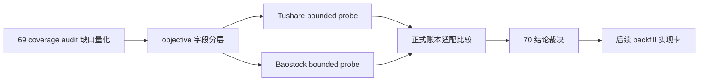

# data 模块历史 objective profile 回补源选型与治理章程

`日期：2026-04-15`
`状态：生效中`

## 问题

`69` 已把 `filter` 的客观可交易性与标的宇宙 gate 冻结为正式上游合同，并新增只读 `objective coverage audit`。真实官方库首轮审计已经证明：

1. `H:\Lifespan-data\filter\filter.duckdb` 中 `filter_snapshot` 现有 `6835` 行全部处于 objective missing。
2. 日期窗口覆盖 `2010-01-04 -> 2026-04-08`。
3. `H:\Lifespan-data\raw\raw_market.duckdb` 当前尚不存在 `raw_tdxquant_instrument_profile` 表。

这说明当前缺口已经不再是 `filter` 合同冻结问题，而是独立的“历史 objective profile 回补 / 覆盖率治理”问题。

同时，当前 `run_tdxquant_daily_raw_sync(...)` 里的 `get_stock_info(code)` 更像“当前观测快照按 `observed_trade_date` 记账”，尚未证明它能回放历史时点的停牌、ST、退市整理等状态。直接把今天查到的状态回填到历史日期，会破坏历史账本真值语义。

## 设计输入

1. `docs/01-design/modules/data/03-daily-raw-base-fq-incremental-update-source-selection-charter-20260410.md`
2. `docs/01-design/modules/data/04-tdxquant-daily-raw-source-ledger-bridge-charter-20260410.md`
3. `docs/01-design/modules/filter/01-filter-formal-snapshot-charter-20260409.md`
4. `docs/02-spec/modules/filter/01-filter-formal-snapshot-spec-20260409.md`
5. `docs/02-spec/Ω-system-delivery-roadmap-20260409.md`
6. `docs/03-execution/69-filter-objective-tradability-and-universe-gate-freeze-conclusion-20260415.md`
7. `docs/03-execution/evidence/69-filter-objective-tradability-and-universe-gate-freeze-evidence-20260415.md`

## 裁决

### 裁决一：`70` 是选型与治理卡，不是正式 backfill runner 卡

本轮先冻结：

1. 候选历史源的真值能力。
2. 候选历史源与正式账本的契约映射。
3. 后续实现卡的边界与风险。

本轮不直接新增正式回补 runner，也不把任何第三方数据直接写成正式历史真值。

### 裁决二：objective 字段必须分层，不得把静态字段和时变状态混成一类

本轮至少区分两类信息：

1. 低频或静态字段：`name / market_type / security_type / list_status / list_date / delist_date` 一类。
2. 时变状态字段：`suspension_status / risk_warning_status / delisting_arrangement` 一类。

如果上游源只能提供“当前快照”而不能提供“历史生效时点”，则它最多只能作为向前增量沉淀的来源，不能直接当作历史回补真值源。

### 裁决三：候选源优先按“历史时点真值能力”排序，不按单次抓取便利性排序

本轮比较维度固定为：

1. 是否有按日期或生效日的历史接口。
2. 是否能覆盖 `2010-01-04 -> 2026-04-08` 最小缺口窗口。
3. 是否能稳定支持 A 股 universe、停复牌、ST、退市整理等正式 gate 字段。
4. 是否能沉淀成可审计、可续跑的正式账本，而不是临时 DataFrame。

### 裁决四：`Tushare` 与 `Baostock` 必须并列做 bounded probe

当前候选源冻结为：

1. `Tushare`
2. `Baostock`

其中：

1. `Tushare` 重点验证 `stock_basic / suspend_d / st` 三类历史接口及权限门槛。
2. `Baostock` 重点验证 `query_all_stock(day)`、`query_stock_basic(...)`、`query_history_k_data_plus(..., tradestatus, isST)` 是否足以承担日级快照或交叉验证职责。

### 裁决五：`TdxQuant get_stock_info(...)` 当前只保留为“向前观测快照候选”，不自动外推成历史真值

在证明其支持历史时点查询前：

1. 不把 `get_stock_info(...)` 当作 `2010-01-04 -> 2026-04-08` 的历史回补真值源。
2. 允许它继续作为未来每日增量沉淀的候选快照源。
3. 历史回补需要另行选源，或采取“事件源 + 日快照物化”的正式方案。

### 裁决六：后续正式实现优先考虑“外部事件账本 -> objective profile 日快照物化”

如果候选源成立，后续实现优先考虑：

1. 先沉淀外部事件账本或日级状态账本。
2. 再统一物化到正式 `objective profile` 日快照。

不直接把各外部源耦合进 `filter` runner。

## 评估维度

1. `历史时点能力`
2. `字段覆盖完整度`
3. `2010 起最小窗口可回补性`
4. `A 股 universe / 停牌 / ST / 退市整理覆盖`
5. `许可证与接入稳定性`
6. `账本化适配度`
7. `checkpoint / replay / 审计适配度`
8. `长期维护成本`

## 模块边界

### 范围内

1. `Tushare / Baostock` 双源选型。
2. objective 字段分层。
3. 正式账本落地方案比较。
4. bounded probe、证据、记录、结论。

### 范围外

1. 正式历史 backfill runner 实现。
2. `filter`、`alpha`、`position` 行为改写。
3. 大规模历史灌库。
4. 生产库 schema 改写。

## 一句话收口

`70` 的目标不是马上回补历史数据，而是先用正式账本标准裁清：`Tushare / Baostock / TdxQuant` 各自能不能提供历史 objective 真值，哪些字段可以回补，哪些字段只能从现在开始积累。

## 流程图

