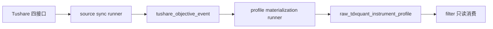

# data 模块 Tushare objective source ledger 与 profile materialization 章程
`日期：2026-04-15`
`状态：生效中`

## 问题

`70` 已经把历史 objective profile 回补的主源、字段映射与账本化形态裁清：

1. `Tushare` 暂定为历史 objective 回补主源，组合路径固定为 `stock_basic + suspend_d + stock_st + namechange`。
2. `Baostock` 只保留 `tradestatus / isST` 的侧证和交叉验证职责。
3. 后续正式实现必须采用“两层账本”结构：
   - `Tushare source ledger`
   - `raw_tdxquant_instrument_profile` 官方消费快照

因此当前问题已经不再是 source probe，而是如何把 `Tushare` 四接口正式接入 `raw_market`，并把归一化后的 objective 事件物化成 `filter` 可只读消费的官方日级 snapshot。

## 设计输入

1. `docs/01-design/modules/data/04-tdxquant-daily-raw-source-ledger-bridge-charter-20260410.md`
2. `docs/01-design/modules/data/07-historical-objective-profile-backfill-source-selection-and-governance-charter-20260415.md`
3. `docs/02-spec/modules/data/04-tdxquant-daily-raw-source-ledger-bridge-spec-20260410.md`
4. `docs/02-spec/modules/data/07-historical-objective-profile-backfill-source-selection-and-governance-spec-20260415.md`
5. `docs/02-spec/modules/filter/01-filter-formal-snapshot-spec-20260409.md`
6. `docs/03-execution/70-historical-objective-profile-backfill-source-selection-and-governance-conclusion-20260415.md`

## 裁决

### 裁决一：`71` 是正式实现卡，不再继续 probe

本卡直接进入：

1. schema / bootstrap
2. bounded source runner
3. bounded materialization runner
4. 单测、readout 与 bounded evidence

本卡不再新增“再观察一下接口能力”的开放项。

### 裁决二：实现拆成“源同步 runner”和“快照物化 runner”两条正式入口

本卡冻结两个正式入口：

1. `scripts/data/run_tushare_objective_source_sync.py`
2. `scripts/data/run_tushare_objective_profile_materialization.py`

### 裁决三：materialization 也必须是 data-grade runner，而不是一段 helper 脚本

由于 `raw_tdxquant_instrument_profile` 是 `filter` 的正式上游，所以 event -> profile 物化必须同时具备：

1. bounded bootstrap
2. 局部重算
3. checkpoint / replay
4. run 级审计读数

不能把它降级成“临时 SQL 脚本”。

### 裁决四：`raw_tdxquant_instrument_profile` 现名继续保留，不在本卡改合同名

虽然实际 source owner 将从“仅 TdxQuant”扩展为“Tushare 历史 + TdxQuant 未来观测”，但 `filter` 当前已经冻结消费表名为 `raw_tdxquant_instrument_profile`。因此：

1. 本卡只扩展表内字段与上游物化来源。
2. 不在本卡改下游消费合同名。
3. 如未来要 source-neutral 改名，必须单开合同升级卡。

### 裁决五：历史批量回补与未来增量沉淀必须共用同一套 objective event 账本

本卡实现的 `tushare_objective_event` 既服务：

1. `2010-01-04 -> 2026-04-08` 的一次性历史回补
2. 后续每日 `suspend_d / stock_st / stock_basic / namechange` 的持续增量沉淀

不能为历史 bootstrap 和未来日更各写一套互不兼容的落表逻辑。

## 预期产出

本卡至少要落下：

1. `Tushare objective source` schema / bootstrap
2. `run_tushare_objective_source_sync(...)`
3. `objective profile materialization` schema / bootstrap
4. `run_tushare_objective_profile_materialization(...)`
5. 单测、bounded smoke、真实 readout 与执行闭环

## 模块边界

### 范围内

1. `src/mlq/data` 下的 source runner / materialization runner / bootstrap
2. `scripts/data` 下的两个正式入口
3. `raw_market` 中本卡表族与 `raw_tdxquant_instrument_profile` 物化
4. `tests/unit/data` 对应单测
5. `71` 的 card/evidence/record/conclusion

### 范围外

1. `filter` 业务逻辑改写
2. `Baostock` 正式入库
3. source-neutral 改表名
4. 更高阶的退市整理语义建模

## 一句话收口

`71` 的任务是把 `Tushare` 四接口正式接进 `raw_market` 历史账本，并把 objective event 物化成 `raw_tdxquant_instrument_profile`，使 `filter` 可以只读消费真实历史 coverage，而不再依赖 probe 结论或在线接口。

## 流程图

