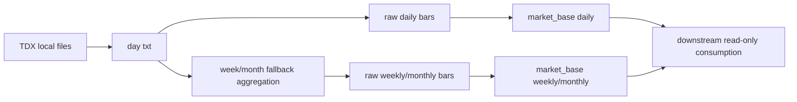

# data 模块 raw/base 周月线正式账本扩展章程
`日期：2026-04-16`
`状态：生效中`

## 问题

当前 `data` 模块已经正式冻结了：

1. `TDX -> raw_market -> market_base` 两级账本
2. `stock / index / block` 三类资产
3. `none / backward / forward` 三套价格口径
4. `73 / 74` 收口后的全历史补库与分批建仓治理

但正式表族仍然只有日线：

1. `raw_market.{stock,index,block}_daily_bar`
2. `market_base.{stock,index,block}_daily_adjusted`

这与当前系统和用户实际使用习惯不一致：

1. 下游 `malf / structure / filter / alpha` 已经正式消费 `D / W / M` 多周期语义。
2. 本地离线目录已经预留 `stock-week / stock-month / index-week / index-month / block-week / block-month`。
3. 个人交易观察需要在 `day / week / month` 三个级别上以统一账本口径查看标的，而不是继续依赖运行时临时重采样。

同时，本机真实离线目录还暴露出一个现实约束：

1. `*-week / *-month` 目录目前为空。
2. 只有 `*-day` 下存在正式 txt 文件。

因此本卡不是简单“多加几个表名”，而是要正式冻结一个多周期 data 合同：  
日线继续按原始 txt 入账；周线、月线在缺少直接 txt 源时，允许以本地日线 txt 为唯一输入做确定性聚合，并把结果正式沉淀进 `raw/base` 历史账本。

## 设计输入

1. `docs/01-design/modules/data/01-tdx-offline-raw-and-market-base-bridge-charter-20260410.md`
2. `docs/01-design/modules/data/02-raw-base-strong-checkpoint-and-dirty-materialization-charter-20260410.md`
3. `docs/01-design/modules/data/05-index-block-raw-base-incremental-bridge-charter-20260410.md`
4. `docs/01-design/modules/data/06-mainline-local-ledger-standardization-charter-20260413.md`
5. `docs/02-spec/modules/data/01-tdx-offline-raw-and-market-base-bridge-spec-20260410.md`
6. `docs/02-spec/modules/data/02-raw-base-strong-checkpoint-and-dirty-materialization-spec-20260410.md`
7. `docs/02-spec/modules/data/05-index-block-raw-base-incremental-bridge-spec-20260410.md`
8. `docs/02-spec/modules/data/06-mainline-local-ledger-standardization-spec-20260413.md`
9. `docs/03-execution/73-market-base-backward-full-history-backfill-conclusion-20260416.md`
10. `docs/03-execution/74-market-base-batched-bootstrap-governance-conclusion-20260416.md`

## 裁决

### 裁决一：正式 data 合同提升为 `asset_type + timeframe + adjust_method`

自 `75` 起，`raw/base` 的正式最小通用维度不再只有 `asset_type + adjust_method`，而是：

`asset_type + timeframe + adjust_method`

其中：

1. `asset_type in {stock, index, block}`
2. `timeframe in {day, week, month}`
3. `adjust_method in {none, backward, forward}`

### 裁决二：不改现有日线表名语义，周月线新增独立表族

不把周线、月线偷偷塞进现有 `*_daily_*` 表中。  
正式表族扩成：

1. `raw_market.{asset}_daily_bar`
2. `raw_market.{asset}_weekly_bar`
3. `raw_market.{asset}_monthly_bar`
4. `market_base.{asset}_daily_adjusted`
5. `market_base.{asset}_weekly_adjusted`
6. `market_base.{asset}_monthly_adjusted`

这样保留现有日线下游兼容性，也让周/月具备清晰边界。

### 裁决三：`file_registry / dirty_queue / run_audit` 保持共享表，但必须显式记录 `timeframe`

以下共享账本不再只按 `asset_type` 区分，必须新增 `timeframe` 字段：

1. `raw_ingest_run / raw_ingest_file`
2. `stock/index/block_file_registry`
3. `base_dirty_instrument`
4. `base_build_run / base_build_scope / base_build_action`

原因：

1. 周/月与日线需要共享同一套治理入口。
2. 脏标的不能再只按 `code + adjust_method` 挂账，否则 `week` 重建会误伤 `day`。
3. 分批建仓 summary 必须能清楚区分 `day/week/month`。

### 裁决四：周/月 raw ingest 优先读直接源；若直接源缺失，则允许从本地日线 txt 做确定性聚合

`timeframe='week' | 'month'` 的 raw ingest 合同冻结为：

1. 先尝试读取 `{asset_type}-week|month/AdjustedFolder`
2. 如果目录存在且有 txt，则直接按对应 txt 入账
3. 如果目录缺失或为空，则回退读取 `{asset_type}-day/AdjustedFolder`
4. 用本地日线 txt 做确定性周/月聚合，再写入对应 `raw_market.{asset}_{weekly/monthly}_bar`

该回退只改变文件发现与聚合方式，不改变正式业务实体锚点。

### 裁决五：周/月聚合规则必须客观、稳定、可复算

从日线聚合周/月时，正式规则冻结为：

1. `open = 周/月首个交易日 open`
2. `high = 周/月窗口内 high 最大值`
3. `low = 周/月窗口内 low 最小值`
4. `close = 周/月最后一个交易日 close`
5. `volume = 周/月窗口内 volume 求和`
6. `amount = 周/月窗口内 amount 求和`
7. `trade_date = 周/月窗口内最后一个真实交易日`

不允许把 `trade_date` 伪造成自然周末或自然月末非交易日。

### 裁决六：正式 CLI 继续沿用现有两条入口，只增加 `--timeframe`

本卡不再新开一套脚本。正式入口仍是：

1. `scripts/data/run_tdx_asset_raw_ingest.py`
2. `scripts/data/run_market_base_build.py`

但两者都必须新增：

`--timeframe {day,week,month}`

并与 `--batch-size` 组合使用，优先服务个人 PC 分批建仓。

## 预期产出

1. `raw/base` 周/月新表族与 schema bootstrap
2. 带 `timeframe` 的共享审计/dirty queue 合同
3. 支持 `--timeframe` 的 raw ingest / market_base build / batched bootstrap
4. 周/月 direct-source 与 daily-fallback 两条路径单测
5. 正式库周线、月线真实落表证据

## 模块边界

### 范围内

1. `src/mlq/data` 的 bootstrap / runner / scope / materialization / shared contract
2. `scripts/data/run_tdx_asset_raw_ingest.py`
3. `scripts/data/run_market_base_build.py`
4. `tests/unit/data` 周/月路径单测
5. `75` 的 card / evidence / record / conclusion

### 范围外

1. `malf / structure / filter / alpha` 的消费逻辑改写
2. 新增 `trade/system` 多周期消费合同
3. 把周/月回写成独立 live 数据源
4. 重命名既有日线表族

## 一句话收口

`75` 的任务是把 `data` 模块正式提升为 `asset_type + timeframe + adjust_method` 的通用 raw/base 账本入口，在不破坏日线正式合同的前提下，把周线、月线也沉淀进官方 DuckDB 历史账本。

## 流程图

