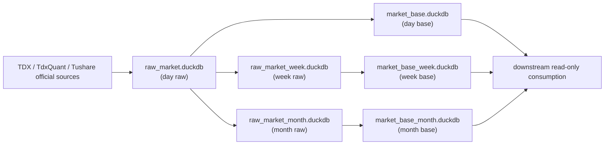

# data 模块 raw/base 日周月分库迁移章程
`日期：2026-04-17`
`状态：草案`

## 问题

`75` 已把 `raw/base` 扩到 `day / week / month` 三个 timeframes，并允许在周月直连源缺失时从本地日线 `txt` 回退聚合。这个口径在 schema 和 bounded runner 层面能工作，但在真实本地库上暴露出两个结构性问题：

1. 周月线和日线共用同一个 `raw_market.duckdb / market_base.duckdb`，而 DuckDB 在单 writer、长事务和大 staging 下会把整库锁住。
2. `H:\tdx_offline_Data` 当前只有 `stock-day / index-day / block-day` 的日线源文件，没有任何 `*-week / *-month` 目录；因此 stock 周月回补实际上是在反复重扫 `5509` 个日线 `txt`，而不是消费真正的周月原始源。

截至 `2026-04-17` 的真实官方库事实是：

1. `raw_market.stock_weekly_bar(backward)` 只有 `5186` 个 code，而 `stock_file_registry(timeframe='week', adjust_method='backward')` 已登记 `5192` 个 code。
2. `raw_market.stock_monthly_bar(backward)` 为 `0` 行。
3. `market_base.stock_weekly_adjusted(backward)` 为 `0` 行。
4. `market_base.stock_monthly_adjusted(backward)` 为 `0` 行。
5. `base_dirty_instrument` 中 `stock + week + backward + pending = 5186`，说明 stock 周线 raw 已挂了大量脏标的，但 base 根本没有物化完成。
6. `index / block` 的周月 raw/base 已完整落表，问题集中在 `stock` 的规模与路径选择上。

因此当前阻塞已经不再是“有没有 week/month 表族”，而是“单库多 timeframe + 从 txt 重扫 week/month”这条执行路径不适合作为长期官方方案。

## 设计输入

1. [01-tdx-offline-raw-and-market-base-bridge-charter-20260410.md](/h:/lifespan-0.01/docs/01-design/modules/data/01-tdx-offline-raw-and-market-base-bridge-charter-20260410.md)
2. [02-raw-base-strong-checkpoint-and-dirty-materialization-charter-20260410.md](/h:/lifespan-0.01/docs/01-design/modules/data/02-raw-base-strong-checkpoint-and-dirty-materialization-charter-20260410.md)
3. [05-index-block-raw-base-incremental-bridge-charter-20260410.md](/h:/lifespan-0.01/docs/01-design/modules/data/05-index-block-raw-base-incremental-bridge-charter-20260410.md)
4. [09-raw-base-weekly-monthly-timeframe-ledger-bootstrap-charter-20260416.md](/h:/lifespan-0.01/docs/01-design/modules/data/09-raw-base-weekly-monthly-timeframe-ledger-bootstrap-charter-20260416.md)
5. [74-market-base-batched-bootstrap-governance-conclusion-20260416.md](/h:/lifespan-0.01/docs/03-execution/74-market-base-batched-bootstrap-governance-conclusion-20260416.md)
6. [75-raw-base-weekly-monthly-timeframe-ledger-bootstrap-conclusion-20260416.md](/h:/lifespan-0.01/docs/03-execution/75-raw-base-weekly-monthly-timeframe-ledger-bootstrap-conclusion-20260416.md)

## 裁决

### 裁决一：官方路径从“单库多 timeframe”切到“日周月分库”

自 `76` 起，`raw/base` 的官方库形态调整为：

1. `H:\Lifespan-data\raw\raw_market.duckdb`
   - 继续作为 `day raw` 官方库
2. `H:\Lifespan-data\raw\raw_market_week.duckdb`
   - 新增 `week raw` 官方库
3. `H:\Lifespan-data\raw\raw_market_month.duckdb`
   - 新增 `month raw` 官方库
4. `H:\Lifespan-data\base\market_base.duckdb`
   - 继续作为 `day base` 官方库
5. `H:\Lifespan-data\base\market_base_week.duckdb`
   - 新增 `week base` 官方库
6. `H:\Lifespan-data\base\market_base_month.duckdb`
   - 新增 `month base` 官方库

也就是说，现有 `raw_market.duckdb / market_base.duckdb` 不废弃，但角色收窄为 `day` 官方库。

### 裁决二：week/month 不再从 TDX txt 直接建库，而是从官方 day 库派生

`76` 明确废止 `75` 中“week/month 缺源时回退日线 txt 重扫”的长期官方执行口径。新的长期路径是：

1. `day raw`
   - 继续只从 TDX / TdxQuant / Tushare 官方源写入
2. `week raw`
   - 只读消费 `day raw` 的日线官方事实，按稳定聚合规则物化
3. `month raw`
   - 只读消费 `day raw` 的日线官方事实，按稳定聚合规则物化
4. `week base`
   - 只读消费 `week raw`
5. `month base`
   - 只读消费 `month raw`

这样 day 的日更不再和 week/month 的大批量历史回补争同一个物理库锁。

### 裁决三：objective / profile / 日更原始源事实全部留在 day raw 库

以下表族不分摊到 week/month raw 库，而是继续留在 `raw_market.duckdb`：

1. `raw_tdxquant_run / request / instrument_checkpoint / instrument_profile`
2. `tushare_objective_run / request / checkpoint / event`
3. `objective_profile_materialization_run / checkpoint / run_profile`

原因是这些账本是“日级或事件级原始事实”，不是周月 timeframe 的派生价量账本。

### 裁决四：day raw 继续保留 file-backed ingest 语义，week/month raw 改为 day-derived materialization 语义

`day raw` 仍保留：

1. `raw_ingest_run`
2. `raw_ingest_file`
3. `{asset}_file_registry`

`week/month raw` 不再伪装成“文件 ingest”，而要引入独立的 day-derived materialization 审计表族，例如：

1. `raw_timeframe_build_run`
2. `raw_timeframe_build_scope`
3. `raw_timeframe_checkpoint`

这样可以避免把 `source_path / file_registry` 强行套在并不存在的周月源文件上。

### 裁决五：迁移采用“先并行建新库，后清理旧表”的双轨收口

迁移顺序冻结为：

1. 冻结当前单库周月方案
   - 不再继续追加旧单库 week/month 的正式回补
2. 在新 week/month 库中重建 raw/base
3. 用计数、日期范围、code 覆盖和 spot-check 验证新库
4. 验证通过后，才删除旧 `raw_market.duckdb / market_base.duckdb` 里的周月表和周月数据

不允许先删旧表再开始建新库。

## 预期产出

1. `paths.py / bootstrap / runner` 的日周月分库路径契约
2. `day raw -> week/month raw` 的新 materialization runner
3. `week/month raw -> week/month base` 的新物化链路
4. 旧单库周月表的迁移校验与删除脚本
5. 执行证据：
   - 新六库建成
   - stock week/month 全历史落库
   - 旧 day 库里的周月表已清除

## 模块边界

### 范围内

1. `src/mlq/core/paths.py`
2. `src/mlq/data/bootstrap.py`
3. `src/mlq/data/data_raw_*`
4. `src/mlq/data/data_market_base_*`
5. `scripts/data/*`
6. `tests/unit/data/*`
7. `76` 对应设计/规格/执行文档

### 范围外

1. `malf / structure / filter / alpha` 的消费逻辑调整
2. `trade / system` 恢复卡组推进
3. 把 objective/profile 再拆成额外独立数据库

## 一句话收口

`76` 的设计目标不是继续把单库周月回补“调快一点”，而是把 `data` 模块的官方 price ledger 从“单库多 timeframe”重构成“day 保持日更、week/month 独立派生”的六库分时框。

## 流程图

