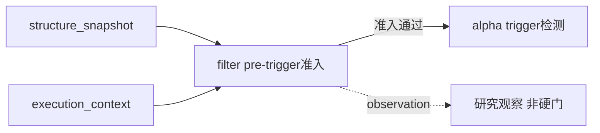

# filter 模块经验冻结

日期：`2026-04-09`
状态：`生效中`

## 当前职责

- 消费 `structure + execution_context`
- 回答“在这些事实已经成立以后，是否允许进入 trigger 检测”
- 作为正式准入层，而不是研究性杂项收纳箱

## 必守边界

1. `filter` 只做 pre-trigger 准入，不做 trigger 判定。
2. `filter` 不负责 position / trade 风险门控。
3. `filter` 的正式输出必须能被 `alpha` 优先消费，而不是回退到旧兼容字段。

## 已验证坑点

1. 如果不把 `filter` 与 `structure` 分开，结构事实和准入裁决会持续串味。
2. 把过多研究观察直接升成硬门，会把正式主链卡死。
3. 缺少独立 `filter` 账本时，下游很难做冻结、复查和 selective rebuild。

## 新系统施工前提

1. 先保留最小、无争议的正式硬门，其余条件先降级成 observation。
2. `filter_snapshot` 应采用历史账本语义，不再只当 run 临时产物。
3. 所有新增过滤条件都必须先说明它是“正式准入”还是“研究观察”。

## 来源

1. 老系统 `alpha 03` filter admission 边界冻结设计
2. 老系统 `malf 31 / 32` 的 filter 分层与最小硬门重置章程

## 流程图

