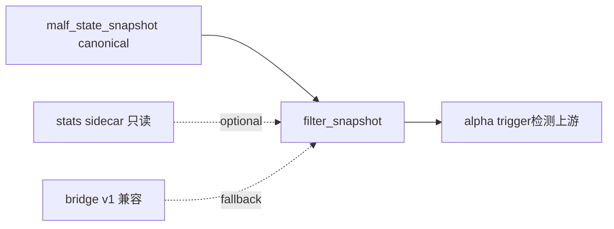

# filter 正式 snapshot 设计章程

日期：`2026-04-09`
状态：`生效中`

> 角色声明：本文定义 `filter` 的 pre-trigger 准入职责，不把 `malf` 的纯语义核心重新扩写成上下文或动作系统。
> 当前 runner 若仍需回读 bridge v1 兼容上下文，只代表过渡实现；长期正式方向是 `structure_snapshot + 下游只读 context/stats sidecar`。
> `pivot-confirmed break` 与 `same-timeframe stats sidecar` 若被消费，也必须按 `docs/01-design/modules/malf/04-malf-mechanism-layer-break-confirmation-and-same-timeframe-stats-sidecar-charter-20260411.md` 作为只读机制层解释。

## 问题

老仓已经明确过：`filter` 不是 `PAS`，也不是 `position / trade` 风险门。它的正式职责是 pre-trigger 准入。但新仓到目前为止还没有独立的 `filter` 官方出口，导致：

1. `alpha` 还只能直接吃 `malf` 兼容上下文或临时准入字段。
2. `structure` 已经被定义为独立模块，却没有对应的正式下游准入层。
3. 后续继续补 `alpha` 内部家族表时，仍容易把 `filter` 逻辑错误塞回 `alpha` 或 `PAS`。

## 设计输入

1. `docs/01-design/modules/filter/00-filter-module-lessons-20260409.md`
2. `docs/01-design/modules/structure/00-structure-module-lessons-20260409.md`
3. `docs/01-design/modules/structure/01-structure-formal-snapshot-charter-20260409.md`
4. `G:\MarketLifespan-Quant\docs\01-design\modules\alpha\03-alpha-filter-admission-layer-extraction-and-boundary-freeze-20260405.md`
5. `G:\MarketLifespan-Quant\docs\01-design\modules\malf\31-malf-filter-layer-and-downstream-structure-consumption-charter-20260407.md`
6. `docs/03-execution/10-alpha-formal-signal-contract-and-producer-conclusion-20260409.md`

## 裁决

### 裁决一：`filter` 只回答“是否允许进入 trigger 检测”

`filter` 的官方身份固定为：

1. 消费 `structure_snapshot + 下游只读 context/stats sidecar`。
   - 当前实现若仍需桥接 `malf bridge v1` 兼容上下文，也只允许作为过渡输入，不得再表述成 `malf core`。
2. 形成 pre-trigger 准入结论。
3. 不替代 trigger 检测，不替代 position/trade 风险门，不替代 system admission。

### 裁决二：本轮先冻结最小官方准入出口

本轮只先冻结最小正式输出：

1. `filter_run`
2. `filter_snapshot`
3. `filter_run_snapshot`

`filter_snapshot` 只回答最小准入问题，不试图一次性容纳全部研究观察。

### 裁决三：正式硬门优先最小、无争议、可复查

当前最小正式准入字段固定只回答：

1. `trigger_admissible`
2. `primary_blocking_condition`
3. `blocking_conditions_json`
4. `admission_notes`

其余争议较大的研究观察先降级为 observation，不直接升格为正式硬门。

### 裁决四：`alpha` 后续必须优先消费官方 `filter_snapshot`

新仓正式方向固定为：

1. `structure` 负责沉淀结构事实。
2. `filter` 负责给出 pre-trigger 准入。
3. `alpha` 优先消费 `filter_snapshot`，而不是继续默认回读旧 `scene / phenomenon` 兼容字段。

## 模块边界

### 范围内

1. `filter` 的正式身份
2. 最小 `filter_snapshot` 官方输出
3. `filter -> alpha` 的正式消费优先级

### 范围外

1. `PAS` detector 细节重写
2. `position / trade` 风险门合同
3. `system` 总装 readout

## 一句话收口

`filter` 下一步不是继续寄生在旧兼容上下文里，而是先成为独立、最小、可复查的 pre-trigger 官方准入层；任何 context/stats 都只能以下游 sidecar 或 bridge v1 兼容输入身份出现，不能回写成 `malf core`。

## 流程图

## `62` 补充口径

1. `trigger_admissible` 的正式含义收窄为 pre-trigger gate 是否放行，不再承载结构性 hard verdict。
2. `structure_progress_failed / reversal_stage_pending` 当前只允许沉淀为 `admission_notes` 或既有 risk sidecar，不得再写成 `primary_blocking_condition`。
3. `filter` 只负责 gate + note/risk；`alpha formal signal` 的最终 blocked/admitted authority 不在本设计文档内前置给 `filter`。

