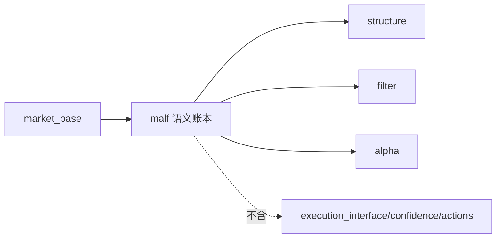

# malf 模块经验冻结

日期：`2026-04-09`
状态：`生效中`

> 角色声明：本文是 `malf legacy lessons`，用于保留老系统经验、坑点与来源线索。
> 它不是当前 `malf core` 的正式定义，也不是当前 bridge runner 的字段合同。
> 当前 `malf core` 请读 `03-malf-pure-semantic-structure-ledger-charter-20260411.md`；
> 当前 bridge v1 请读 `01-market-base-to-malf-minimal-snapshot-bridge-charter-20260410.md`。

## 当前职责

- 提供结构、execution context、filter、pas_context 等市场语义
- 负责回答“当时市场处在什么语义场景里”
- 为下游提供可复用的市场语义事实层

## 必守边界

1. 纵深语义层不能跳层，生命周期与上下文层要清楚分开。
2. 完整性和 freshness 必须分开判断。
3. `malf` 是市场语义层，不是所有事实的最终上游。

## 已验证坑点

1. DuckDB 校验损坏是真风险，一张表坏就可能挡住整条 official refresh。
2. 修完坏表不等于库已追平，下游仍可能整体落后。
3. 增量 planner 只看 source signature、不看 downstream freshness，会造成漏刷。

## 新系统施工前提

1. 明确哪些表是长期语义事实，哪些只是运行审计或增量治理产物。
2. 后续 retrofit 继续服从“正式事实按自然键，续跑与审计按 run 元数据”。
3. `malf` 不得反向卡死 `alpha` 的历史 trigger 候选池。

## 来源

1. 老系统总表 `battle-tested-lessons-all-modules-and-mainline-bridging-20260408.md`
2. 老系统 `malf` 的 structure / filter 分层章程

## 流程图

