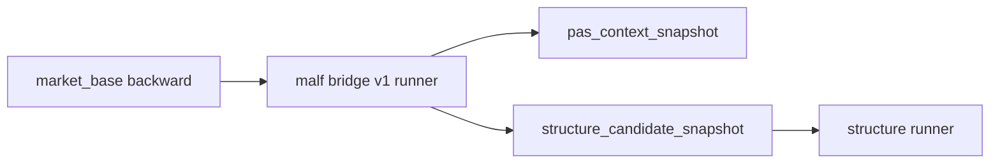

# malf 模块 market_base 到最小语义 snapshot 桥接章程

日期：`2026-04-10`
状态：`生效中`

> 角色声明：本文是 `malf bridge v1` 的设计章程，用于冻结当前 `scripts/malf/run_malf_snapshot_build.py`
> 与 `pas_context_snapshot / structure_candidate_snapshot` 的最小桥接合同。
> 它不是当前 `malf core` 的终局定义。
> 当前 `malf core` 请读 `03-malf-pure-semantic-structure-ledger-charter-20260411.md`；
> 老经验来源请读 `00-malf-module-lessons-20260409.md`。

## 问题

当前新仓 `structure` 虽然已经存在正式 runner，但它依赖的官方上游：

1. `pas_context_snapshot`
2. `structure_candidate_snapshot`

还没有由正式 `data / market_base` 真实物化出来。现有 `malf` 只有样例级数据，不能代表官方主线已经成立。

## 设计输入

1. `docs/01-design/modules/malf/00-malf-module-lessons-20260409.md`
2. `docs/01-design/modules/data/01-tdx-offline-raw-and-market-base-bridge-charter-20260410.md`
3. `docs/01-design/modules/structure/01-structure-formal-snapshot-charter-20260409.md`
4. `docs/02-spec/modules/structure/01-structure-formal-snapshot-spec-20260409.md`

## 裁决

### 裁决一：本轮 `malf` 只回答 `structure` 必需的最小上游

本轮不追求一次性恢复旧系统全部 `malf` 语义，只先建立两类正式输出：

1. `pas_context_snapshot`
2. `structure_candidate_snapshot`

收口标准不是“语义足够复杂”，而是“`structure` 能稳定消费”。

### 裁决二：`malf` 只允许消费官方 `market_base.stock_daily_adjusted`

本轮 `malf` 的正式价格输入固定为：

`market_base.stock_daily_adjusted`

并固定默认使用 `adjust_method = backward`。

不允许：

1. 直接回读离线文本
2. 直接读取 `raw_market`
3. 为了方便 smoke 而走旧兼容脚本

### 裁决三：信号语义固定建立在后复权价格上

本轮 `malf` 对外冻结的结构语义、上下文语义、候选语义，全部建立在 `backward` 价格之上。

原因不是交易执行，而是：

1. 结构与生命周期判断需要连续价格序列
2. 除权除息不应把历史趋势切断
3. `structure / filter / alpha` 需要共享一套稳定的上游语义口径

### 裁决四：执行价格回到 `none`，但不由 `malf` 负责

`malf` 只负责语义，不负责交易股数与执行定价。

当前冻结下游分工为：

1. `malf -> structure -> filter -> alpha` 使用 `backward`
2. `position -> trade` 使用 `none`

也就是说，`malf` 不需要为了照顾执行而改用未复权价；执行层应在自身 bounded runner 中显式切换到 `none`。

### 裁决五：最小语义允许由滚动日线规则派生

本轮允许采用明确、可复算、可增量的滚动日线规则先冻结最小语义：

1. `pas_context_snapshot`
   - 回答当前处于 `BULL_MAINSTREAM / BEAR_MAINSTREAM / RANGE_BALANCED / RECOVERY_MAINSTREAM` 中的哪一类。
2. `structure_candidate_snapshot`
   - 回答当前是否出现 `new_high / new_low / failed_extreme` 一类最小结构候选事实。

只要字段合同稳定、算法可复算、下游能消费，就接受先以最小规则站稳官方桥接。

## 模块边界

### 范围内

1. `market_base.stock_daily_adjusted(backward)` 到 `pas_context_snapshot`
2. `market_base.stock_daily_adjusted(backward)` 到 `structure_candidate_snapshot`
3. `malf` 最小 runner 与脚本入口
4. 与现有 `structure` runner 的正式对接

### 范围外

1. 旧 `malf` 全量事件家族
2. PAS 全量 detector 上游
3. `filter / alpha` 私有解释层扩写
4. 执行定价逻辑

## 一句话收口

`malf` 当前不是先恢复旧系统全量语义，而是先把官方 `market_base(backward)` 稳定翻译成 `structure` 真能消费的最小语义层，同时把“信号后复权、执行不复权”的边界冻结清楚。

## 流程图

