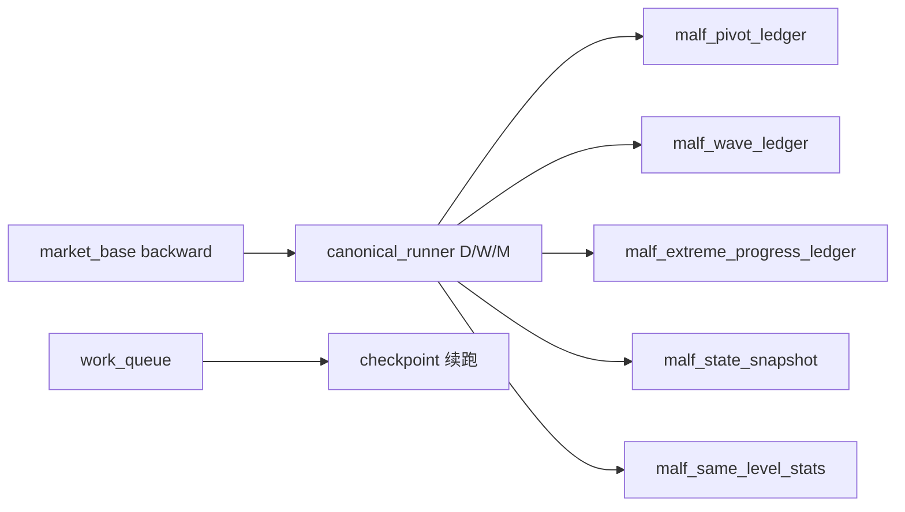

# malf canonical ledger and data-grade runner bootstrap 设计

卡号：`30`
日期：`2026-04-11`
状态：`待施工`

## 目标

把 `29` 冻结的 `malf canonical v2` 语义真正落地成：

1. 正式 DuckDB 账本
2. 正式 bounded runner
3. 正式 queue / checkpoint / replay / resume
4. 一次性批量建仓 + 每日增量更新能力

## 交付范围

### 1. 正式表族

- `malf_canonical_run`
- `malf_canonical_work_queue`
- `malf_canonical_checkpoint`
- `malf_pivot_ledger`
- `malf_wave_ledger`
- `malf_extreme_progress_ledger`
- `malf_state_snapshot`
- `malf_same_level_stats`

### 2. 正式 runner

新增 canonical bounded runner：

- 从官方 `market_base` 读入 `price bar`
- 以 `code + timeframe` 为处理 scope
- 支持 `D / W / M` 各自独立运行
- 支持 replay / resume

### 3. 正式脚本

新增 canonical script，供本卡及后续卡调用。  
旧 `bridge-v1` 入口在 `31` 完成前仅保留兼容用途，不再代表正式 `malf` 真值。

## 设计原则

### 1. 先 canonical，再 downstream

本卡只把 canonical `malf` 自身做实，不在本卡里完成 `structure / filter / alpha` 改绑。

### 2. scope 级增量，而不是全库全量

`malf` 要向 `data-grade` 对齐，但不要求每次全库重算。  
增量处理的最小 scope 冻结为：

- `asset_type + code + timeframe`

### 3. checkpoint 必须保留确认尾巴

`pivot` 需要确认窗口，因此 checkpoint 不能只记最后处理日期；必须保留一个未确认尾巴，以支持增量续跑时的重放。

### 4. bridge-v1 暂存，不混真值

`bridge-v1` 可以继续留作兼容，但 canonical `malf` 的正式表、正式 runner、正式验证必须独立，不允许把旧表继续当真值。

## 非目标

本卡不做：

- `31` 的 downstream rebind
- `32` 的主链 truthfulness revalidation
- alpha / trade / system 的策略与执行逻辑

## 历史账本约束

- 实体锚点：`asset_type + code + timeframe`
- 业务自然键：
  - pivot：`asset_type + code + timeframe + pivot_bar_dt + pivot_type`
  - wave：`asset_type + code + timeframe + wave_id`
  - extreme：`asset_type + code + timeframe + wave_id + extreme_seq`
  - snapshot：`asset_type + code + timeframe + asof_bar_dt`
- 批量建仓：按 `code + timeframe` 全历史回放生成 canonical 表
- 增量更新：仅对 dirty scope 重放确认尾巴之后的数据
- 断点续跑：依赖 `work_queue + checkpoint`
- 审计账本：`malf_canonical_run` 与执行文档

## 流程图

