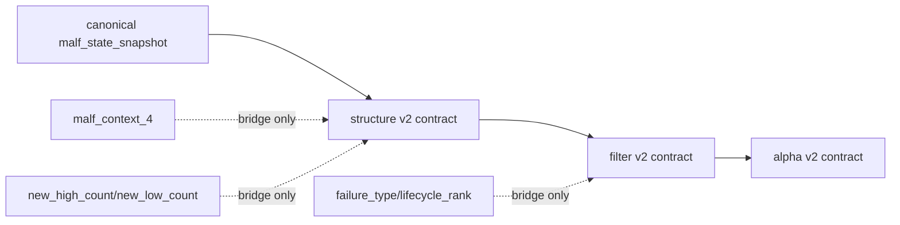

# malf downstream canonical contract purge 设计宪章

日期：`2026-04-11`
状态：`待执行`

## 背景

canonical `malf` 已经成为正式真值上游，但 `structure / filter / alpha` 的正式合同仍大量沿用 `malf_context_4 / new_high_count / failure_type / lifecycle_rank_*` 这类 bridge-era 语义壳。结果是“换了真值源”，却没有把下游正式语言切换到 canonical `malf`。

## 设计目标

1. 让 `structure / filter / alpha` 的正式输入语言直接建立在 canonical `malf` 字段上。
2. 把旧字段壳降级为兼容桥或派生字段，不再作为正式主合同。
3. 为后续多级别消费、寿命 sidecar 和 data-grade 增量对齐清出干净接口。

## 非目标

1. 本卡不引入新的 `malf core` 原语。
2. 本卡不直接实现 `W/M` 消费。
3. 本卡不直接实现寿命概率 sidecar。
4. 本卡不把交易动作逻辑写回 `malf`。

## 设计图

## 核心裁决

1. `structure` 正式合同必须以 `major_state / trend_direction / reversal_stage / wave_id / current_hh_count / current_ll_count` 为主输入。
2. `filter` 正式合同必须把 canonical `malf` 的 `break/stats/stage` 字段升级为正式可消费输入，而不是仅作备注提示。
3. `alpha` 正式上下文必须从 `filter/structure` 的 canonical 字段透传，不再以 `malf_context_4 / lifecycle_rank_*` 作为正式真值。
4. 旧字段壳仅允许保留为兼容桥、审计桥或只读派生视图，不得继续主导 `structure/filter/alpha` 的正式判断。
