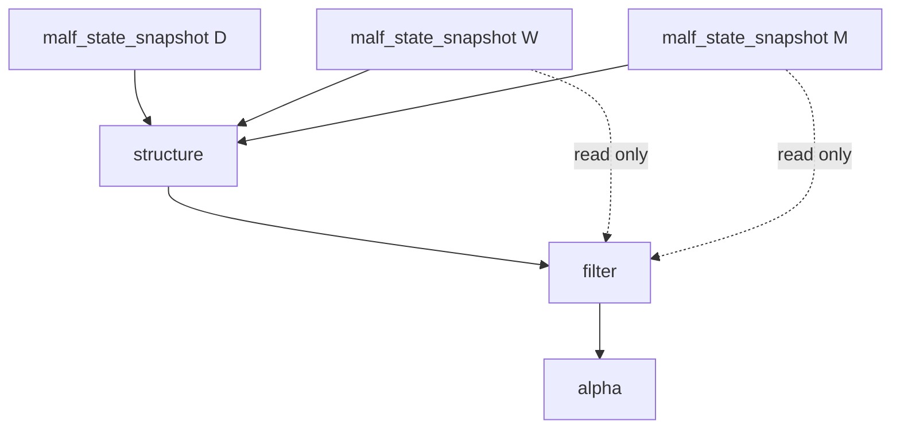

# malf multi-timeframe downstream consumption 设计宪章

日期：`2026-04-11`
状态：`待执行`

## 背景

canonical `malf` 已经独立物化 `D / W / M`，但当前下游正式主链仍默认只消费 `timeframe='D'`。这会让 `malf` 的多级别结构真值停留在账本层，无法成为真正的下游运转中心。

## 设计目标

1. 冻结 `W/M` 作为下游只读 canonical context 的正式消费边界。
2. 明确 `D` 主执行级别与 `W/M` 只读背景级别之间的关系。
3. 确保高周期 context 只读消费，不反向参与 `malf core` 计算。

## 非目标

1. 本卡不重写 `malf core` 状态机。
2. 本卡不允许高周期 context 回写 `state / wave / break / count`。
3. 本卡不直接输出交易动作建议。

## 设计图

## 核心裁决

1. `D` 仍是当前主执行级别。
2. `W/M` 只允许以 canonical read-only context 进入 `structure / filter / alpha`。
3. `W/M` 只回答背景，不替代 `D` 的结构判断。
4. 任意多级别消费都必须显式记录来源级别与 `source_context_nk`。
