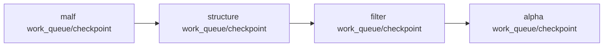

# downstream data-grade checkpoint alignment after malf 设计宪章

日期：`2026-04-11`
状态：`待执行`

## 背景

当前 canonical `malf` 已具备 `work_queue + checkpoint + tail replay`，但 `structure / filter / alpha` 仍主要停留在 bounded materialization。这样整链并没有围绕 `malf` 的 dirty/replay 边界做增量运转。

## 设计目标

1. 让 `structure / filter / alpha` 具备与 canonical `malf` 相协调的 queue/checkpoint/replay 机制。
2. 让下游增量范围服从 `malf` 的 source advanced 与 tail replay 边界。
3. 把“`malf` 是语义中心”推进成“`malf` 也是下游增量调度中心”。

## 非目标

1. 本卡不实现 live orchestration。
2. 本卡不重写 `trade/system`。
3. 本卡不把 queue/checkpoint 反写成 `malf core` 语义字段。

## 设计图

## 核心裁决

1. `structure / filter / alpha` 必须声明各自稳定实体锚点、业务自然键、checkpoint 与审计账本。
2. 下游续跑边界必须服从 canonical `malf` 的 source replay/tail replay。
3. bounded 全窗口重跑只能作为 bootstrap 或显式补跑，不再作为默认每日运行口径。
