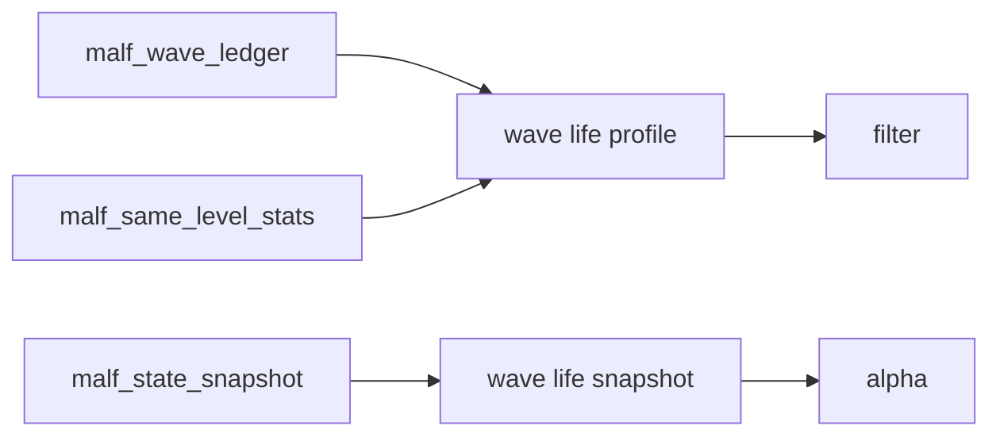

# malf wave life probability sidecar 设计宪章

日期：`2026-04-11`
状态：`待执行`

## 背景

canonical `malf` 已经正式沉淀 `malf_wave_ledger / malf_state_snapshot / malf_same_level_stats`，能够回答“历史波段实际活了多久”，但还不能稳定回答“当前活跃波段位于寿命分布的哪个位置、历史上类似波段通常还能活多久、终止风险是否抬升”。

## 设计目标

1. 在不污染 `malf core` 的前提下增补 `wave life probability` 只读 sidecar。
2. 对活跃波段形成寿命快照，对已完成波段形成寿命 profile。
3. 为 `filter / alpha` 提供寿命分位与终止风险输入。

## 非目标

1. 本卡不改写 `malf core` 原语。
2. 本卡不直接给出交易动作建议。
3. 本卡不把寿命概率反写回 `state / wave / break / count`。

## 设计图

## 核心裁决

1. `wave life probability` 只允许作为 canonical `malf` 的只读 sidecar。
2. 活跃 wave 与已完成 wave 必须分开建模。
3. 输出至少覆盖寿命分位、剩余寿命估计与终止风险分桶。
