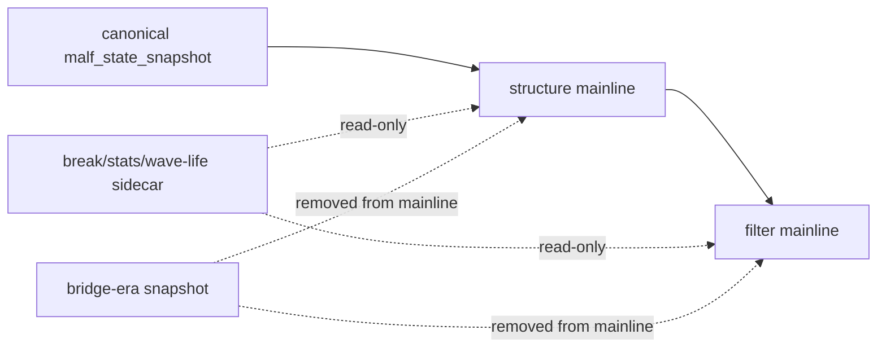

# structure filter 主线旧版 malf 语义清理设计

日期：`2026-04-13`
状态：`生效中`

## 目标

`31/33/35/36` 已把 `structure / filter / alpha` 的默认上游改绑到 canonical `malf`，但主线代码里仍残留 bridge-era 的旧读取分支、旧语义映射与旧测试夹具。  
本设计冻结新的正式边界：

1. `structure / filter` 主线 runner 只接受 canonical `malf` 语义。
2. bridge-era `pas_context_snapshot / structure_candidate_snapshot` 不再属于主线可执行路径。
3. 兼容字段与 sidecar 只能作为只读透传或审计线索，不得继续影响主判断。

## 问题

当前残留的风险不在文档口径，而在实现细节：

1. `structure` 仍保留 bridge input/context loader 与 `malf_context_4 -> major_state` 的旧映射逻辑。
2. `tests/unit/structure` 与部分 `system` 测试仍直接构造 `pas_context_snapshot / structure_candidate_snapshot` 作为主线夹具。
3. `filter` 虽默认消费 canonical `structure_snapshot + malf_state_snapshot`，但主线上游的结构体检尚未把“旧语义不可再触发”冻结为正式制度。

## 设计裁决

### 1. 主线只保留 canonical 读法

`run_structure_snapshot_build` 与 `run_filter_snapshot_build` 的主线契约固定为：

1. `structure` 只读取 canonical `malf_state_snapshot`
2. `filter` 只读取官方 `structure_snapshot` 与 canonical `malf_state_snapshot`
3. `source_*_table` 参数只允许在 canonical 官方表族内切换，不再接受 bridge-era 表名

### 2. 旧语义退出主线

下列旧能力不再属于主线代码路径：

1. `pas_context_snapshot`
2. `structure_candidate_snapshot`
3. `malf_context_4 -> major_state` 映射
4. `lifecycle_rank_*` 驱动 `structure / filter` 主判断

这些内容若仍需保留，只允许留在：

1. `malf snapshot / mechanism` 的兼容输出
2. 历史证据或兼容回放脚本
3. 不接入主线 runner 的只读测试夹具

### 3. sidecar 仍保留只读身份

以下输入仍允许存在，但身份固定为只读 sidecar：

1. `pivot_confirmed_break_ledger`
2. `same_timeframe_stats_snapshot`
3. `malf_wave_life_snapshot / profile`

它们可以：

1. 附加提示
2. 参与下游观察字段
3. 形成审计线索

它们不可以：

1. 反向改写 `major_state / trend_direction / reversal_stage`
2. 充当 `filter` 的硬主判定真值
3. 重新定义 `malf core`

## 模块边界

### `structure`

职责固定为：

1. 把 canonical `malf` 的 `D` 级结构语义沉淀为官方 `structure_snapshot`
2. 只读挂接 `W / M` 上下文与 sidecar
3. 不解释 `alpha / position / trade`

### `filter`

职责固定为：

1. 基于官方 `structure_snapshot` 做 pre-trigger admission
2. 只读感知 canonical `malf` 上下文是否存在
3. 不重新解释 bridge-era `malf`

## 施工顺序

1. 先清理 `structure` 的 bridge loader、旧语义映射与测试夹具
2. 再清理 `filter` 的主线兼容入口与测试夹具
3. 最后做 `structure -> filter -> alpha` 主线 truthfulness revalidation

## 结构图

