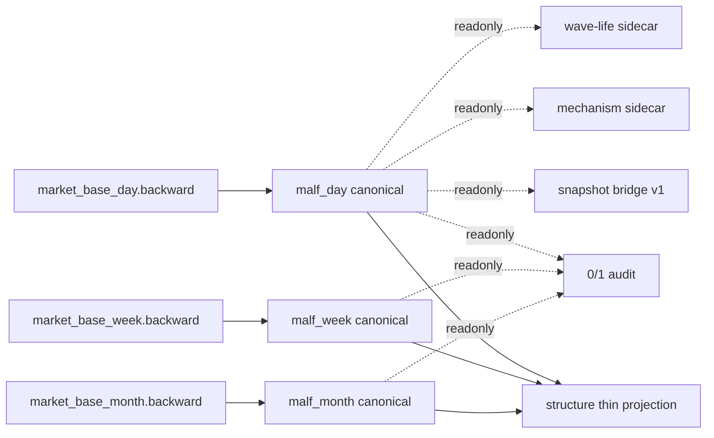

# malf 最新权威设计与实现锚点章程

`日期`：`2026-04-19`
`状态`：`生效中`

## 目的

`malf` 目录下已经积累了 `01-14` 多张分段章程，但这些文档分别冻结 bridge、canonical、mechanism、wave-life 与 downstream purge 等切片，缺少一份“当前最新、最完整、单点可指向”的权威总设计。

本章程补齐这一缺口，并明确：

1. 本文档是当前 `malf` 的单点权威设计锚点。
2. `01-14` 继续保留为历史切片与来路，不再单独承担“当前全貌”职责。
3. 当前正式实现必须以本文档 + 对应规格文档为准。

## 当前 `malf` 的单点权威定义

当前正式 `malf` 不是单一 runner，也不是单 `duckdb`。它是由一个真值层和多个只读侧层组成的时间级别原生账本系统：

1. canonical truth
   - `malf_day`
   - `malf_week`
   - `malf_month`
2. legacy bridge
   - `scripts/malf/run_malf_snapshot_build.py`
   - 只保留 bridge v1 兼容输出职责
3. readonly sidecar
   - `scripts/malf/run_malf_mechanism_build.py`
   - `scripts/malf/run_malf_wave_life_build.py`
   - `scripts/malf/run_malf_zero_one_wave_audit.py`

只有 canonical truth 持有 `malf` 主语义。bridge、mechanism、wave-life 与 `0/1` audit 都不得反写 canonical 结构语义。

## 核心裁决

### 1. `malf` 的职责

`malf` 只负责把官方 `market_base` 价格事实沉淀为本级别结构语义账本：

- `HH`
- `HL`
- `LL`
- `LH`
- `break`
- `count`

它不负责：

- 高周期背景标签
- pre-trigger admission
- formal signal 裁决
- 仓位建议
- 交易动作

### 2. `malf` 的正式输入

`malf` 只允许消费官方 `market_base` 的 timeframe native backward 价格：

- `malf_day <- market_base_day.stock_daily_adjusted(adjust_method='backward')`
- `malf_week <- market_base_week.stock_weekly_adjusted(adjust_method='backward')`
- `malf_month <- market_base_month.stock_monthly_adjusted(adjust_method='backward')`

`W/M` 不再允许从 `day` 内部重采样充当默认生产路径。

### 3. `malf` 的正式输出

每个 timeframe native 库都固定承载同一组 canonical 表族：

- `malf_canonical_run`
- `malf_canonical_work_queue`
- `malf_canonical_checkpoint`
- `malf_pivot_ledger`
- `malf_wave_ledger`
- `malf_extreme_progress_ledger`
- `malf_state_snapshot`
- `malf_same_level_stats`

### 4. `malf` 的状态边界

当前正式 `major_state` 仍限定在：

- `牛顺`
- `牛逆`
- `熊顺`
- `熊逆`

其中 `牛逆 / 熊逆` 只表示旧顺结构失效后、到新顺结构确认前的本级别过渡状态，不得被解释成跨级别背景标签。

### 5. `0/1 wave` 的治理边界

`0/1 wave` 现在已经被证明是 canonical truth 层的系统性事实，而不是下游噪声。

当前正式裁决是：

1. canonical `malf_wave_ledger / malf_state_snapshot` 继续保留原始短 wave 事实。
2. 如果要过滤，只能在只读派生层处理，不能静默改写 canonical truth。
3. `scripts/malf/run_malf_zero_one_wave_audit.py` 是 `0/1` 问题的统一只读审计基线。
4. 任何 `canonical_materialization` 行为改写、消费合同调整或三库重建，都必须保留同口径的变更前/后对照。

## 正式分层

## 实现锚点

当前正式实现锚点固定为：

- canonical build：
  - `scripts/malf/run_malf_canonical_build.py`
  - `src/mlq/malf/canonical_runner.py`
  - `src/mlq/malf/canonical_source.py`
  - `src/mlq/malf/canonical_materialization.py`
- bootstrap / path：
  - `src/mlq/malf/bootstrap.py`
  - `src/mlq/core/paths.py`
- bridge：
  - `scripts/malf/run_malf_snapshot_build.py`
  - `src/mlq/malf/runner.py`
- mechanism：
  - `scripts/malf/run_malf_mechanism_build.py`
  - `src/mlq/malf/mechanism_runner.py`
- wave life：
  - `scripts/malf/run_malf_wave_life_build.py`
  - `src/mlq/malf/wave_life_runner.py`
- zero/one audit：
  - `scripts/malf/run_malf_zero_one_wave_audit.py`
  - `src/mlq/malf/zero_one_wave_audit.py`

## 历史账本原则

`malf` 必须继续服从历史账本约束：

1. 实体锚点：`asset_type + code`
2. 业务自然键：`asset_type + code + timeframe + bar_dt`，以及 `wave_id / pivot_nk / snapshot_nk`
3. 批量建仓：`malf_day / week / month` 必须支持独立 full coverage 建仓
4. 增量更新：三库各自维护 `work_queue / checkpoint`
5. 断点续跑：任何 timeframe 中断后都必须只靠对应库继续恢复
6. 审计账本：`run / checkpoint / summary_json` 必须齐全

## 对下游的唯一口径

当前 `malf` 对下游的正式口径是：

1. `structure` 只能消费 canonical `malf_state_snapshot`
2. `filter` 只能把 `malf` 当结构上下文，不得重新定义 `malf`
3. `alpha` 只能在 canonical truth 与只读 sidecar 之上做终审，不得回推 `malf`

## 与旧文档的关系

`01-14` 的地位调整如下：

1. 它们继续有效，但只表示某个切片的冻结事实。
2. 当它们与本文档冲突时，以本文档为当前总设计。
3. 当需要精确表结构、字段、CLI 或 rebuild 合同时，再读对应规格文档。

## 当前权威阅读顺序

1. `docs/03-execution/91-malf-timeframe-native-base-source-rebind-conclusion-20260418.md`
2. 本文档
3. `docs/02-spec/modules/malf/15-malf-authoritative-timeframe-native-ledger-spec-20260419.md`
4. `docs/03-execution/80-malf-zero-one-wave-filter-boundary-freeze-conclusion-20260418.md`
5. `docs/03-execution/92-structure-thin-projection-and-day-binding-card-20260418.md`
