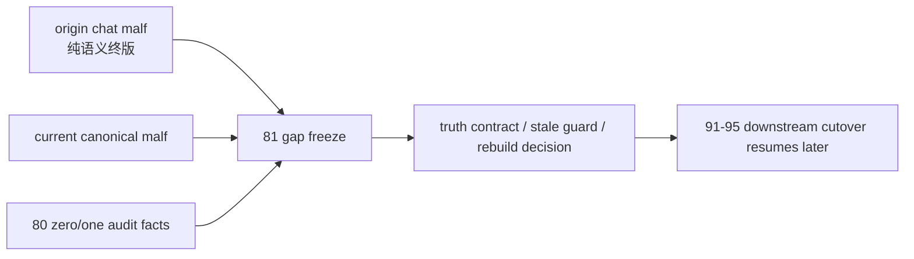

# malf 原始对话语义回溯与当前真值偏差冻结章程

`日期`：`2026-04-19`
`状态`：`待执行`

## 背景

`malf` 在本仓并不是先从代码长出来的，而是先在一段长对话里逐步成型：

1. 最早版本把 `malf` 设想成“多级别极值推进账本 + 执行账本接口”。
2. 随后经过持续减法，`malf` 被收缩成“纯结构语义 + 纯记账逻辑”。
3. 最终被明确为：
   - 只从 `price bar` 出发
   - 只使用 `HH / HL / LL / LH / break / count`
   - 各 timeframe 独立运行
   - `break` 只表示旧结构失效，不等于新结构成立
   - 转折必须经历 `trigger -> 未确认 -> 新 HH/LL 确认`

这段对话里的语义演化，必须明确区分成两层，而不是混成一句“聊天里成型的 malf”：

### 第一层：早期重型 `malf`

这版的显著特征是：

1. `malf = 多级别极值推进账本 + 执行账本接口`
2. 保留：
   - `bar_ledger`
   - `pivot_ledger`
   - `wave_ledger`
   - `extreme_progress_ledger`
   - `state_snapshot`
   - `same_level_stats`
   - `execution_interface`
3. 明确写出：
   - 月 / 周 / 日联动
   - `filter` 消费 higher timeframe context
   - `alpha` 消费 `execution_interface`
4. `push_count / pullback_count` 仍在正式字段中

### 第二层：最终纯语义 `malf`

这版是持续减法后的终版，显著特征是：

1. `malf` 不再承担 execution interface
2. 高周期 `context` 不再参与结构计算
3. `structure` 不看 context，`filter` 才看 context，而且 context 最终还可以继续降级为系统外只读信息
4. `HH/LL` 负责推进，`HL/LH` 负责守成，`break` 负责触发旧结构失效
5. `break` 不等于新结构成立，必须等待新的 `HH / LL` 推进确认
6. 最终一句话定义收缩为：
   - 价格形成极值
   - 极值构成结构
   - 结构通过回摆被守护
   - 通过突破被破坏
   - 通过连续极值推进而延续

当前仓库里的 `malf` 已经吸收了其中一部分减法结论：

1. execution interface 已移出 `malf`
2. 高周期 context 已移出 `malf core`
3. same-timeframe stats 已降级为只读 sidecar
4. canonical truth 已切成 `malf_day / malf_week / malf_month`

但前面的 `0/1 wave` 审计又说明：当前 canonical truth 并不等于那套聊天语义已经被忠实实现。

## 核心判断

必须先把一句话钉死：

当前系统 `malf` 与聊天里最终收敛出的“纯语义 malf”不是世界观相反，而是主轴相同、真值实现存在重大偏差。

更具体地说：

1. 架构方向上，两者没有巨大分裂。
2. 真值忠实度上，两者存在重大缺口。

这两个判断必须同时成立，不能只说其一。

## 统计触发事实

`80` 的只读审计已经给出不能回避的事实：

1. 完成短 wave 总数：`16,992,169`
2. `same_bar_double_switch`：`243,757`
3. `stale_guard_trigger`：`14,085,407`
4. `next_bar_reflip`：`2,663,005`

分级别看：

1. `D`：`14,192,751`
2. `W`：`2,421,809`
3. `M`：`377,609`

这说明当前 canonical `malf` 存在两个不能再模糊带过的问题：

1. `break / trigger / confirm` 并未被稳定记成聊天里那套纯语义过程。
2. stale guard 的长期复用正在系统性放大短 wave。

## 这张设计章程要解决什么

本章程不是再讲一遍 `malf` 是什么，而是冻结三件更难的事：

1. 聊天里成型的 `malf`，哪一版才算原始权威语义。
2. 当前系统 `malf` 到底继承了哪些、背离了哪些。
3. 彻底解决 `malf` 时，应该优先修“世界观”，还是优先修“truthfulness”。

## 原始语义锚点

本章程正式裁决：

聊天里最早那个“多级别极值推进账本 + 执行账本接口”的版本，保留为 `malf` 的历史来路，但不再作为当前 `malf` 的直接权威目标。

当前真正要对齐的原始语义锚点，是聊天中最后收敛出来的“纯语义版 malf”：

1. `malf` 只负责结构事实
2. execution / decision 不属于 `malf`
3. context 不参与结构计算
4. `break` 只表示旧结构失效
5. 新顺结构必须靠新的 `HH / LL` 推进确认

换句话说：

1. 当前系统不需要再向早期重型 `malf` 回退
2. 当前系统需要向最终纯语义 `malf` 靠拢，并补齐 truthfulness

## 现行系统与原始语义的关系

### 1. 已经继承到位的部分

1. `malf` 已从 execution 接口中退场
2. `malf` 已切成 `D/W/M` 三个独立世界
3. 同级别统计已被压成只读 sidecar
4. 高周期 context 已不再回写 `malf core`
5. `filter / alpha` 才持有更强的决策解释权，而不是 `malf`

### 2. 尚未忠实实现的部分

1. `break` 与“新结构确认”在账本里没有被明确分层
2. `trigger / hold / expand` 只部分存在，且没有成为正式 truth contract
3. `0/1 wave` 说明大量波段在“旧结构失效”与“新结构成立”之间被错误地记成完成 wave
4. stale guard 长期复用说明当前转折门槛并不等于“最近有效结构门槛”
5. “我主要看 `LL`，同时盯最近那个 `LH`；第一个被突破的 `LH break` 被视为转折门槛”这套直觉，还没有被稳定落成 truth ledger

## 原始对话中必须保留的关键直觉

为了避免 `81` 只剩抽象结论，本章程再把原始对话里必须保留的几条核心直觉钉死：

1. `LL` 管推进，`LH` 管空头结构的最后门槛；`HH` 管推进，`HL` 管多头结构的最后门槛。
2. 日线 `LH` 的 break 可能是假，周月级别更难假，但也不能被提升成“绝不可能假”；真正决定真假的是确认机制，不是级别神话。
3. 所谓转折，必须分成至少两层：
   - 旧结构失效
   - 新结构成立
4. context 最终可以完全退出结构系统，只保留为只读背景，甚至继续下放到系统外解释层。
5. 统计必须是同级别、以 wave 为样本，而不是 bar，更不是跨级别混样本。

## 设计裁决

### 1. 先承认偏差，再决定修法

`81` 必须先把“当前实现和原始语义有多大偏差”冻结清楚，再谈改 `canonical_materialization` 还是重建三库。

### 2. 以最终纯语义版为对齐对象

后续一切 `malf` 修订，都不再回到“execution_interface 放回 malf”那条路上。

### 2.5 当前系统与聊天 `malf` 是否有巨大差异

正式回答必须分层：

1. 如果拿当前系统去对比聊天里的早期重型 `malf`，差异很大，而且这是有意做的减法。
2. 如果拿当前系统去对比聊天里的最终纯语义 `malf`，世界观差异不大，但 truthfulness 差异很大。

这条回答以后必须保持一致，不允许今天说“完全不是一套东西”，明天又说“已经完全一致”。

### 3. `0/1 wave` 是 truthfulness 问题，不是下游消费习惯问题

`0/1` 问题不能再被描述成“structure/filter/alpha 以后自己过滤一下就行”，它首先是 canonical truth 和原始语义之间的偏差。

### 4. `91-95` 暂不继续前推

在 `81` 没把原始语义、现行 truth gap 与修订顺序冻结清楚之前，`92-95` 只能视为已远置的后续 cutover 卡组，不再作为当前最近施工位。

## 后续顺序

`81` 之后的顺序应该是：

1. 冻结 origin-chat 语义与当前偏差矩阵
2. 冻结 `break / invalidation / confirmation` 的正式 truth contract
3. 冻结 stale guard 的治理边界
4. 决定是否重建 `malf_day / malf_week / malf_month`
5. 最后再恢复 `91-95`

## 结构图

