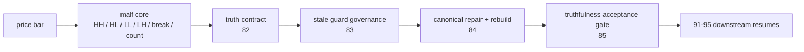
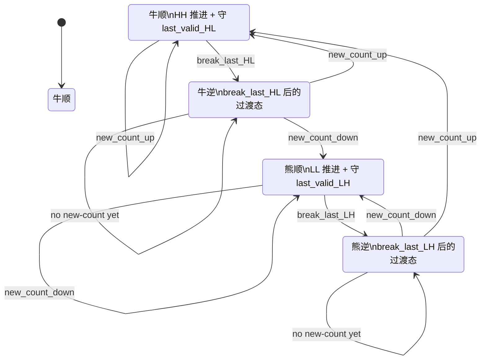
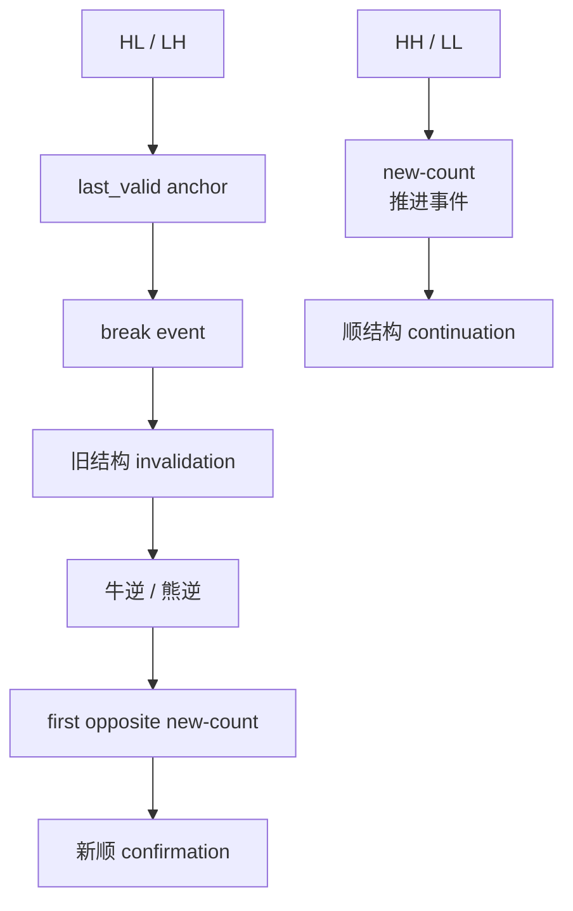
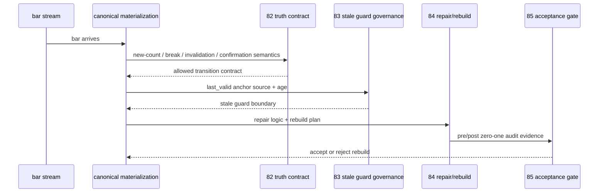

# malf truth contract、stale guard 与 rebuild 治理总设计章程
`日期`：`2026-04-19`
`状态`：`待执行`

适用执行卡：

- `82-malf-break-invalidation-confirmation-contract-freeze-card-20260419.md`
- `83-malf-last-valid-structure-anchor-and-stale-guard-governance-card-20260419.md`
- `84-malf-canonical-materialization-repair-and-three-ledger-rebuild-card-20260419.md`
- `85-malf-post-rebuild-truthfulness-and-audit-acceptance-gate-card-20260419.md`

## 背景

`81` 已经把最核心的判断钉死：

1. 当前系统 `malf` 与 origin-chat 最终收敛出的纯语义 `malf`，主轴同向。
2. 当前 canonical truth 与那套纯语义 `malf` 之间，存在重大 truthfulness 偏差。
3. `0/1 wave` 不是下游消费习惯问题，而是 `canonical_materialization` 自身的账本产物。

`80` 的审计进一步说明，这个偏差不是零星异常，而是系统性问题：

1. `same_bar_double_switch = 243,757`
2. `stale_guard_trigger = 14,085,407`
3. `next_bar_reflip = 2,663,005`
4. `total_short_wave_count = 16,992,169`

因此，`81` 之后不能直接跳回 `91-95`，必须先把 `malf` 自己扳正。

## 设计目标

这组设计只解决四件事：

1. 把 `new-count / break / invalidation / confirmation` 的 truth contract 讲清楚。
2. 把 `last_valid_HL / last_valid_LH` 与 stale guard 的治理边界讲清楚。
3. 在上述合同冻结后，再允许修改 `canonical_materialization` 并决定三库重建。
4. 用正式验收闸门判断 `malf` 是否真的被扳正，而不是靠感觉恢复 `91-95`。

## 核心裁决

### 1. `new-count`、`break` 与 `confirmation` 不是一回事

`malf` 仍然只保留 `HH / HL / LL / LH / break / count` 六个核心原语，但语义必须分层；其中 `count` 不能只作为静态字段，它必须在状态机里显式表现为 `new-count` 事件：

1. `new-count`
   - 只表示当前方向再次创出新的有效 `HH / LL`，并使本 wave 的 `hh_count / ll_count` 增加。
   - 它是趋势继续推进的第一驱动力。
   - 当它发生在过渡态上时，它同时承担“新顺确认”的职责。
2. `break`
   - 只表示旧结构失效门槛被击穿。
3. `invalidation`
   - 是对旧顺结构失效的正式账本解释。
4. `confirmation`
   - 只在新一轮 `HH / LL` 推进被确认后成立。
   - 这个确认在事件层上，必须由“第一笔有效 `new-count`”来承载，而不是靠 `break` 单独完成。

### 2. `last_valid_HL / last_valid_LH` 必须可审计

当前最大的量级问题不是“有没有 guard”，而是“guard 多久不更新、为什么还算有效”没有被正式记账。

后续合同必须强制回答：

1. 这个 `last_valid_HL / last_valid_LH` 从哪来。
2. 它为什么还有效。
3. 它什么时候应该失效。
4. 它被重复使用了多久。

### 3. rebuild 不是先手动作

在 `82` 和 `83` 没有先把 truth contract 与 stale guard 治理边界冻结前，不允许直接改 `canonical_materialization` 或直接重建三库。

### 4. `80` 的审计基线必须保留

后续任何 `canonical_materialization` 改写或三库重建，都必须保留：

1. 变更前 `run_malf_zero_one_wave_audit.py` 基线
2. 变更后同口径对照
3. 前后差异摘要

## 结构边界图

## 终极版共用总图

这张图与 `malf/15` 共用，代表当前 `malf` 的正式最终状态机口径。

## 状态语义图

## 时序图

## 卡组推进图

## 每张卡的职责

### `82`

回答：`new-count` 如何驱动推进，旧结构什么时候算失效，新结构什么时候算成立，中间态如何记账。

### `83`

回答：`last_valid_HL / last_valid_LH` 的来源、生命周期、复用边界和 stale 审计。

### `84`

回答：在 `82-83` 已冻结后，如何修改 `canonical_materialization`、如何重建 `malf_day / malf_week / malf_month`、如何保留前后审计证据。

### `85`

回答：修完以后，什么叫“扳正成功”，以及何时允许恢复 `91-95`。

## 非目标

这份设计不做：

1. 把 `execution_interface` 放回 `malf`
2. 恢复高周期 `context` 参与 `malf core` 计算
3. 提前替 `structure / filter / alpha` 做 cutover 裁决
4. 直接给出 `canonical_materialization` 的代码实现细节
