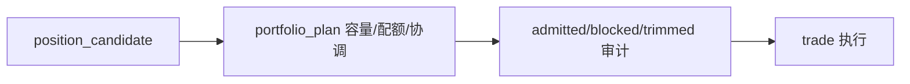

# portfolio_plan 模块经验冻结

日期：`2026-04-09`
状态：`生效中`

## 当前职责

- 负责组合层容量、协同、配额与组合回测
- 把单标的 `position` 计划桥接成组合层计划账本
- 回答“这一批信号放进同一组合后怎么协调”

## 必守边界

1. `portfolio_plan` 不回写 trigger 是否成立。
2. `portfolio_plan` 不替代 `trade` 记录真实成交与持仓事实。
3. 组合级容量与单标的允许仓位要分层，不允许继续混在 `position` 占位字段里。

## 已验证坑点

1. 老系统长期缺少正式组合层，导致很多容量问题只能被挤进 `position` 占位字段。
2. 如果组合容量不落正式账本，下游很难解释某次机会为什么被整体组合挡掉。
3. 只看单标的回测容易高估策略潜力，看不到组合级互相挤占。

## 新系统施工前提

1. 先冻结组合容量、配额、占用与剩余容量的正式词汇。
2. 组合计划账本必须能追溯到来自哪些 `position` 候选。
3. 组合级 blocked / admitted / trimmed 也要保留审计链。

## 来源

1. 由老系统 position / system 主线经验外推形成
2. 新系统对组合层正式模块化的当前裁决

## 流程图

