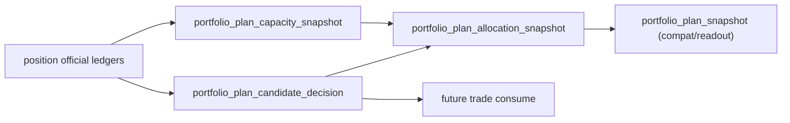

# portfolio_plan 官方账本族与容量裁决设计宪章

日期：`2026-04-13`
状态：`生效中`

## 问题

当前 `portfolio_plan` 只有 `run / snapshot / run_snapshot` 三表最小骨架，足以证明
`position -> portfolio_plan` 桥接成立，但还不足以达到 `data -> malf` 一样的全 A 质量。

现在的缺口不是“有没有组合层”，而是：

1. 组合层还没有冻结稳定的正式实体锚点与业务自然键。
2. `blocked / admitted / trimmed` 仍是最小裁决结果，容量占用、排序理由、配额裁决还不够厚。
3. `portfolio_plan` 还没有成为下游 `trade` 的高质量正式数据支撑点。

## 设计输入

1. [00-portfolio-plan-module-lessons-20260409.md](/H:/lifespan-0.01/docs/01-design/modules/portfolio_plan/00-portfolio-plan-module-lessons-20260409.md)
2. [01-portfolio-plan-minimal-ledger-and-position-bridge-charter-20260409.md](/H:/lifespan-0.01/docs/01-design/modules/portfolio_plan/01-portfolio-plan-minimal-ledger-and-position-bridge-charter-20260409.md)
3. [01-portfolio-plan-minimal-ledger-and-position-bridge-spec-20260409.md](/H:/lifespan-0.01/docs/02-spec/modules/portfolio_plan/01-portfolio-plan-minimal-ledger-and-position-bridge-spec-20260409.md)
4. [03-historical-ledger-shared-contract-charter-20260409.md](/H:/lifespan-0.01/docs/01-design/03-historical-ledger-shared-contract-charter-20260409.md)
5. [Ω-system-delivery-roadmap-20260409.md](/H:/lifespan-0.01/docs/02-spec/Ω-system-delivery-roadmap-20260409.md)

## 设计目标

把 `portfolio_plan` 从“最小组合桥接层”升级为“官方组合裁决账本层”。

它正式回答：

1. 这批 `position` 候选进入同一组合后，谁被 `admitted / blocked / trimmed / deferred`
2. 组合容量、分组预算、单批占用、剩余空间分别是多少
3. 本次组合裁决为什么这样排序，为什么这样裁减

它不回答：

1. `alpha` 是否触发
2. 单标的最多可以做多少
3. 真实成交与持仓如何变化

## 裁决一：`portfolio_plan` 的正式主语义必须从“最小 snapshot”提升为“组合裁决事实族”

当前三表还不够。

正式升级后，`portfolio_plan` 至少要形成下面几类持久化支撑点：

1. `portfolio_plan_candidate_decision`
   记录单候选在组合层的最终裁决。
2. `portfolio_plan_capacity_snapshot`
   记录组合层容量、已用、剩余与约束解释。
3. `portfolio_plan_allocation_snapshot`
   记录组合层最终分配权重与被裁减结果。
4. `portfolio_plan_run / run_snapshot`
   继续承担审计桥接职责。

这意味着 `portfolio_plan_snapshot` 不再是唯一主表，而是最小兼容层或聚合层。

## 裁决二：`portfolio_plan` 的实体锚点与自然键必须明确区分

`portfolio_plan` 不是按 `run_id` 组织业务真值。

正式实体锚点固定为：

`portfolio_id`

在实体锚点之上叠加业务自然键：

1. `candidate_nk + portfolio_id + reference_trade_date + plan_contract_version`
2. `portfolio_id + reference_trade_date + capacity_scope + plan_contract_version`
3. `portfolio_id + allocation_scene + candidate_nk + reference_trade_date + plan_contract_version`

`run_id` 只用于审计，不得再承担组合真值主键职责。

## 裁决三：`portfolio_plan` 只消费官方 `position` 账本，不回读私有过程

正式输入边界继续冻结为：

1. `position_candidate_audit`
2. `position_capacity_snapshot`
3. `position_sizing_snapshot`
4. 后续如新增 `position` 的 entry/exit leg 计划，只允许按正式落表表族只读消费

禁止：

1. 直接回读 `alpha formal signal` 内部过程
2. 回读 `position` 内部临时 DataFrame
3. 把组合裁决逻辑塞回 `position`

## 裁决四：`portfolio_plan` 必须成为 `trade` 之前的正式物化支撑点

后续 `trade` 只能站在官方 `portfolio_plan` 上消费，不再站在“组合临时结果”上运行。

因此 `portfolio_plan` 的账本厚度必须足以支撑：

1. 下游重放时不必重算完整组合裁决
2. 组合层裁减原因可追溯
3. 多次重物化可区分 `inserted / reused / rematerialized`

## 历史账本约束

1. `实体锚点`
   - `portfolio_id`
2. `业务自然键`
   - `candidate_nk + portfolio_id + reference_trade_date + plan_contract_version`
   - `portfolio_id + capacity_scope + reference_trade_date + plan_contract_version`
3. `批量建仓`
   - 允许按 `portfolio_id + reference_trade_date window + instrument slice` 做分批历史建仓
4. `增量更新`
   - 以官方 `position` 脏候选与组合配置变更驱动组合层增量重物化
5. `断点续跑`
   - 后续必须补齐 `work_queue + checkpoint + replay/resume`
6. `审计账本`
   - `portfolio_plan_run / portfolio_plan_run_snapshot / summary_json / freshness audit`

## 图示

