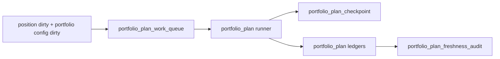

# portfolio_plan data-grade runner 与 freshness 设计宪章

日期：`2026-04-13`
状态：`生效中`

## 问题

当前 `portfolio_plan` 只有 bounded runner。

它可以写正式库，但还缺少：

1. 独立 `work_queue`
2. 独立 `checkpoint`
3. replay/resume
4. freshness audit

这使它仍然低于 `data / malf / structure / filter / alpha` 的 data-grade 标准。

## 目标

把 `portfolio_plan` runner 升级成组合层 data-grade runner。

正式目标：

1. 能分批建历史组合账本
2. 能按日增量同步
3. 中断后能从 queue/checkpoint 恢复
4. 能输出 freshness audit

## 设计裁决

### 裁决一：`portfolio_plan` 的 dirty 单元不能继续完全依赖上游隐式传播

正式 dirty 单元冻结为：

1. `portfolio_id + candidate_nk + reference_trade_date`
2. `portfolio_id + capacity_scope + reference_trade_date`

上游 `position` 可以触发 dirty，但组合层必须有自己的 queue 账本。

### 裁决二：批量建仓必须允许大数据量分片回放

考虑到组合层会逐步变厚，必须支持：

1. `portfolio_id` 分片
2. 日期窗口分片
3. 候选切片分片

不能要求全历史每次重算。

### 裁决三：freshness audit 不能缺位

如果 `portfolio_plan` 将来要作为 `trade` 的正式上游，那么它也必须像 `data` 一样有自己的 freshness 读数。

## 历史账本约束

1. `实体锚点`
   - `portfolio_id`
2. `业务自然键`
   - `portfolio_id + candidate_nk + reference_trade_date`
   - `portfolio_id + capacity_scope + reference_trade_date`
3. `批量建仓`
   - 支持 `portfolio_id / date window / candidate slice`
4. `增量更新`
   - position dirty 与组合配置变更共同驱动
5. `断点续跑`
   - `work_queue + checkpoint + replay/resume`
6. `审计账本`
   - `run / run_snapshot / freshness_audit`

## 图示

