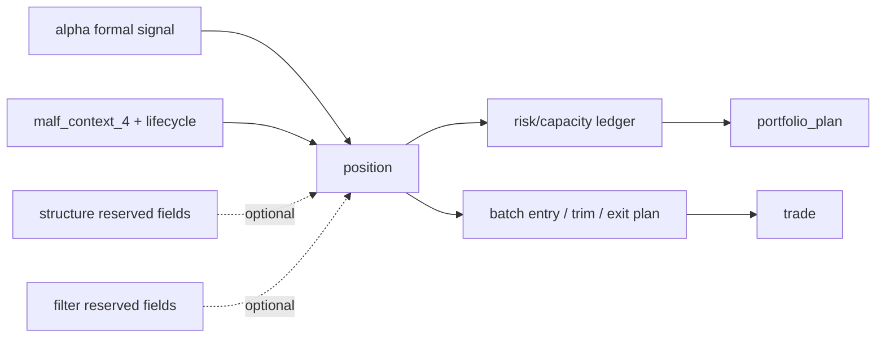

# position MALF 驱动分批仓位管理宪章

`生效日期`：`2026-04-13`
`状态`：`Active`

## 1. 目标

`position` 必须从“消费 alpha formal signal 的最小 bounded materialization”提升为主线正式仓位管理模块。

它的正式职责是：

1. 只消费官方 `alpha formal signal` 与官方执行口径价格事实。
2. 把“当前最多能做多少、需要分几批做、需要如何减仓”显式沉淀为 `position` 历史账本事实。
3. 为下游 `portfolio_plan / trade` 提供风险门控，而不是替代 `trade` 做成交与撮合。

## 2. 不可突破的边界

1. 不直接搬运 `EmotionQuant-gamma` 或 `MarketLifespan-Quant` 的旧代码，只允许继承被验证过的原则、失败教训和边界定义。
2. 不随意改写当前系统既有的 `t+0 / t+1 / t+2 ...` 时间语义；`position` 只能把这些时间语义参数化、显式化，不能私自重定义。
3. `position` 只生成“仓位计划事实”，不生成真实 `SELL/BUY` 订单，不替代 `trade` 的 runtime。
4. `position` 必须以 `malf` 新语义为主，不再以旧 broker 风控 overlay 为主导。
5. `structure / filter` 只作为只读辅助输入或预留接口，不允许在 `position` 内反向夹带 `alpha / trade / system` 逻辑。

## 3. 对旧系统只继承什么

从 `EmotionQuant-gamma` positioning campaign 中，只继承这些结论：

1. `FIXED_NOTIONAL_CONTROL` 只适合作为 operating baseline，不代表最终全部仓位控制逻辑。
2. `SINGLE_LOT_CONTROL` 只适合作为 floor sanity，不代表正式主逻辑。
3. risk budget、single-name cap、portfolio cap 必须拆开落事实，不能只藏在公式里。
4. partial-exit 必须先定义计划腿，再由下游执行，不能在上游把“减仓计划”偷换成“即时成交”。
5. `fixed_ratio / williams_fixed_risk / fixed_volatility` 等家族仍留在研究层，不直接晋升为主线默认控制。

## 4. MALF 驱动的新正式方向

`position` 的正式驱动应来自 `malf_context_4 + lifecycle`，而不是旧式统一资金分配。

主线目标是：

1. `BULL_MAINSTREAM` 支持中线波段中的主升浪持仓与分批加仓。
2. `BULL_COUNTERTREND` 支持回撤中的保守试探与分批确认。
3. `BEAR_COUNTERTREND` 只允许探针级别仓位，不允许扩张成主仓。
4. `BEAR_MAINSTREAM` 禁止新增 long，只允许维持、减仓或退出计划。

这里的核心不是“一次下多少”，而是：

1. 当前上下文允许的最大暴露上限。
2. 当前生命周期阶段允许的分批节奏。
3. 现有持仓与新增计划之间的 trim / hold / add / exit 路径。

## 5. position 必须沉淀的正式事实

`position` 不能只写一个 `target_weight`，而应沉淀至少四层事实：

1. `candidate audit`
   - 此信号是否允许进入仓位决策。
2. `risk budget / capacity decomposition`
   - 上下文上限、单标的上限、组合上限、剩余容量、最终允许权重。
3. `entry sizing / batch plan`
   - 本次是首批、加仓、维持还是禁止；每一批的目标权重与目标股数。
4. `exit / trim plan`
   - 当前是否需要减仓、分批减仓、保护性退出或终局清仓。

## 6. 与现有主线的契约

## 7. 历史账本约束

1. `实体锚点`
   - 单标的仓位事实默认是 `asset_type + code`。
   - 若进入计划腿，计划腿锚点应是 `candidate_nk + leg_role + schedule_stage`。
2. `业务自然键`
   - `position` 不得以 `run_id` 充当主语义；`run_id` 只做审计。
3. `批量建仓`
   - 必须说明如何从正式 `alpha formal signal` 一次性回灌 position 全量事实。
4. `增量更新`
   - 必须说明 alpha signal、market_base 参考价、context contract 变化时如何增量重算。
5. `断点续跑`
   - 必须具备 `work_queue + checkpoint + replay/resume`。
6. `审计账本`
   - 必须显式记录 `run / queue / checkpoint / snapshot / plan / acceptance`。

## 8. 后续卡片绑定

本宪章约束以下卡片：

1. `47-position-malf-context-driven-sizing-and-batch-contract-card-20260413.md`
2. `48-position-risk-budget-and-capacity-ledger-hardening-card-20260413.md`
3. `49-position-batched-entry-trim-and-partial-exit-contract-card-20260413.md`

