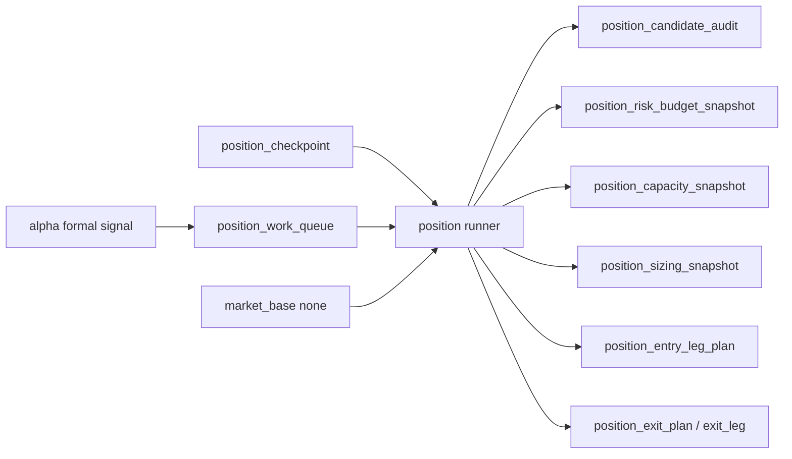

# position data-grade ledger 与 runner 宪章

`生效日期`：`2026-04-13`
`状态`：`Active`

## 1. 目标

`position` 要达到与 `data -> malf -> structure -> filter -> alpha` 同级的施工质量，不能停留在 bounded materialization。

因此必须补齐：

1. 稳定自然键
2. 官方本地 ledger
3. `work_queue + checkpoint + replay/resume`
4. rematerialize 传播
5. real-data smoke 与 acceptance

## 2. 为什么现状不够

当前 `position` 的不足是：

1. 有 `run`，但没有正式 `work_queue / checkpoint`。
2. 有最小 DDL，但没有完整的 data-grade 增量续跑语义。
3. 有 candidate/capacity/sizing snapshot，但缺少 risk budget、批次计划与增量重算合同。
4. 仍以 bounded helper 为主，还未成为主线历史账本 runner。

## 3. 正式 runner 的边界

`position` data-grade runner 只允许：

1. 读取官方 `alpha formal signal`
2. 读取官方 `market_base(none)` 执行参考价
3. 读取官方 `position` 自身历史账本
4. 写入官方 `position.duckdb`

不允许：

1. 回读 `alpha` 内部临时过程
2. 回写 `trade`
3. 把 `run_id` 当主语义

## 4. 正式表族方向

## 5. 历史账本约束

1. `实体锚点`
   - `asset_type + code`，以及基于 `candidate_nk` 的计划腿事实。
2. `业务自然键`
   - `candidate_nk / capacity_snapshot_nk / sizing_snapshot_nk / entry_leg_nk / exit_plan_nk / exit_leg_nk`。
3. `批量建仓`
   - 必须支持从正式 `alpha formal signal` 回灌 position 全表族。
4. `增量更新`
   - 必须支持对新增信号、重物化信号、参考价变化的增量更新。
5. `断点续跑`
   - 必须具备 `position_work_queue + position_checkpoint + replay/resume`。
6. `审计账本`
   - 必须保留 `position_run` 与 acceptance readout。

## 6. 绑定卡片

1. `50-position-data-grade-checkpoint-and-replay-runner-card-20260413.md`
2. `51-pre-portfolio-plan-position-acceptance-gate-card-20260413.md`

