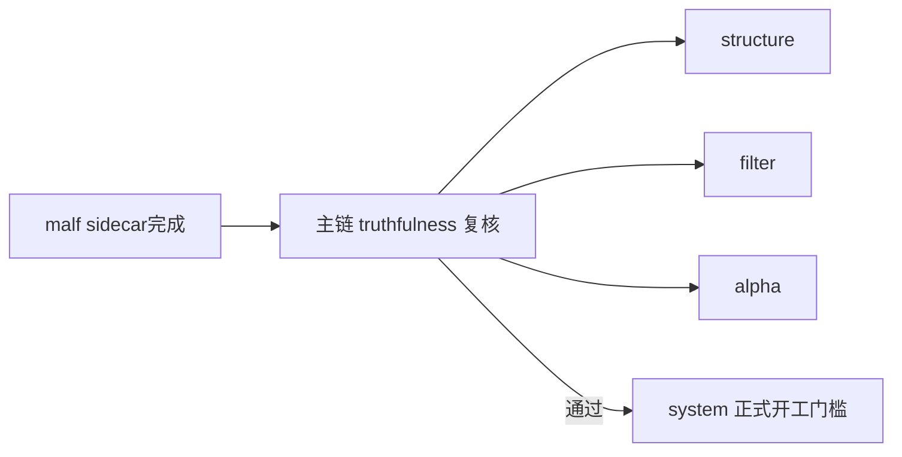

# system 主链 truthfulness 复核设计宪章

日期：`2026-04-11`
状态：`生效`

## 背景

`23`、`24`、`25` 已经连续完成三步关键收口：

1. 把 `malf core` 收缩回按时间级别独立运行的纯语义走势账本。
2. 把 `pivot-confirmed break` 与 `same-timeframe stats sidecar` 冻结为 `malf` 之外的只读机制层能力。
3. 把 bridge-era 机制层 sidecar 正式落成账本、runner、checkpoint 与最小 `structure / filter` 接入。

这说明局部能力已经成立，但还没有回答一个更关键的问题：

在引入 `23/24/25` 新口径之后，当前正式主链

`data -> malf -> structure -> filter -> alpha -> position -> portfolio_plan -> trade`

是否仍然真实闭环，是否仍旧遵守各层正式输入输出合同，是否存在旧 bridge 口径残留、sidecar 被误当硬判定、或价格口径错接的问题。

如果这个问题不先复核，就直接继续开 `system` 或继续把 sidecar 向 `alpha / position` 扩，会把“局部能力新增”和“整链真实成立”混成一件事，最终让 `system` 的系统级 readout 建在未复核的主链上。

## 设计目标

1. 正式新增一张整链 truthfulness 复核卡，专门验证 `23/24/25` 之后主链是否仍然真实成立到 `trade`。
2. 把复核对象明确限定为“正式合同、正式 runner、正式账本与 bounded 验证”，而不是再顺手加新功能。
3. 明确 `system` 开工前的前置裁决：只有整链 truthfulness 复核通过，才允许把 `system` 拉进主线。
4. 明确 `26-alpha-position-sidecar-readout-card` 与 `26-malf-canonical-runner-bootstrap-card` 只是备选后续方向，不得抢在 truthfulness 复核之前。

## 核心设计

### 1. 复核对象

`26` 号卡的正式复核对象固定为：

1. `data -> malf` 输入输出合同是否仍闭合。
2. `structure / filter` 是否把 25 的 sidecar 当作只读附加，而不是新的硬前提。
3. `alpha / position / portfolio_plan / trade` 是否仍只读取各自正式上游，不绕过正式账本回读 bridge 中间过程。
4. `backward` 与 `none` 两套价格口径在主链上的切换边界是否仍一致。
5. bounded mainline 验证是否还能形成可追溯证据。

### 2. 复核裁决类型

`26` 号卡只允许产出三类裁决：

1. 整链继续成立，可进入下一张主线卡。
2. 存在局部口径偏移，需要先开后置修复卡。
3. 存在主链级断裂，不得继续推进 `system` 或更下游读取扩展。

### 3. 与后续卡的关系

- `26-mainline-truthfulness-revalidation-after-malf-sidecar-bootstrap` 是主线前置复核卡。
- `26-alpha-position-sidecar-readout-card` 只在 truthfulness 复核通过后，才允许讨论是否上升为下一张实现卡。
- `26-malf-canonical-runner-bootstrap-card` 也排在 truthfulness 复核之后；否则很容易在旧主链尚未校准时提前切换 `malf` 核心实现。

## 边界

### 范围内

1. 主链正式合同复核。
2. bounded mainline 验证命令与证据。
3. 执行区 card / evidence / record / conclusion 收口。
4. 若发现偏移，明确裁决下一步应该开修复卡还是主线卡。

### 范围外

1. 新增 `system` 代码实现。
2. 把 sidecar 正式接入 `alpha / position`。
3. 启动 pure semantic canonical runner 替换工程。
4. 趁复核顺手新增 schema、runner 或读数特性。

## 影响

1. 当前主线在 `25` 完成后不会直接跳 `system`，而是先进入整链 truthfulness 复核。
2. `system` 模块的正式开工门槛被抬高到“整链 truthfulness 已裁决通过”。
3. 后续任何声称"主链已经整体成立"的结论，都必须建立在 `26` 的 bounded 复核证据上，而不是建立在单模块成功之上。

## 流程图

