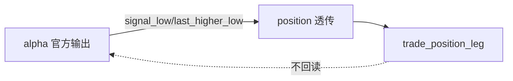

# trade signal anchor contract freeze 设计宪章

日期：`2026-04-11`
状态：`待执行`

## 背景

`trade` 模块已经注册了与业务模型一致的策略标签，但策略真正依赖的价格锚点尚未形成正式跨模块合同。当前仓库缺的不是“策略名字”，而是“策略名字对应的官方价格事实”。

## 设计目标

1. 冻结 `signal_low` 的官方来源层与语义边界。
2. 冻结 `last_higher_low` 的官方来源层与语义边界。
3. 明确这些字段如何从 `alpha` 透传到 `position`，再透传到 `trade_position_leg`。
4. 保证后续 `trade exit / pnl / progression` 不再依赖临时推断。

## 核心裁决

1. `signal_low` 必须作为正式信号事实的一部分冻结在 `alpha` 官方输出里，而不是在 `trade` 临时回推。
2. `last_higher_low` 必须作为 trailing stop 所需的结构锚点，被明确绑定到正式信号或其下游透传字段中。
3. `position` 负责承接这些锚点并把它们连同资金管理结果一起传到 `trade`，不允许 `trade` 直接回读 `alpha` 内部临时过程。
4. `trade` 只消费正式透传值，不负责定义结构锚点的业务含义。

## 非目标

1. 本卡不实现逐日推进引擎。
2. 本卡不改 `position` 的参考价口径。
3. 本卡不引入 live runtime 或 broker 语义。

## 流程图

