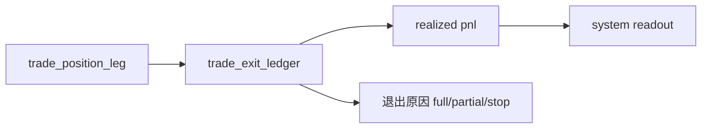

# trade exit pnl ledger bootstrap 设计宪章

日期：`2026-04-11`
状态：`待执行`

## 背景

当前 `trade` 已有 `execution_plan / position_leg / carry_snapshot`，但没有正式退出账本，导致系统只能记住“要做什么”，不能沉淀“最终发生了什么”。

## 设计目标

1. 建立最小正式退出账本。
2. 让部分退出、全退出、退出原因和 realized pnl 有正式落点。
3. 为后续逐日推进引擎提供稳定写入目标。

## 当前施工位裁决

1. 本卡必须排在 `100 / 101` 之后，因为 `signal anchor` 与 entry 参考价是退出和 `1R` 的前置输入。
2. 本卡的目标不再是“最小退出账本占位”，而是正式交付 `trade_exit_ledger + trade_realized_pnl_ledger`。
3. 本卡收口后，`103` 只允许写入本卡冻结的正式账本，不得另起私有退出表。

## 核心裁决

1. `trade_exit_ledger` 负责记录退出动作、退出类型、退出后剩余仓位和触发原因。
2. `trade_realized_pnl_ledger` 负责记录 realized pnl、成本基准、R multiple 与对应退出动作。
3. `system` 后续只消费正式退出与 realized pnl 账本，不消费 progression 私有中间态。

## 流程图

