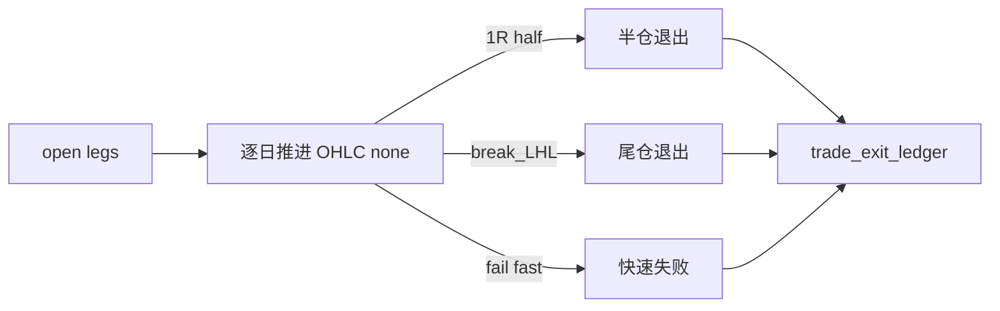

# trade backtest progression runner 设计宪章

日期：`2026-04-11`
状态：`待执行`

## 背景

当前系统没有把 `leg_status='open'` 的仓位腿逐日推进到 `closed` 的正式引擎。真实业务模型是 `T+0 信号 -> T+1 交易 -> T+2 观察 -> 1R 半仓 -> LH 失效尾仓退出`，这正是当前最大的实现缺口。

## 设计目标

1. 基于 `market_base.stock_daily_adjusted(adjust_method='none')` 的日线 OHLC，逐日推进 open legs。
2. 支持最小退出规则：快速失败、`1R` 半仓、`break_last_higher_low` 尾仓退出。
3. 支持 checkpoint / dirty queue / resume。

## 当前施工位裁决

1. 本卡必须排在 `102` 之后，因为它只允许写本卡之前已经冻结的正式退出与 realized pnl 账本。
2. 本卡是 `trade` 从 bounded runtime 升级到 data-grade runner 的关键卡，必须显式交付 `work_queue + checkpoint + replay/resume + freshness`。
3. 本卡收口后，`104` 只验证真实官方库 smoke，不再承担定义 progression 合同的职责。

## 核心裁决

1. `trade` progression 的 dirty 单元不得只按整组合粗粒度重跑，必须能定位到正式 open leg 与推进日期。
2. 逐日推进产生的状态变化必须先写正式 progression/exit/PnL 账本，再由下游读取。
3. `trade` 的 freshness audit 不得缺位，否则不能作为 `system` 的正式上游。

## 流程图

