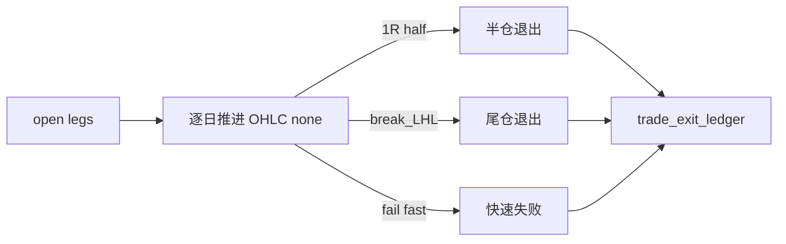

# trade backtest progression runner 设计宪章

日期：`2026-04-11`
状态：`待执行`

## 背景

当前系统没有把 `leg_status='open'` 的仓位腿逐日推进到 `closed` 的正式引擎。真实业务模型是 `T+0 信号 -> T+1 交易 -> T+2 观察 -> 1R 半仓 -> LH 失效尾仓退出`，这正是当前最大的实现缺口。

## 设计目标

1. 基于 `market_base.stock_daily_adjusted(adjust_method='none')` 的日线 OHLC，逐日推进 open legs。
2. 支持最小退出规则：快速失败、`1R` 半仓、`break_last_higher_low` 尾仓退出。
3. 支持 checkpoint / dirty queue / resume。

## 流程图

