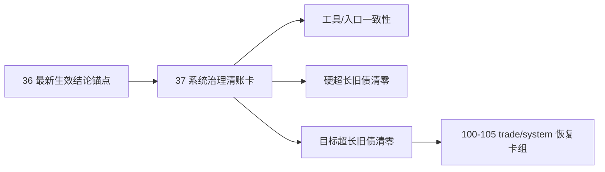

# governance historical debt backlog burndown 设计宪章

日期：`2026-04-12`
状态：`待执行`

## 背景

`1-36` 主线已经完成并生效，但全仓治理扫描仍显式暴露一批历史债务：

1. 历史超长 Python 文件旧债
2. 历史接近上限的目标超长文件旧债
3. 治理工具与执行脚手架和当前目录口径不一致的工具债务

如果这些债务继续仅以“白名单”或“口头已修”存在，仓库会出现三个问题：

1. 全仓治理扫描和按路径严格检查的口径会继续分叉
2. 已解决项没有正式登记，后续很难证明债务确实被消化
3. `100-105` 的 trade/system 恢复卡组会被治理噪音持续打断

## 设计目标

1. 为历史治理债务建立唯一的正式执行总卡，统一登记“已解决项”和“未解决项”。
2. 让 `scripts/system/development_governance_legacy_backlog.py` 只承担“剩余历史债务”登记职责，不再混入隐性口头状态。
3. 规定治理债务的收口顺序：先工具与入口一致性，再硬超长旧债，再目标超长旧债。
4. 在不破坏 `100-105` 既有 trade/system 卡组语义的前提下，插入一张前置治理清债卡。

## 核心裁决

1. 新开 `37-system-governance-historical-debt-backlog-burndown-card-20260412.md` 作为当前待施工卡。
2. `100-105` 继续保留为后续 trade/system 恢复卡组，但在 `37` 完成前暂不恢复为当前施工位。
3. `development_governance_legacy_backlog.py` 中只保留“尚未清零”的历史债务；已经解决的事项必须在 `37` 的 card / evidence / record / conclusion 中登记。
4. 对本轮已完成的纠偏项，必须在 `37` 中明确登记，至少包括：
   - `wave_life_runner` 超长文件拆分
   - `portfolio_plan / trade / system` 相关脚本与测试的中文治理补齐
   - 历史 backlog 清单显式化
   - `AGENTS.md / README.md / pyproject.toml` 的入口同步
   - `new_execution_bundle.py` 与当前索引口径不一致的工具修正

## 非目标

1. 本设计不直接改写 `100-105` 的业务目标。
2. 本设计不把治理债务伪装成新的业务主线模块。
3. 本设计不允许以“保留长期白名单”替代真实拆分与真实收口。

## 分层图


```
