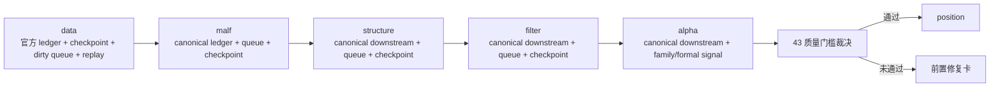

# structure / filter / alpha 达到 data-grade 质量门槛后再进入 position 设计宪章

日期：`2026-04-13`
状态：`生效`

适用执行卡：`43-structure-filter-alpha-data-grade-quality-gate-before-position-card-20260413.md`

## 背景

截至 `42`，当前主链已经形成明显分段：

1. `data -> malf`
   - 已具备接近同一标准的官方 ledger、自然键、checkpoint、dirty/work queue、replay/resume 与 freshness/readout
2. `structure -> filter -> alpha`
   - 已完成 canonical rebind 与 `35` 的 downstream queue/checkpoint 对齐
   - 但整体质量仍未完全达到 `data -> malf` 的事实标准
3. `position -> portfolio_plan -> trade -> system`
   - 仍主要停留在 bounded runner / bounded acceptance / 恢复卡组阶段

如果现在直接进入 `position`，实际进入的不是“稳定上游”，而是“仍有质量缺口的 canonical downstream”。这样会把 `position` 以后所有问题都混成一团，无法判断到底是：

1. `structure / filter / alpha` 的 source fingerprint、rematerialize 或 official local ledger 还不够稳
2. 还是 `position / trade / system` 自己真的有缺口

## 设计目标

1. 在 `position` 之前新增一个正式质量闸门卡，专门判断 `structure / filter / alpha` 是否已经达到接近 `data -> malf` 的事实标准。
2. 把“达到标准才能进入 `position`”写成明确的系统级准入条件，而不是聊天判断。
3. 把当前后半部施工顺序改写为：
   - `29 -> 42` 上游 canonical 与稳定化收口
   - `43` 上游质量门槛裁决
   - `100 -> 105` 下游执行恢复卡组
4. 让 `100` 不再被理解成“当前天然下一步”，而是“只有 `43` 接受后才能开的下一卡”。

## 核心设计

### 1. 43 的正式职责

`43` 不是实现卡，也不是单纯路线图卡。它是一个跨模块质量门槛卡，正式负责回答：

1. `structure / filter / alpha` 的官方本地 ledger 是否已经达到与 `data / malf` 同类的数据级治理要求
2. 当前 mainline 是否还能默认容忍 compat-only 列、bridge-era fallback 或 temp-only 证据
3. 进入 `position` 之前，哪些前置缺口必须先补齐

### 2. data-grade 事实标准

本卡把“接近 `data -> malf` 的事实标准”固定为以下五条：

1. 官方本地 ledger 路径清单明确，且默认消费 `H:\Lifespan-data` 正式库
2. 主语义自然键、dirty 单元与 checkpoint 颗粒度明确，不再只是“有 runner”
3. replay/resume 的 rematerialize 由正式上游 fingerprint 驱动，而不是只靠全窗口重跑
4. 至少一轮真实官方库 smoke / bounded replay 证据可复现
5. `alpha formal signal` 必须能解释自己是否已经具备进入 `position` 的稳定输出合同

### 3. 43 的输出

`43` 只允许输出以下三类结论：

1. 接受：
   `structure / filter / alpha` 已达到进入 `position` 的 data-grade 质量门槛，可恢复 `100`
2. 部分接受：
   `structure / filter / alpha` 已完成大部分对齐，但仍需先补一张或多张前置修复卡，再进入 `100`
3. 拒绝：
   当前禁止进入 `position`，必须先完成上游质量补齐

### 4. 与 100 的关系

- `100` 继续保留为 `alpha -> position -> trade` 的正式 signal anchor freeze 卡。
- 但自本宪章生效起，`100` 的施工前置条件新增一条：
  `43` 必须先明确接受，或明确列出已补齐的前置修复卡。

## data-grade 质量门槛图

## 非目标

1. 本卡不直接实现 `position`
2. 本卡不直接实现 `trade exit / pnl / progression`
3. 本卡不把 `43` 写成 live/runtime/orchestration 卡

## 影响

1. 当前主线正式施工位从 `100` 前移到 `43`
2. 系统路线图必须把 `43` 标为 `position` 前置质量闸门
3. 后续任何“进入 `position`”的提议，都必须先引用 `43` 的正式裁决
