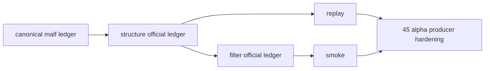

# structure / filter 官方 ledger replay 与 smoke 硬化设计宪章

日期：`2026-04-13`
状态：`生效`

适用执行卡：`44-structure-filter-official-ledger-replay-smoke-hardening-card-20260413.md`

## 背景

`35` 已经把 `structure / filter / alpha` 推进到 canonical downstream 的 queue/checkpoint 对齐阶段，但这还不是 `data -> malf` 的事实标准。

当前 `structure / filter` 与 `data / malf` 的主要差距在于：

1. `35` 更偏“逻辑对齐”，而不是“正式本地 ledger 运行质量硬化”
2. 还缺少基于 `H:\Lifespan-data` 官方库的 replay / smoke 级证据
3. 还没有把 `structure / filter` 明确抬到“进入 `position` 前的稳定上游”地位

## 设计目标

1. 对 `structure / filter` 的正式本地 ledger 路径、默认运行口径与 replay/smoke 验证进行硬化。
2. 证明 `structure / filter` 的 canonical downstream 不只是“能跑”，而是“在正式库上可续跑、可复算、可审计”。
3. 为 `45` 和 `46` 提供稳定的上游质量基础。

## 核心裁决

1. `structure / filter` 的默认运行口径必须建立在官方本地 ledger 上，而不是 temp-only 或测试夹具。
2. `bounded bootstrap` 可以保留，但必须降级为补跑接口，不再代表默认日常执行。
3. replay / smoke 证据必须优先来自官方 `H:\Lifespan-data` 路径或其受控复制，不允许只靠内存级单测替代。

## 非目标

1. 本卡不处理 `alpha formal signal` 的最终稳定输出
2. 本卡不进入 `position`
3. 本卡不改动 `trade / system`

## 流程图

