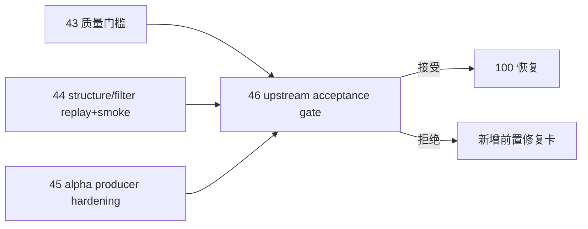

# 进入 position 前的 upstream acceptance gate 设计宪章

日期：`2026-04-13`
状态：`生效`

适用执行卡：`46-pre-position-upstream-acceptance-gate-card-20260413.md`

## 背景

`43`、`44`、`45` 分别解决：

1. 质量门槛定义
2. `structure / filter` 官方 ledger replay / smoke 硬化
3. `alpha formal signal` producer 稳定化

但进入 `position` 前仍缺最后一层系统级裁决：

1. 这三张卡的结果是否已经形成统一稳定上游
2. 当前是否允许恢复 `100`
3. 若允许，`100` 之后的 `101-105` 是否仍需新增前置修复卡

## 设计目标

1. 在进入 `position` 前设置最后一道正式 acceptance gate。
2. 把“是否允许恢复 `100`”升级为正式 conclusion，而不是聊天判断。
3. 明确 `46` 是 `100` 的唯一直接前置 acceptance 卡。

## 核心裁决

1. `100` 只能在 `46` 接受后恢复为当前待施工卡。
2. `46` 必须基于 `43 / 44 / 45` 的正式 evidence / record / conclusion 做系统级裁决。
3. 若 `46` 不接受，必须新增新的前置修复卡，不得直接跳回 `100`。

## 非目标

1. 本卡不直接实现 `position`
2. 本卡不直接实现 `100`
3. 本卡不替代后续 `trade/system` 恢复卡组

## 流程图

