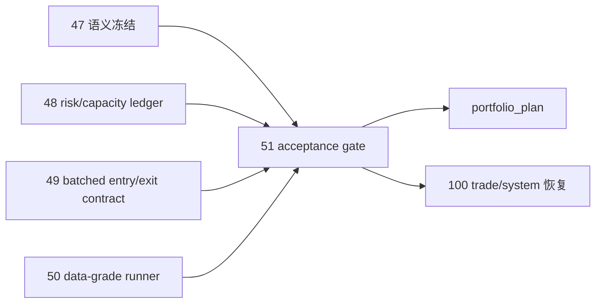

# 进入 portfolio_plan 前的 position acceptance gate 宪章

`生效日期`：`2026-04-13`
`状态`：`Active`

## 1. 目标

在 `position` 没有达到与上半部同级的 data-grade 质量前，不允许进入 `portfolio_plan`，也不允许恢复后续 `100-105`。

## 2. gate 判定对象

## 3. gate 核心标准

1. `position` 的实体锚点、自然键与上游一致。
2. `position` 的 risk / capacity / batch / exit 事实可审计。
3. `position` 的 runner 具备 queue/checkpoint/replay/resume。
4. `position` 的时间语义不破坏现有 `t+0 / t+1 / t+2 ...`。
5. `position` 的 MALF 语义消费是正式化、非兼容桥接式的。

