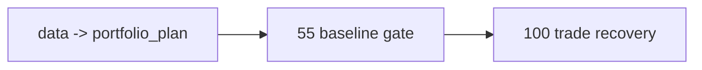

# pre-trade upstream data-grade baseline gate 设计宪章

日期：`2026-04-13`
状态：`生效中`

## 问题

如果 `trade` 在 `portfolio_plan` 还是 bounded skeleton 的状态下恢复，
那么主线就不可能形成 `data -> portfolio_plan` 的全 A 基线。

因此需要一个新的系统级闸门：

在进入 `100` 之前，先裁决
`data -> malf -> structure -> filter -> alpha -> position -> portfolio_plan`
是否已经形成统一的 data-grade baseline。

## 目标

冻结一个新的正式准入条件：

只有当前中前段主链全部达到 A 级确定性、可续跑、可复算、可审计后，
才允许恢复 `trade -> system`。

## 裁决

1. `55` 是新的 pre-trade upstream acceptance gate。
2. `55` 通过前，不允许恢复 `100-105`。
3. `55` 必须逐模块检查：
   - 自然键
   - 批量建仓
   - 增量更新
   - checkpoint / dirty queue / replay
   - freshness audit
   - 正式 `H:\Lifespan-data` 落表

## 图示

