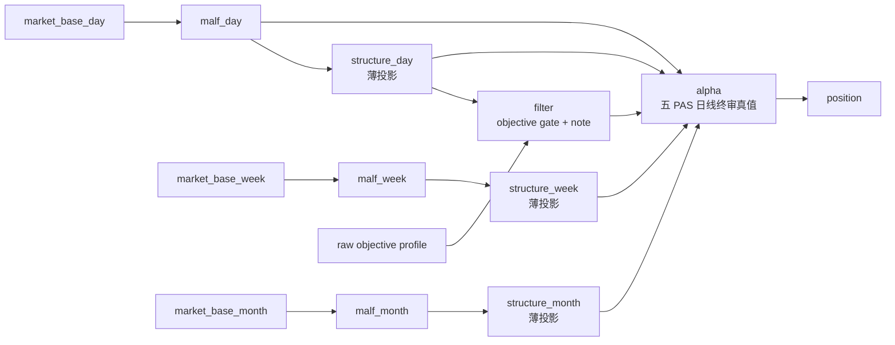
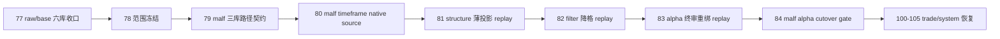

# malf alpha 双主轴与 timeframe native 重构设计章程

`日期`：`2026-04-18`
`状态`：`待执行`

## 背景

`77` 已完成 `raw/base day/week/month` 六库收口，正式价格事实层已经改成 timeframe native 分库。
但当前 `malf -> structure -> filter -> alpha` 仍保留两类旧形态：

1. `malf` 仍写入单 `malf.duckdb`，把 `D/W/M` 混在一个官方库里。
2. `structure / filter` 仍然过厚，容易在 `alpha` 之前提前解释结构和提前裁决准入。

这会带来两类持续问题：

1. 上游 `market_base` 已经分库，下游 `malf` 却仍在内部从日线重采样周月，账本形态落后于上游事实层。
2. `alpha` 本应是正式决策真值层，但现实上长期被 `structure / filter` 抢占一部分解释权与裁决权。

## 设计目标

本轮新增 `78-84` 卡组，直接替换已经删除的 `78-84` 旧 middle-ledger 窗口建仓卡组，冻结新的正式主链口径：

1. `malf` 改成 `day / week / month` 三库。
2. `malf_day / week / month` 分别直接消费 `market_base_day / week / month`，不再在 `malf` 内部从 `day` 重采样 `W/M`。
3. `structure` 保留，并跟随 `malf` 拆成 `day / week / month` 三个薄事实投影层，但不升级成三套厚解释层。
4. `filter` 保留模块壳，但降为薄门卫，只承接 objective gate 与 note/risk sidecar；它只负责拦截“客观上今天不该交易或根本不在正式宇宙里”的情况。
5. `alpha` 升格为正式决策主真值层，持有 trigger 与 final verdict 主权。
6. `alpha` 正式账本按五个日线 PAS 族拆成五库：`BOF / TST / PB / CPB / BPB`，不再默认把单 `alpha.duckdb` 当成统一真值库。

## 新主链口径

## 设计原则

### 1. 双主轴

主权层只保留两层：

1. `malf` 负责市场语义真值。
2. `alpha` 负责决策真值。

`structure / filter` 只允许作为服务层存在，不再拥有最终裁决主权。

### 2. timeframe native

`D/W/M` 各自使用官方上游库，不再由 `malf` 从 `day` 内部二次聚合周月。

### 3. 服务层降格

1. `structure` 跟随 `malf` 保留 `day / week / month` 三个薄事实投影层，只负责稳定输出对应 timeframe 的结构事实，不提前代替 `alpha` 做裁决。
2. `filter` 的 hard block 只允许来自客观不可交易或不在正式宇宙的事实：
   - 停牌 / 未复牌
   - 风险警示 / ST
   - 退市整理
   - 证券类型不在正式宇宙
   - 市场类型不在正式宇宙
3. `structure_progress_failed / reversal_stage_pending` 一类结构解释只允许以下游 `note / risk sidecar` 留痕，不再构成终审拦截。

### 4. day-first downstream

本轮重构后，`alpha` 的正式决策入口仍是日线，但它允许读取 `structure_day / week / month` 与 `malf_day / week / month` 的统一上下文。
`filter` 仍只保留一个 day 级 gate ledger，不跟随 `structure` 再拆三库。

### 5. alpha 五库日线化

1. `alpha` 的正式主真值不再是单库聚合写入，而是按 `BOF / TST / PB / CPB / BPB` 五个 PAS 族拆成五个日线官方账本。
2. 五库各自维护本 PAS 的 `trigger / family / formal signal` 账本闭环；若需要横向观察，只能在只读汇总层做，不允许再回写成单一默认真值库。

### 6. filter 落库策略延后到 82

`78` 先冻结 `filter` 的职责边界，不提前假装“是否必须保留独立本地库”已经定论。
`82` 必须显式裁决：`filter` 是继续保留薄 `filter.duckdb`，还是进一步降为 `alpha` 消费前的薄 sidecar 物化层。

### 7. cutover 先于续推

`78-84` 完成前，不允许恢复 `100-105`。
旧 `78-84` 窗口卡组删除，不再保留双线施工口径。

## 卡组顺序

1. `78`：范围冻结，确认双主轴、三库与模块主次关系。
2. `79`：冻结 `malf_day / week / month` 路径、表族与 bootstrap 契约。
3. `80`：把 `malf canonical` 改成 timeframe native source。
4. `81`：把 `structure` 收敛成 `structure_day / structure_week / structure_month` 三个薄投影层并完成 replay。
5. `82`：把 `filter` 收敛成 objective gate + note sidecar，并裁决是否保留独立本地库。
6. `83`：把 `alpha` 重绑为正式终审层，并按五个 PAS 日线库完成 historical replay。
7. `84`：做 `malf -> alpha` 官方 truthfulness 与 cutover gate。

## 影响

1. `src/mlq/core/paths.py` 将新增 `malf_day / malf_week / malf_month` 正式路径。
2. `scripts/malf/run_malf_canonical_build.py` 与 `src/mlq/malf/*` 将不再默认单库混 `D/W/M`。
3. `structure` 将稳定拆成 `structure_day / structure_week / structure_month` 三个薄投影层，分别绑定对应 `malf_*`。
4. `filter` 的默认 hard block 清单会收窄到客观可交易性与正式宇宙 gate；独立落库与否留待 `82` 裁决。
5. `alpha` 将从默认单 `alpha.duckdb` 迁到 `BOF / TST / PB / CPB / BPB` 五个日线官方库。
6. `README.md`、`AGENTS.md`、`pyproject.toml` 与 `Ω` 路线图需同步改口径。

## 流程图

