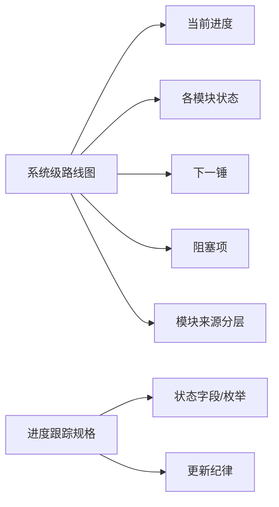

# 系统级路线图与进度跟踪器设计宪章

日期：`2026-04-09`
状态：`生效中`

## 问题

新仓现在已经具备：

1. 五根目录契约
2. 历史账本共享契约
3. 文档先行硬门禁
4. 模块级经验文档

但仍缺少一个系统级总视图，能在一个地方持续回答下面这些问题：

1. 当前整体开发推进到了哪一段
2. 各模块分别处于什么状态
3. 下一锤应该先砍哪里
4. 目前有哪些阻塞项
5. 哪些模块只是“已开工”，哪些已经能接主线
6. 这些判断分别建立在哪些老仓来源之上
7. 哪些模块可以沿袭旧结论，哪些只能吸收经验，哪些仍然没有把握

如果没有这类总视图，后续继续施工时很容易出现：

1. 只盯单张执行卡，看不到全系统上下文
2. 模块都在推进，但不知道谁先谁后
3. 聊天里讲过的路线图，几天后就失效

## 目标

为新仓补一份正式的系统级总路线图，并配套一份进度跟踪规格。

它需要长期覆盖：

1. 当前进度
2. 各模块状态
3. 下一锤
4. 阻塞项
5. 里程碑定义
6. 模块来源分层
7. 当前未定项与低把握区域

## 设计原则

1. 路线图必须是仓库内正式文档，不依赖聊天上下文长期保存。
2. 状态定义必须尽量离散、稳定，避免“看起来差不多”这种口头描述。
3. 模块推进顺序必须服从主链冻结，而不是谁临时想做什么就先做什么。
4. 路线图只回答系统级推进，不替代具体模块设计与执行卡。
5. 路线图必须写清楚当前判断背后的老仓来源，不允许把“记忆里的旧结论”当成正式系统共识。
6. 路线图必须明确区分“可沿袭结论”“需重写合同”和“目前仍无把握”的区域。

## 作用边界

范围内：

1. 系统阶段划分
2. 模块状态看板
3. 下一锤与阻塞项
4. 里程碑状态定义
5. 模块来源分层
6. 当前高不确定性区域

范围外：

1. 不直接替代某个模块的正式设计
2. 不直接替代执行卡的任务分解
3. 不把所有细节变成一张超长待办清单

## 裁决

本轮采用“一个总路线图 + 一个跟踪规格”的方式。

也就是：

1. 规格文档冻结状态字段、状态枚举和更新纪律
2. 路线图文档记录当前系统现实进度和下一步顺序

这样你以后既能快速看全局，又不会把状态定义搞飘。

## 流程图

