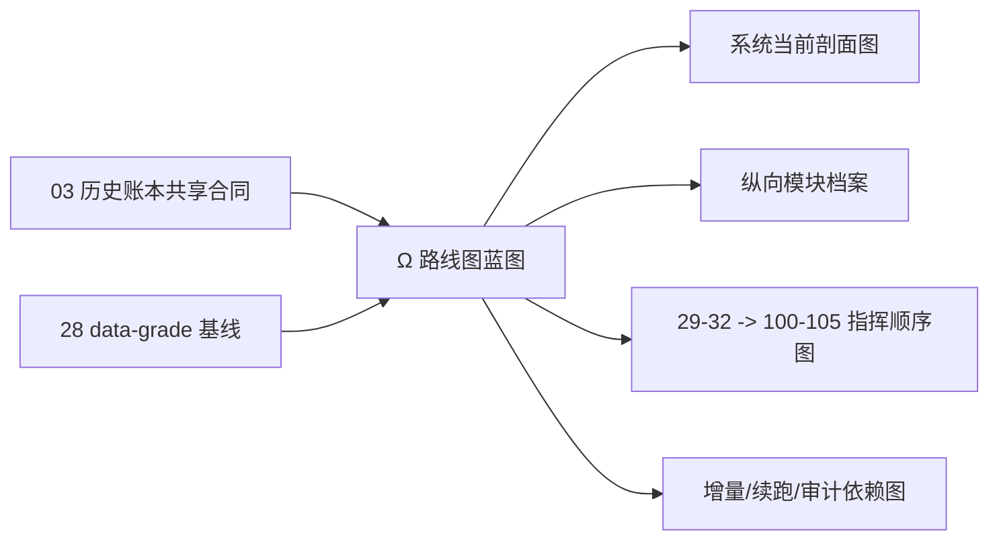

# 系统级路线图与进度跟踪器设计宪章

日期：`2026-04-09`
最近刷新：`2026-04-13`
状态：`生效中`

## 问题

`05` 初版路线图解决了“仓库里需要有一份系统级总视图”的问题，但在 `28` 裁决统一 data-grade 基线、`29-42` 完成 canonical `malf` 与 downstream 收口之后，路线图的职责已经变化：

1. 它不再只是“告诉你现在做到哪”。
2. 它必须直接回答后半部应该怎么施工。
3. 它必须把 `position -> portfolio_plan -> trade -> system` 的治理缺口讲清楚。
4. 它必须在不横向滚动的前提下，把每个模块的历史账本约束展示清楚。

如果继续沿用“横向宽表 + 概述段落”的旧写法，会持续出现三个问题：

1. 各模块的实体锚点、业务自然键和 checkpoint 语义埋在宽表里，读不出来。
2. `29 -> 32` 与 `100 -> 105` 的先后关系会再次退化成聊天口头记忆。
3. 你很难一眼看出：哪些模块已经 data-grade 对齐，哪些模块仍只是 bounded materialization。

## 目标

把系统级路线图与进度跟踪器升级为后半部施工的正式指挥蓝图。

它必须长期回答：

1. 当前冻结主链是什么。
2. `28` 之后统一采用的 data-grade 基线是什么。
3. 各模块当前处于哪个实现深度分档。
4. 各模块的六条历史账本约束是否已经对齐。
5. `29 -> 32` 与 `100 -> 105` 的先后衔接关系是什么。
6. 当前后半部最薄弱、最优先修复的链段是什么。

## 设计原则

1. 路线图必须先服从 [03-historical-ledger-shared-contract-charter-20260409.md](03-historical-ledger-shared-contract-charter-20260409.md) 的六条硬约束，再谈模块成熟度。
2. 模块跟踪默认使用纵向档案，不再使用需要横向滚动的宽表。
3. 路线图必须显式区分：
   - 已对齐区域
   - 部分对齐区域
   - 待治理区域
4. 路线图必须把 `28` 裁决过的正式施工顺序固定写入正文和图示，不允许回退成“谁有空先做谁”。
5. 正式文档默认多用图；路线图必须至少同时提供：
   - 系统剖面图
   - 后半部施工顺序图
   - 增量更新 / 断点续跑 / 审计依赖图
6. 路线图只负责系统级调度与成熟度判断，不替代模块 design/spec，也不替代执行卡的任务分解。

## 作用边界

范围内：

1. 主链冻结口径
2. `28` 基线后的统一治理标准
3. 模块实现深度分档
4. 模块六条历史账本约束对齐情况
5. 后半部卡组施工顺序
6. 系统级阻塞项与里程碑

范围外：

1. 单个模块的字段级 schema 细节
2. 某张执行卡内部的代码任务拆分
3. 任何绕过正式账本直接调临时过程的实现说明

## 核心裁决

1. `Ω-system-delivery-roadmap-20260409.md` 现在不仅是“阶段进度文档”，还是后半部施工的正式指挥蓝图。
2. 自 `28` 起，路线图必须把 `checkpoint + dirty/work queue + replay/resume + audit` 作为统一观察坐标。
3. 模块状态展示必须改为纵向模块档案；每个模块至少显式写出：
   - 实体锚点
   - 业务自然键对齐
   - 批量建仓
   - 增量更新
   - 断点续跑
   - 审计账本
4. `29 -> 32` 被正式定义为 canonical `malf` 优先卡组；`100 -> 105` 被正式定义为后半部 `trade/system` 恢复卡组；后者只能建立在前者及其后续收口完成的前提上。
5. 后半部系统级成熟度的首要观察点，不再是“trade/system 有没有脚本”，而是“`position` 以下是否补齐与 `35` 同等级的 data-grade 续跑语义”。

## 影响

1. 路线图会从“宽表说明文档”升级成“纵向模块档案 + 剖面图 + 施工顺序图”的组合式蓝图。
2. 以后评估任何模块，不允许只写“已开工/未开工”；必须回到六条历史账本约束与实现深度分档。
3. 后半部施工若偏离 `29 -> 32 -> ... -> 100 -> 105` 的既定顺序，路线图必须先更新并给出新的正式裁决。

## 流程图

